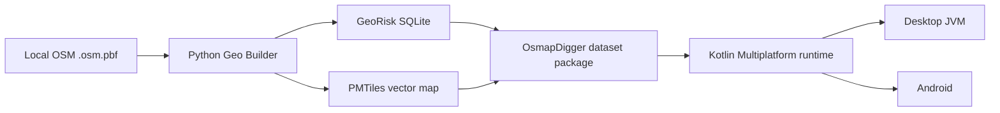

# OsmapDigger

OsmapDigger is an offline-first geographic analysis application for discovering, comparing, and inspecting settlements and locations with transparent numeric filters.

The initial product is useful to:

- real-estate buyers comparing villages, towns, and rural areas;
- real-estate agents preparing evidence-based location comparisons for clients;
- people planning relocation and balancing nature, transport, services, and environmental risks;
- travelers and tourists planning offline routes, stops, and areas worth visiting;
- hikers, campers, anglers, and other outdoor users looking for water, forests, protected areas, or remoteness;
- farmers, beekeepers, gardeners, and rural land users evaluating surrounding land use and infrastructure;
- analysts who need a compact, queryable geographic dataset without a cloud dependency.

The runtime is country-agnostic. The first production-oriented package is expected to cover Belarus because a whole-country OSM extract is practical at that scale. The repository uses a small Andorra PBF as a real local integration fixture. Large countries are expected to be represented by separately downloadable regional PBF extracts or other practical dataset scopes.

## System at a glance



The runtime never parses OSM PBF. Python performs heavy GIS processing at build time; the installed app reads a generated SQLite search database and a generated PMTiles basemap.

## Start here

Commands below run from the repository root unless noted otherwise.

| Goal | Read / run |
|---|---|
| Understand product requirements and the active initial scope | [`docs/specs/README.md`](docs/specs/README.md), [`docs/specs/active/initial-functional-product.md`](docs/specs/active/initial-functional-product.md) |
| Understand stable system boundaries | [`docs/ARCHITECTURE.md`](docs/ARCHITECTURE.md) |
| Understand current classes, files, data contracts, security boundaries, and known limitations | [`docs/IMPLEMENTATION.md`](docs/IMPLEMENTATION.md) |
| Set up Python, JDK, Android, and map tooling | [`docs/INSTALLATION.md`](docs/INSTALLATION.md) |
| Build datasets and run Desktop/Android | [`docs/USAGE.md`](docs/USAGE.md) |
| Understand dataset and metric configuration | [`docs/CONFIGURATION.md`](docs/CONFIGURATION.md) |
| Understand automated and manual validation | [`docs/TESTS.md`](docs/TESTS.md) |
| See planned follow-up work | [`docs/ROADMAP.md`](docs/ROADMAP.md) |
| Work specifically on Python dataset generation | [`geo-builder/README.md`](geo-builder/README.md), [`geo-builder/IMPLEMENTATION.md`](geo-builder/IMPLEMENTATION.md) |
| Work specifically on the KMP runtime | [`mobile/README.md`](mobile/README.md), [`mobile/IMPLEMENTATION.md`](mobile/IMPLEMENTATION.md) |
| Change the persisted SQLite/metadata contract | [`geo-format/README.md`](geo-format/README.md), [`geo-format/IMPLEMENTATION.md`](geo-format/IMPLEMENTATION.md) |

## Repository structure

- [`mobile/`](mobile/) — Kotlin Multiplatform shared domain/search/UI plus Android and Desktop platform hosts.
- [`geo-builder/`](geo-builder/) — Python build-time OSM extraction, configurable metric calculation, SQLite publication, PMTiles generation, validation, and packaging.
- [`geo-format/`](geo-format/) — versioned persisted contract shared by Python writers and runtime readers.
- [`docs/`](docs/) — cross-project architecture, implementation, setup, usage, tests, roadmap, and change specifications.
- [`data/`](data/) — local raw/generated geographic data. It is intentionally excluded from Git except for [`data/README.md`](data/README.md).

Each code subproject has a local `README.md`, `AGENTS.md`, and `IMPLEMENTATION.md` where useful. Root documentation owns cross-project behavior; local implementation documents map that behavior to concrete files and platform details.

## Quick verification

Python 3.11+:

```bash
python -m venv .venv
source .venv/bin/activate
python -m pip install -e './geo-builder[dev]'
make check
```

`make check` is designed to be deterministic and network-free. It uses synthetic GIS fixtures and does not require the Andorra PBF, Docker, tilemaker, or Android SDK.

When the JDK/Gradle/Android environment is available:

```bash
make check-all
```

See [`docs/TESTS.md`](docs/TESTS.md) for the exact matrix and current environment-dependent checks.

## Build the real Andorra test dataset

The local fixture path configured by default is:

```text
data/source/osm/andorra-260821.osm.pbf
```

That file is ignored by Git. Build SQLite and metadata without a map:

```bash
make build-andorra-data
```

Build the full package when tilemaker or Docker is installed:

```bash
make build-andorra
```

Published artifacts appear under the ignored path:

```text
data/generated/packages/andorra/
```

The portable package is `andorra.omd.zip`.

## Run Desktop

If an unpacked generated package already exists:

```bash
export OSMAPDIGGER_DATASET_DIR="$PWD/data/generated/packages/andorra"
make run-desktop
```

Without `OSMAPDIGGER_DATASET_DIR`, Desktop starts without an active dataset and lets the user open a generated directory or `.omd.zip` package.

## Android

Build the current Android host:

```bash
make build-android
```

Android imports a `.omd.zip` through the system document picker, validates required package files, installs them into app-private storage, opens SQLite read-only, and resolves the local PMTiles file into the generated MapLibre style.

## Search model

Filters are dataset-driven. The app reads `metric_definition` rows generated from `geo-builder/config/metrics.toml`; common UI does not contain branches such as `if metric == forest`.

A user can select a center settlement and radius, then combine any number of numeric min/max conditions such as:

- forest distance from 0 to 2 km;
- water distance up to 5 km;
- railway-station distance up to 20 km;
- farmyard distance at least 5 km.

The app also renders the current visual filter state as deterministic human-readable text. No LLM is required.

## Map and search are deliberately separate

SQLite is the authoritative analytical search source. PMTiles is the offline visual basemap. Search results are converted to a runtime GeoJSON overlay and rendered above the basemap by MapLibre Compose.

This separation is a core invariant: changing map styling must not change search results, and adding a new metric must not require regenerating map tiles unless the visual map itself needs that layer.

## Local data and repository hygiene

Raw PBF files, generated SQLite databases, PMTiles archives, `.omd.zip` packages, build caches, and local GIS outputs must not be committed. See [`.gitignore`](.gitignore) and [`data/README.md`](data/README.md).

`archive.sh` creates a shareable repository ZIP while excluding local geographic data and build artifacts.

`concat_osmapdigger.sh` creates a source/documentation snapshot for LLM review through the same external concatenation helper used by the Sibyl workflow. It includes active specs and excludes raw/generated GIS data plus archived specs.

## Documentation model

- [`docs/ARCHITECTURE.md`](docs/ARCHITECTURE.md) owns stable responsibilities and boundaries.
- [`docs/IMPLEMENTATION.md`](docs/IMPLEMENTATION.md) owns the current cross-project implementation, persisted-format semantics, security/privacy details, and current validation status.
- Local `IMPLEMENTATION.md` files own subproject internals.
- [`docs/specs/`](docs/specs/) contains intended deltas for significant work. The active initial product spec remains there until the current vertical slice is accepted.

This distinction is important for both human and LLM contributors: active specs say what a change must become; implementation docs say what the repository currently does.

## License

No final project license has been selected yet. See [`LICENSE.md`](LICENSE.md).
