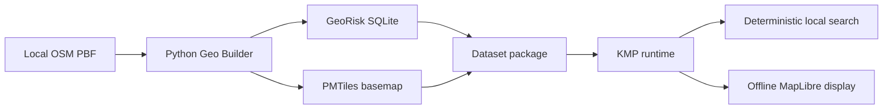
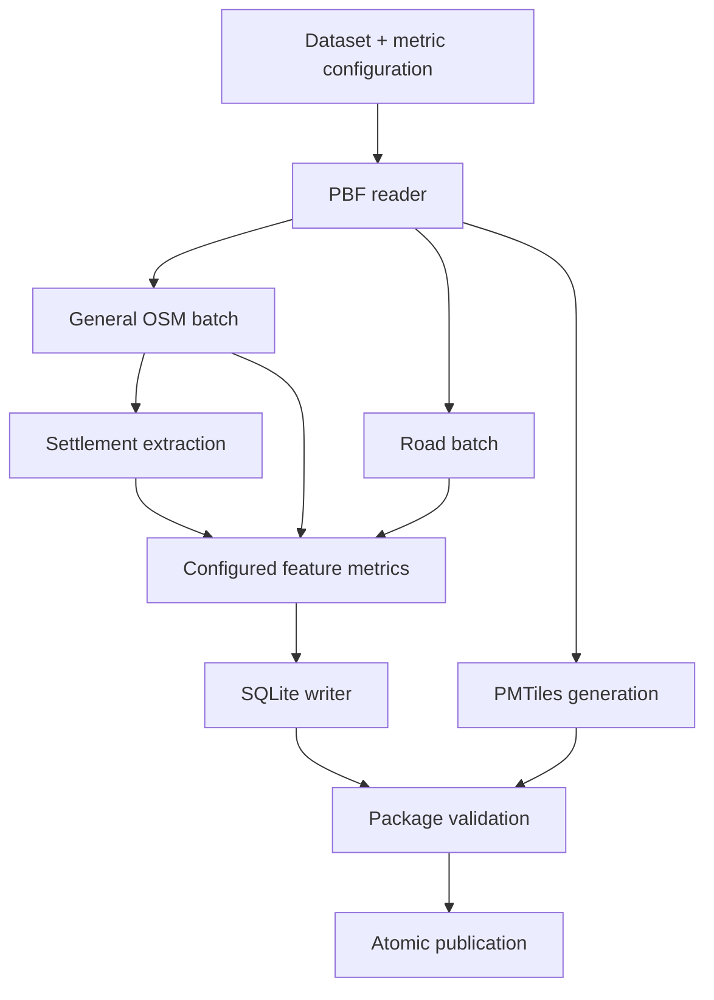
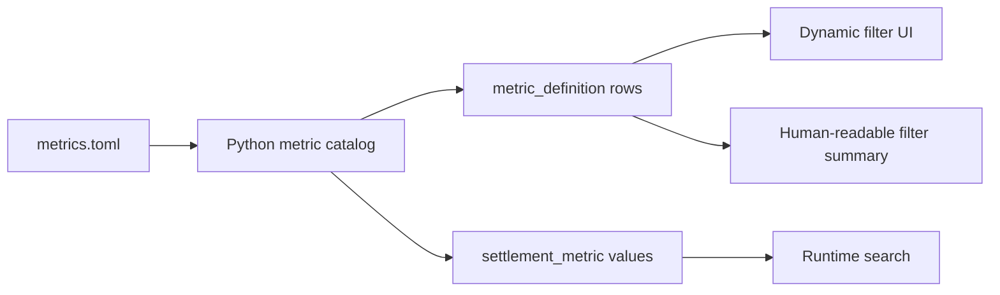
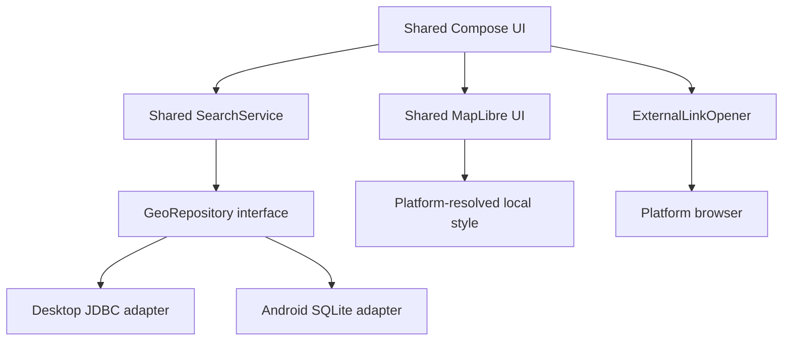
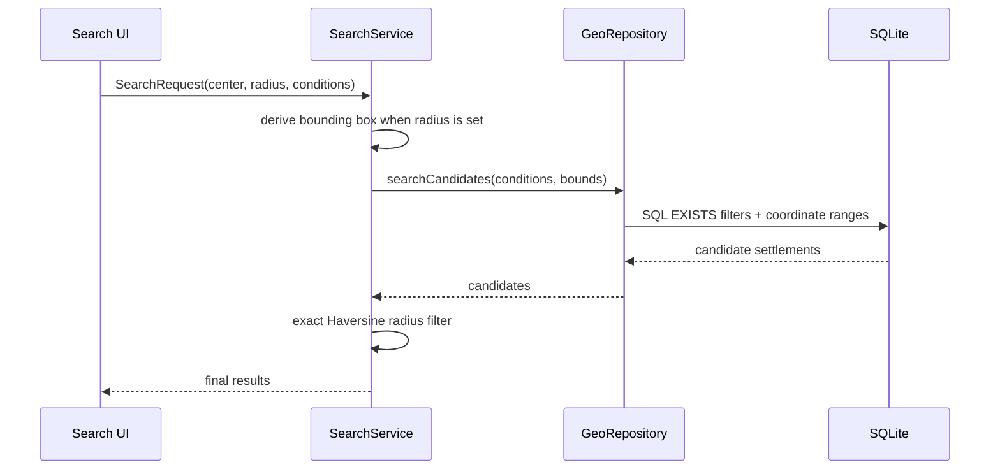

# OsmapDigger architecture

## Purpose

This document owns the stable system boundaries: what each subsystem is responsible for, which data crosses boundaries, and which concerns must remain independent. Concrete filenames, class names, current library versions, validation status, and known implementation limitations belong in [`IMPLEMENTATION.md`](IMPLEMENTATION.md) or local subproject implementation guides.

The active initial product requirements are in [`specs/active/initial-functional-product.md`](specs/active/initial-functional-product.md).

## Core architectural decision

OsmapDigger separates expensive geographic preparation from lightweight offline runtime search.

The runtime never parses OSM PBF. This keeps Android/Desktop runtime dependencies smaller and avoids performing long-running geometry processing during normal app use.

## Dataset as deployment unit

A **dataset** is the geographic scope of one generated runtime package. It is intentionally not synonymous with a country.

A dataset can represent:

- a whole country when practical;
- a region/state/province of a large country;
- a custom administrative extract;
- an arbitrary PBF extract prepared elsewhere.

If one complete-country dataset is already installed, ordinary searches inside that country are runtime filters against the existing SQLite database; the builder does not need to generate a separate package for every internal region. Separate smaller packages exist for download/storage practicality or deliberately reduced scope.

## Build-time responsibilities

`geo-builder/` owns all heavy source processing:

The builder may depend on Pyrosm, GeoPandas, Shapely, tilemaker, and other desktop/server-class tooling. Those dependencies must not become runtime dependencies of KMP code.

## Persisted-format boundary

`geo-format/` is the compatibility boundary between independently implemented producers/readers.

The current package contains:

- `georisk.sqlite` — authoritative searchable data;
- `<dataset-id>.pmtiles` — optional offline basemap;
- `style.template.json` — MapLibre style with a local PMTiles URI placeholder;
- `metadata.json` — package identity, map center, source/build information, artifact names, and statistics;
- `<dataset-id>.omd.zip` — optional portable archive containing the published artifacts.

SQLite is normalized around dynamic metric definitions. Runtime code does not require a schema column for every possible OSM category.

## Dynamic metric boundary

Build configuration defines categories and generated measures. The builder publishes those measures as runtime `metric_definition` records.

This is the extension mechanism for new OSM-derived filters. Shared Kotlin UI should not need source changes when an additive numeric metric is added to the dataset contract.

## Runtime responsibilities

The runtime is split into shared logic and platform adapters.

`mobile/shared` owns:

- immutable domain models;
- search request semantics;
- exact radius post-filtering;
- deterministic filter descriptions;
- result-to-GeoJSON conversion;
- shared responsive UI and map overlays.

Platform hosts own:

- filesystem paths;
- SQLite APIs/drivers;
- dataset ZIP installation/opening;
- local PMTiles URI resolution;
- browser intents/desktop browsing;
- platform lifecycle.

## Search semantics

SQLite performs metric filtering and optional latitude/longitude bounding-box reduction. Shared Kotlin performs exact Haversine radius filtering after candidate retrieval, avoiding a dependency on platform-specific SQLite spatial extensions.

A missing `settlement_metric` row means the value is unavailable. It must not be interpreted as zero and therefore does not satisfy a condition that requires that metric.

## Map/search separation

PMTiles and SQLite are generated from related OSM source data but have different responsibilities:

- PMTiles optimizes visual rendering at map zoom levels;
- SQLite optimizes settlement-level analytical filtering.

Search results are serialized into an in-memory GeoJSON feature collection and rendered as an overlay. A selected settlement is rendered as a separate overlay. The map does not drive SQL semantics.

## External web-search boundary

Real-estate discovery currently opens external search engines using dataset-configured site/term templates. The app does not scrape property portals and does not ingest their listings into the local database.

This boundary keeps the core product offline and avoids coupling dataset semantics to one commercial portal.

## Local data boundary

Raw PBF and generated package artifacts live under ignored local directories. Git stores only code, configuration, schemas, documentation, and synthetic tests.

The repository can therefore remain small while a developer keeps country-scale PBF/PMTiles files locally.

## Future architecture extensions

Additional build-time data sources such as DEM/elevation, flood risk, satellite-derived indicators, climate, soil, pollution, or cadastral/public-property data should enter through new builder adapters and new versioned metrics. They should not bypass the persisted-format boundary or create data-source-specific branches in shared UI.

A future Desktop “build my PBF” workflow may orchestrate the existing Python builder, but PBF processing remains a build task, not normal runtime search logic.
