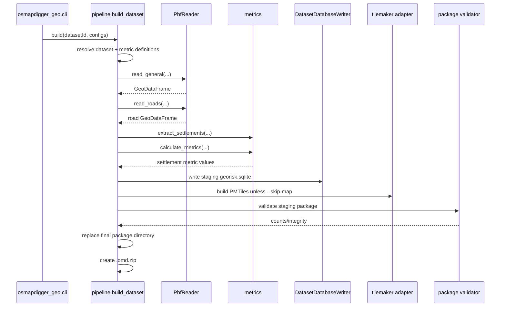
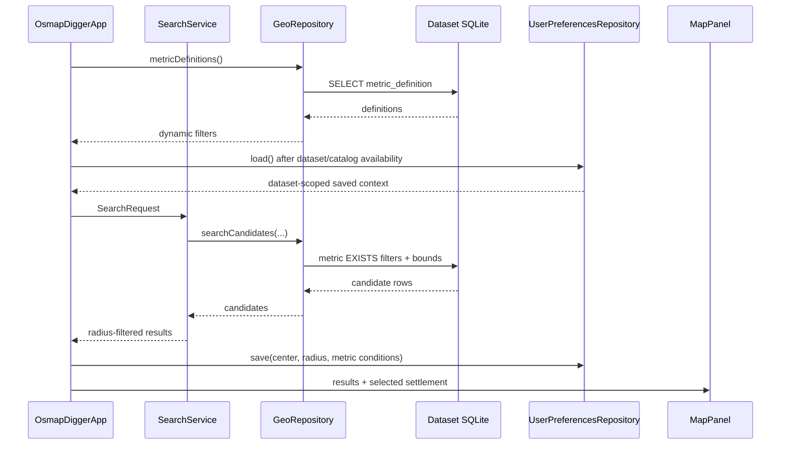

# OsmapDigger implementation guide

## Purpose and ownership

This document maps the stable architecture in [`ARCHITECTURE.md`](ARCHITECTURE.md) to the **current repository implementation**. It also owns cross-project persisted-format semantics, package-security/privacy behavior, current validation status, and known implementation limitations that would otherwise be scattered across small standalone documents.

- [`ARCHITECTURE.md`](ARCHITECTURE.md) owns stable boundaries.
- [`specs/active/spec-initial-functional-product.md`](specs/active/spec-initial-functional-product.md) owns the currently active initial-product acceptance requirements.
- This document owns current cross-project realization.
- [`../geo-builder/IMPLEMENTATION.md`](../geo-builder/IMPLEMENTATION.md), [`../mobile/IMPLEMENTATION.md`](../mobile/IMPLEMENTATION.md), and [`../geo-format/IMPLEMENTATION.md`](../geo-format/IMPLEMENTATION.md) own subproject-level details.

## Repository implementation map

| Area | Current responsibility | Detailed guide |
|---|---|---|
| `geo-builder/` | Local PBF reading, category filtering, spatial metrics, SQLite writing, PMTiles invocation, package validation/publication | [`../geo-builder/IMPLEMENTATION.md`](../geo-builder/IMPLEMENTATION.md) |
| `geo-format/` | Format version, SQLite schema, metadata schema, writer/reader compatibility contract | [`../geo-format/IMPLEMENTATION.md`](../geo-format/IMPLEMENTATION.md) |
| `mobile/shared` | Domain models, search orchestration, filter summaries, GeoJSON result overlay, shared Compose/MapLibre UI | [`../mobile/IMPLEMENTATION.md`](../mobile/IMPLEMENTATION.md) |
| `mobile/desktopApp` | JDBC SQLite, local directory/ZIP package opening, Desktop browser, JVM host | [`../mobile/IMPLEMENTATION.md`](../mobile/IMPLEMENTATION.md) |
| `mobile/androidApp` | Android SQLite, SAF ZIP import, app-private installation, Android browser, Activity host | [`../mobile/IMPLEMENTATION.md`](../mobile/IMPLEMENTATION.md) |
| `geo-builder/config/` | Dataset source/output configuration and dynamic OSM metric catalog | [`CONFIGURATION.md`](CONFIGURATION.md) |
| `data/` | Local source PBF and generated packages; ignored by Git | [`../data/README.md`](../data/README.md) |

## Current end-to-end build path

`osmapdigger_geo.pipeline.build_dataset()` is the Python composition root for one configured dataset.

Important current behavior:

- full-country/small-region PBF files can be used directly;
- a configured boundary can constrain analytical reads and produce a cropped PBF for regional map generation;
- general features and roads are read separately to avoid forcing all road geometry into the general category batch;
- settlement metrics are precomputed so runtime search does not need general-purpose geometry processing;
- the output directory is replaced only after staging validation succeeds.

## Current metric implementation

`geo-builder/config/metrics.toml` contains category definitions. Each category declares OSM selector alternatives and which measure types to generate.

Current generated measure families:

- `*.distance_km` — nearest geometry distance in kilometers;
- `*.count_<radius>` — count of matching mapped features intersecting a settlement buffer;
- `*.coverage_pct_<radius>` — percentage of a settlement buffer covered by matching polygon features.

`metric_catalog.py` turns category configuration into persisted `MetricDefinition` rows. The runtime reads those rows and builds the filter catalog dynamically.

The current configuration intentionally includes more categories than the default UI shows. `default_filter = true` selects the initial visual filter set; additional metrics remain addable at runtime.

## Persisted dataset format

Current format version is the integer in [`../geo-format/VERSION`](../geo-format/VERSION). The canonical relational schema is [`../geo-format/schema.sql`](../geo-format/schema.sql).

### `dataset_metadata`

Stores small string key/value compatibility and dataset identity fields required by SQLite readers. Package-level richer metadata is kept in `metadata.json`.

### `metric_definition`

Stores the runtime filter catalog. Important semantics:

- `metric_id` is a stable persisted key such as `water.distance_km`;
- `category_id` groups related measures produced from one source category;
- `group_id`, `title`, `description`, and `unit` support generic UI;
- `measure_type` distinguishes distance/count/coverage semantics;
- `preferred_direction` is descriptive metadata for future scoring/presentation; it does not currently alter search filtering;
- `default_enabled` controls the initial filter rows shown by the shared UI;
- `sort_order` gives deterministic presentation order.

### `settlement`

Stores one searchable point representation per named settlement. The builder derives the point from OSM geometry; non-point place geometry uses a representative point. OSM identity fields are retained when available.

### `settlement_metric`

Stores one numeric value per `(settlement_id, metric_id)`.

A missing row means **unknown/unavailable**. It is deliberately different from `0.0`. Runtime SQL uses `EXISTS`, so a settlement with no value for a requested metric does not satisfy that filter.

## Package metadata and map artifacts

`metadata.json` currently records:

- format version and dataset identity;
- source PBF filename/hash/size;
- package bounds and initial map center/zoom;
- external property-search defaults;
- artifact filenames;
- builder details such as map backend/context distance;
- generated database statistics.

`style.template.json` contains a `{{PMTILES_URI}}` placeholder. Platform package loaders replace the placeholder with the installed absolute local file URI before passing the JSON to MapLibre Compose.

The current style is intentionally small and focuses on a usable offline base layer. It is not a complete cartographic product yet; richer label/font/sprite handling is roadmap work.

## Map generation

`map_builder.py` selects either:

1. direct local `tilemaker`, or
2. Docker running tilemaker.

`--skip-map` publishes a data-only package for development when neither backend is available.

When a boundary is configured, `osm_reader.crop_pbf()` creates a valid regional PBF before tilemaker runs. This avoids generating tiles for a large parent source when the requested installable dataset is only a subset.

## Current runtime call path

Shared Kotlin code treats platform storage as an interface.

Desktop implements `GeoRepository` through Xerial SQLite JDBC. Android uses `android.database.sqlite.SQLiteDatabase`. Shared code therefore does not depend on a specific SQLite library.

Mutable user state is separate from generated dataset SQLite. Shared `UserPreferencesRepository` and restore logic persist the current dataset ID, stable center ID, optional radius, and dynamic metric ranges. Desktop stores this in `~/.osmapdigger/settings/preferences.sqlite`; Android uses app-private `filesDir/settings/preferences.sqlite`. The settings schema and version lifecycle are independent from `geo-format`.

## Dynamic filter UI

`SearchPane.kt` receives persisted `MetricDefinition` values and creates min/max input rows generically.

Current behavior:

- all definitions with `defaultEnabled = true` are inserted into the initial filter state;
- an empty min/max condition is visible but not effective;
- **Add filter** offers other persisted definitions;
- conditions are passed to `SearchService` without category-specific shared code;
- `FilterSummaryBuilder` uses metric title/unit metadata to render readable deterministic text.

The current UI uses text numeric inputs. More specialized controls may be added later while preserving `SearchCondition` semantics.

## Center/radius search

The user can search settlement names and choose one as a center. Shared `GeoMath.boundingBox()` computes a coarse latitude/longitude box. Platform SQL applies the box and metric filters. Shared `GeoMath.distanceKm()` then performs exact Haversine filtering.

This approach intentionally avoids requiring SpatiaLite or custom SQLite math functions in both platform runtimes.

## Settlement details and external search

`GeoRepository.details()` hydrates the selected settlement plus every persisted metric value, ordered by definition sort order. Shared UI groups values by `group`.

`PropertySearchLinks` builds explicit Google/Yandex query URLs. Dataset metadata may define a site restriction such as `kufar.by`; no property portal is scraped or embedded.

## Desktop package loading

`DesktopDataset.open()`:

- requires `metadata.json` and `georisk.sqlite`;
- parses metadata and resolves optional PMTiles;
- opens SQLite through JDBC;
- rewrites the map style URI;
- creates `OsmapDiggerRuntime` with repository/map/browser dependencies.

`DesktopDatasetChooser` can open a generated directory or install a ZIP into `~/.osmapdigger/datasets/`.

## Android package loading

`AndroidDatasetInstaller.install()` reads a user-selected ZIP from Android Storage Access Framework into app-private storage. Each ZIP entry is canonicalized and checked against the destination directory before extraction.

`AndroidDataset.open()`:

- validates required files;
- opens SQLite with `OPEN_READONLY`;
- rewrites the PMTiles URI to the installed file;
- creates platform browser and repository adapters.

## Security and privacy implementation

Core map browsing/filtering uses local package artifacts and requires no network.

Current security/privacy rules implemented by code or repository policy:

- dataset ZIP import rejects path traversal on both Desktop and Android;
- Android opens the generated database read-only;
- Desktop requests read-only JDBC use after opening the connection;
- raw PBF/generated artifacts are ignored by Git and shareable archive helpers;
- user search-context preferences are stored locally in application-owned SQLite only;
- no telemetry, cloud query history, remote inference, or account system exists;
- external Google/Yandex searches occur only after an explicit button click and then leave the application.

Dataset packages are currently treated as locally trusted content after structural/integrity validation; there is no cryptographic package-signature system yet.

## Repository-local data hygiene

The intended working layout is under `data/`:

- `data/source/osm/` — local source PBF files;
- `data/generated/packages/<dataset-id>/` — published generated runtime artifacts.

Both are ignored. `concat_osmapdigger.sh` and `archive.sh` also exclude raw/generated GIS data so a development machine can hold large files without polluting Git or LLM source snapshots.

## Current validation status

Validation performed when the functional repository was generated:

- Python source compilation succeeded;
- synthetic/unit Python tests passed (8 tests at generation time);
- dataset discovery included configured `andorra` and `belarus` datasets;
- metric configuration produced 69 source categories, 95 numeric metric definitions, and 27 default filter definitions at generation time;
- platform-independent Kotlin domain/search/external-link code compiled with `kotlinc` in the generation environment;
- Git ignore rules were verified for raw PBF and generated geographic artifacts;
- the included Andorra fixture was recognized as OSM Protocolbuffer Binary Format.

Environment-dependent paths were **not** fully executed in that generation environment:

- real Andorra Pyrosm processing, because the generator environment did not have Pyrosm installed and could not download it;
- PMTiles generation, because tilemaker/Docker was unavailable;
- full Gradle KMP compilation, because Gradle dependencies could not be downloaded in the restricted generation environment.

These checks must be rerun on a configured development workstation before treating the vertical slice as accepted. [`TESTS.md`](TESTS.md) maps the commands.

## Known current limitations

- Map styling is intentionally basic and does not yet provide a polished offline label/font/sprite bundle.
- Multiple simultaneously installed datasets are not yet managed through a full dataset-manager screen.
- Desktop can import/open generated packages but does not yet provide an integrated “select PBF and run Python builder” wizard.
- Android imports prebuilt packages; it does not run Pyrosm/tilemaker locally.
- Search result ranking is currently deterministic name/order + filters, not a scoring model.
- Favorites, notes, named saved searches, and comparisons are not persisted yet; only the current search context is restored.
- Non-OSM environmental sources are not implemented yet.

## Main technology choices

Versions are centralized in the owning configuration files rather than repeated here as compatibility promises. Current choices include:

- Python 3.11+;
- Pyrosm + GeoPandas + Shapely for OSM/geospatial processing;
- tilemaker for PMTiles generation;
- SQLite for runtime search;
- Kotlin Multiplatform + Compose Multiplatform;
- MapLibre Compose for map rendering;
- Xerial SQLite JDBC on Desktop;
- Android platform SQLite on Android;
- kotlinx.serialization for package metadata/GeoJSON support.

## Read next

- [`../geo-builder/IMPLEMENTATION.md`](../geo-builder/IMPLEMENTATION.md) for exact Python module call paths.
- [`../mobile/IMPLEMENTATION.md`](../mobile/IMPLEMENTATION.md) for shared/platform Kotlin wiring.
- [`../geo-format/IMPLEMENTATION.md`](../geo-format/IMPLEMENTATION.md) before changing persisted schema/metadata semantics.
- [`TESTS.md`](TESTS.md) before accepting a cross-project change.

## Desktop map runtime compatibility

Map rendering is a platform implementation rather than a hard runtime requirement of the shared search UI. Android uses its MapLibre implementation. Desktop compiles the MapLibre `desktopMain` surface and the `desktopApp` host selects one native JNI capability when the current OS/architecture is supported:

- macOS Apple Silicon (`aarch64`/`arm64`) -> MapLibre Metal JNI;
- Linux x86-64 -> MapLibre OpenGL JNI;
- Windows x86-64 -> MapLibre OpenGL JNI;
- Intel macOS (`x86_64`/`amd64`) -> JCEF + packaged MapLibre GL JS with a loopback-only PMTiles tile adapter;
- other unsupported hosts -> non-fatal map fallback.

MapLibre Compose 0.13.x does not publish a `macos-amd64` capability. Intel macOS therefore uses a separate Desktop-host renderer instead of resolving an incompatible JNI library. If that renderer cannot initialize, analytical workflows continue through the non-fatal fallback.

## Desktop map implementation boundary

`shared/src/desktopMain/.../MapPanel.desktop.kt` remains the default Desktop map implementation for MapLibre Compose native hosts and the analytical fallback. The shared UI also accepts an optional `PlatformMapSurface` injected by the Desktop host for a host-specific renderer.

On Intel macOS, `desktopApp` owns a JCEF renderer that loads packaged MapLibre GL JS assets. A loopback-only local HTTP adapter reads the installed PMTiles archive on the JVM and exposes ordinary vector-tile requests to the embedded browser. JCEF, PMTiles reader APIs, and HTTP lifecycle remain outside shared domain/search code.

`desktopApp/build.gradle.kts` owns native/runtime dependency selection. This avoids conditional source-directory wiring. Historical `desktopMapLibreMain` / `desktopFallbackMain` implementations are no longer part of the source tree.

Do not reintroduce host-specific `kotlin.srcDir(...)` branches. If supported target capabilities change with a future MapLibre Compose version, update the Desktop runtime capability mapping and its deterministic tests together.

## Implementation documentation ownership

This file remains the cross-project current-state implementation map. Concrete KMP/Desktop/Android classes, storage, diagnostics, map-renderer lifecycle, and platform differences belong in [`../mobile/IMPLEMENTATION.md`](../mobile/IMPLEMENTATION.md). Operational Desktop/Android workflows belong in [`USAGE.md`](USAGE.md), and dataset/metric/external-search configuration fields belong in [`CONFIGURATION.md`](CONFIGURATION.md).

There is intentionally no parallel `docs/implementation/` topic-document layer; keeping one cross-project guide plus owning subproject guides avoids duplicate or conflicting current-state descriptions.
