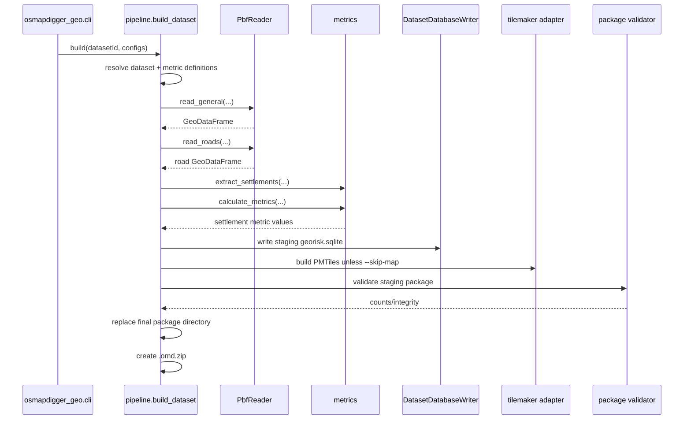
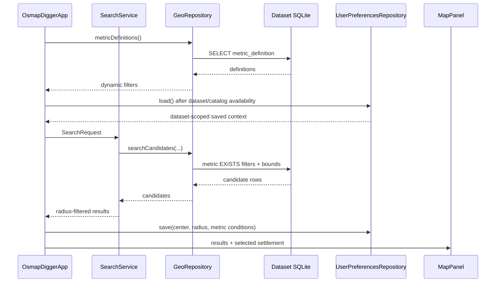

# OsmapDigger implementation guide

## Purpose and ownership

This document maps the stable architecture in [`ARCHITECTURE.md`](ARCHITECTURE.md) to the **current repository implementation**. It also owns cross-project persisted-format semantics, package-security/privacy behavior, current validation status, and known implementation limitations that would otherwise be scattered across small standalone documents.

- [`ARCHITECTURE.md`](ARCHITECTURE.md) owns stable boundaries.
- [`specs/active/spec-initial-functional-product.md`](specs/active/spec-initial-functional-product.md) owns the currently active initial-product acceptance requirements.
- This document owns current cross-project realization.
- [`../geo-builder/IMPLEMENTATION.md`](../geo-builder/IMPLEMENTATION.md), [`../mobile/IMPLEMENTATION.md`](../mobile/IMPLEMENTATION.md), and [`../geo-format/IMPLEMENTATION.md`](../geo-format/IMPLEMENTATION.md) own subproject-level details.

## Repository implementation map

| Area | Current responsibility | Detailed guide |
|---|---|---|
| `geo-builder/` | Local PBF reading, category filtering, spatial metrics, SQLite writing, PMTiles invocation, package validation/publication | [`../geo-builder/IMPLEMENTATION.md`](../geo-builder/IMPLEMENTATION.md) |
| `geo-format/` | Format version, SQLite schema, metadata schema, writer/reader compatibility contract | [`../geo-format/IMPLEMENTATION.md`](../geo-format/IMPLEMENTATION.md) |
| `mobile/shared` | Domain models, deterministic preference scoring/ranking, search orchestration, filter summaries, GeoJSON result overlay, shared Compose/MapLibre UI | [`../mobile/IMPLEMENTATION.md`](../mobile/IMPLEMENTATION.md) |
| `mobile/desktopApp` | JDBC SQLite, local directory/ZIP package opening, Desktop browser, JVM host | [`../mobile/IMPLEMENTATION.md`](../mobile/IMPLEMENTATION.md) |
| `mobile/androidApp` | Android SQLite, SAF ZIP import, app-private installation, Android browser, Activity host | [`../mobile/IMPLEMENTATION.md`](../mobile/IMPLEMENTATION.md) |
| `geo-builder/config/` | Dataset source/output configuration and dynamic OSM metric catalog | [`CONFIGURATION.md`](CONFIGURATION.md) |
| `data/` | Local source PBF and generated packages; ignored by Git | [`../data/README.md`](../data/README.md) |

## Current end-to-end build path

`osmapdigger_geo.pipeline.build_dataset()` is the Python composition root for one configured dataset.

Important current behavior:

- full-country/small-region PBF files can be used directly;
- a configured boundary can constrain analytical reads and produce a cropped PBF for regional map generation;
- general features and roads are read separately to avoid forcing all road geometry into the general category batch;
- settlement metrics are precomputed so runtime search does not need general-purpose geometry processing;
- the output directory is replaced only after staging validation succeeds.

## Current metric implementation

`geo-builder/config/metrics.toml` contains category definitions. Each category declares OSM selector alternatives and which measure types to generate.

Current generated measure families:

- `*.distance_km` — nearest geometry distance in kilometers;
- `*.count_<radius>` — count of matching mapped features intersecting a settlement buffer;
- `*.coverage_pct_<radius>` — percentage of a settlement buffer covered by matching polygon features.

`metric_catalog.py` turns category configuration into persisted `MetricDefinition` rows. The runtime reads those rows and builds the filter catalog dynamically.

The current configuration intentionally includes more categories than the default UI shows. `default_filter = true` selects the initial visual filter set; additional metrics remain addable at runtime.

## Persisted dataset format

Current format version is the integer in [`../geo-format/VERSION`](../geo-format/VERSION). The canonical relational schema is [`../geo-format/schema.sql`](../geo-format/schema.sql).

### `dataset_metadata`

Stores small string key/value compatibility and dataset identity fields required by SQLite readers. Package-level richer metadata is kept in `metadata.json`.

### `metric_definition`

Stores the runtime filter catalog. Important semantics:

- `metric_id` is a stable persisted key such as `beach.distance_km`;
- `category_id` groups related measures produced from one source category;
- `group_id`, `title`, `description`, and `unit` support generic UI;
- `measure_type` distinguishes distance/count/coverage semantics;
- `preferred_direction` is descriptive scoring/presentation metadata; the shared scoring core can use an explicit scoreable direction, but current hard-filter search orchestration is unchanged;
- `default_enabled` controls the initial filter rows shown by the shared UI;
- `sort_order` gives deterministic presentation order.

### `metric_preference_default`

Stores optional dataset-provided generic scoring defaults resolved by the builder from the selected preference profile. Each row references one generated metric and persists explicit scoreable direction, target, limit, weight, and initial enabled state. This table is deliberately separate from `metric_definition.default_enabled`: hard-filter visibility and ranking defaults are different concepts.

The table is an additive format-version-1 extension. Updated Desktop/Android readers return an empty preference-default list when opening an older version-1 package without the table, while older readers safely ignore the extra table in newly generated packages.

### `settlement`

Stores one canonical searchable point representation per named settlement. Before persistence the builder merges duplicate OSM representations only with strong evidence: matching place type plus shared Wikidata identity, or matching normalized name backed by point/area or intersecting-area geometry. A place node is preferred as the canonical runtime coordinate when present.

### `settlement_name`

Stores searchable primary/localized/official/alternate aliases for each canonical settlement. Belarus currently preserves Belarusian, Russian, and English configured name tags. The builder stores a deterministic normalized form for each alias; format-version-1 runtime readers fall back to the legacy settlement name columns when opening older packages without this additive table.

### `settlement_metric`

Stores one numeric value per `(settlement_id, metric_id)`.

A missing row means **unknown/unavailable**. It is deliberately different from `0.0`. Runtime SQL uses `EXISTS`, so a settlement with no value for a requested metric does not satisfy that filter.

## Package metadata and map artifacts

`metadata.json` currently records:

- format version and dataset identity;
- source PBF filename/hash/size;
- package bounds and initial map center/zoom;
- external property-search defaults;
- artifact filenames;
- builder details such as map backend/context distance;
- generated database statistics;
- selected metric/preference profile names and generated definition/default counts in build metadata.

`style.template.json` contains a `{{PMTILES_URI}}` placeholder. Platform package loaders replace the placeholder with the installed absolute local file URI before passing the JSON to MapLibre Compose.

The current style is intentionally small and focuses on a usable offline base layer. Ranked settlement names are added at runtime as transient presentation labels; the generated basemap itself still lacks a complete offline cartographic label/font/sprite bundle.

## Map generation

`map_builder.py` selects either:

1. direct local `tilemaker`, or
2. Docker running tilemaker.

`--skip-map` publishes a data-only package for development when neither backend is available.

When a boundary is configured, `osm_reader.crop_pbf()` creates a valid regional PBF before tilemaker runs. This avoids generating tiles for a large parent source when the requested installable dataset is only a subset.

## Current runtime call path

Shared Kotlin code treats platform storage as an interface.

Desktop implements `GeoRepository` through Xerial SQLite JDBC. Android uses `android.database.sqlite.SQLiteDatabase`. Shared code therefore does not depend on a specific SQLite library.

## Preference scoring and ranked analysis

The active Desktop analysis-workspace implementation now has a pure shared scoring core plus a
parallel ranked-analysis path. `MetricPreference` represents one enabled scoreable metric by stable
metric ID, explicit `LOWER`/`HIGHER` direction, finite target/limit values, and a weight from 1 to 10.
`NEUTRAL` is rejected until an explicit scoreable direction is chosen. `PreferenceScorer` calculates
normalized quality, weighted score, weighted data coverage, and per-preference contribution details.
Missing metric entries remain unknown and are excluded from the known-weight score denominator.

`SettlementAnalysisService` accepts a hard `SearchRequest`, enabled preferences, and a candidate scope. It asks `GeoRepository.analysisCandidates()` for hard-filter-eligible candidates and only the requested scoring metric values, optionally restricted to a reviewed set of stable settlement IDs, applies exact shared Haversine radius semantics, calculates scores, sorts with
`SettlementRanker`, and applies the user-visible limit only after ranking. The service never loops over
`GeoRepository.details()` for candidates.

Desktop JDBC and Android SQLite adapters implement the batch contract with the same hard-condition `EXISTS` predicates as legacy search plus a `LEFT JOIN` restricted to active scoring metric IDs. The unrestricted dataset scope uses the normal batch query; imported stable-ID scopes are deterministically split into bounded SQLite-parameter batches before adding the identity restriction. The left join preserves candidates whose scoring metric is unknown, and no repository name/order limit is applied on this analysis path. The existing `SearchService.searchCandidates()` path remains unchanged for the current UI, so this candidate-source core still does not alter user-visible search behavior.

Generated dataset packages now may contain `metric_preference_default`. `GeoRepository.preferenceDefaults()` exposes those rows generically on Desktop and Android and returns an empty list for legacy version-1 packages without the additive table. The builder resolves a named preference profile only against metrics physically generated by the selected metric profile and validates direction/target/limit/weight semantics before publication.

`AnalysisWorkspaceController` consumes dataset preference defaults together with application-owned sparse overrides and exposes effective preferences plus ranked results as shared `StateFlow` state. It owns generic enabled/weight/target/limit/reset preference mutations, debounced ranked recalculation, and stale-generation suppression. The Desktop host now enables a map-first presentation that consumes this state directly; Android keeps the responsive Search/Map workflow. Legacy packages with no enabled ranking defaults and no effective hard/radius constraint retain explicit refresh instead of triggering an automatic unbounded candidate scan.
Wide Desktop treats automatic debounced recalculation as the normal analysis workflow. Optional radius text is parsed separately from the domain request: blank or numeric zero maps to `radiusKm = null`, while only finite positive values enter `SearchRequest`. The lower map-adjacent area is always useful: without a selection it shows the current ranked-result count and recalculation state; with a selection it shows a compact settlement summary containing score/coverage and every metric participating in the current Required/Preferences analysis. The active-criteria strip scrolls horizontally when necessary so later criteria such as railway distance are not silently omitted. Complete scrollable details and configured external-search provider actions are explicit secondary views in the same non-overlapping lower pane.

Completed ranked-analysis generations also expose non-semantic execution diagnostics: repository candidate count, exact-radius eligible count, enabled scoring metric count, final result count, batch-retrieval time, shared exact-radius/scoring/sort time, and end-to-end analysis time. The shared controller publishes diagnostics only for the current generation, so cancelled/superseded work cannot pollute acceptance measurements. Desktop writes these snapshots to the existing persistent diagnostics log under `analysis.performance`; timings never participate in filtering, scoring, ordering, or persistence semantics.

`scripts/analysis_performance_report.py` owns the cross-project acceptance-report parser for those log entries. It uses only the Python standard library, selects the latest sample meeting an explicit minimum candidate threshold, preferring runs with scoring metrics. `make analysis-acceptance` reports a representative run even when only filter/radius analysis is available and labels it `filter-only`; `make analysis-acceptance-strict` requires at least one scoring metric for final ranked-scoring acceptance. The parser fails when no country-scale sample exists; the parser remains outside runtime/domain layers because it consumes diagnostics as acceptance evidence rather than application data.

Mutable application state is separate from generated dataset SQLite. Shared `UserPreferencesRepository` and restore logic persist the current dataset ID, stable center ID, optional radius, dynamic metric ranges, sparse dataset-scoped preference overrides, and candidate-source state. Candidate-source persistence separates the active dataset/imported scope from an optional retained reviewed import containing stable IDs plus the original user text for editing; the text is never used as identity. Preference overrides may replace `enabled`, `target`, `limit`, or `weight` by stable metric ID while score direction remains owned by the dataset-provided `MetricPreferenceDefault`. Shared `MetricPreferenceOverrideResolver` layers valid user changes over the opened dataset defaults and ignores overrides for metrics no longer present in that default catalog. The same application-owned settings SQLite also stores enabled external-search provider definitions behind `ExternalSearchProviderRepository`. Desktop stores this database in `~/.osmapdigger/settings/preferences.sqlite`; Android uses app-private `filesDir/settings/preferences.sqlite`. The legacy `preferences.sqlite` filename is retained to avoid moving existing user state even though the database now owns broader application settings. The settings schema is version 7 and its lifecycle remains independent from `geo-format`. Version 4 added the persisted reviewed candidate-scope payload; version 5 added normalized `favorite_settlement` rows; version 6 added optional favorite notes and the separate `favorite_analysis_snapshot` table; version 7 adds nullable provider-specific `query_terms_override` to `external_search_provider`. Null remains a backward-compatible unconfigured state that resolves to dataset `propertySearchTerms`; empty means no extra terms, and non-empty text is the provider-specific extra text. The settings UI edits the resolved text directly and saves an explicit string; **Set defaults** copies the dataset terms into the fields.

## Desktop analysis UI and responsive filter UI

`DesktopAnalysisWorkspace.kt` is the wide Desktop orchestration entry point. It keeps the map primary and coordinates the resizable layout, while cohesive presentation responsibilities are split into `DesktopAnalysisSidebar.kt`, `DesktopPreferencesUi.kt`, and `DesktopSettlementPanels.kt`. Ranked result presentation remains in `RankedResultsUi.kt`, and `FavoritesUi.kt` owns the notebook surface. Portable Favorites export is built in shared code as one versioned JSON manifest plus Markdown summary from the same frozen notebook model; current localized settlement names are included when available without replacing saved stable identity/history. Desktop saves the deterministic ZIP through a file chooser and reveals its location, while Android exposes the same archive through the system share sheet. Desktop transient UI never overlaps the platform map rectangle: Add filter/import/Favorites occupy only the left analysis pane, while selected-settlement summary/details/external-search views occupy the dedicated lower pane. Preference rows remain generated from persisted defaults/definitions and edit only generic enabled/target/limit/weight values; no metric IDs are hardcoded in Compose.

`SearchPane.kt` remains the responsive compatibility composition used by Android and narrow/fallback layouts, but reusable center/radius, dynamic-filter, and selected-settlement implementations now live in `SearchAreaUi.kt`, `DynamicFiltersUi.kt`, and `ResponsiveSettlementDetailsUi.kt`. `MetricFilterPresentationBuilder` still derives human-facing controls only from persisted `measureType`, title, description, and unit metadata. Shared `MetricValueFormatter` owns repeated generic numeric metric/unit rendering used across responsive and Desktop details. All definitions with `defaultEnabled = true` enter the initial filter state, empty ranges have no analytical effect, and **Add filter** exposes additional definitions. `FilterSummaryBuilder` continues to describe the structured hard request deterministically.

## Imported settlement candidate workflow

Wide Desktop can switch the candidate universe from the full opened dataset to a reviewed imported settlement list. The first import format is UTF-8 text with one settlement name per non-blank line. Shared parsing trims and normalized-de-duplicates input; `SettlementListImportResolver` uses the existing multilingual alias index and auto-resolves only a unique exact normalized alias. Multiple exact matches remain ambiguous, and prefix/substring/bounded-Levenshtein results remain suggestions until the user explicitly chooses one.

The reviewed result is an ordered, de-duplicated list of stable settlement IDs stored as `SettlementCandidateScope.Imported`. Required constraints, radius filtering, scoring, coverage, deterministic sorting, and result limits are then applied by the existing analysis pipeline. Restoring a saved imported scope intersects its IDs with the current dataset settlement index; stale IDs are removed while an empty imported scope remains explicitly empty instead of reverting to dataset-wide analysis. Desktop supports both direct paste and a platform-owned UTF-8 `.txt` file picker. Android shares the persistence/analysis contracts but does not yet expose the document-import presentation.

## Center/radius search

The user can search settlement names and choose one as a center. `SettlementSearchService` lazily loads the dataset's compact settlement-name index and applies shared deterministic ranking across all aliases: exact match, prefix, substring, then bounded Levenshtein fuzzy fallback. This keeps Cyrillic/Latin alias behavior identical on Desktop and Android without depending on SQLite ICU/FTS extensions. Equal-name results remain separate and are ordered deterministically, with population used only as a ranking tie-breaker.

The candidate-list workflow reuses that alias contract without silently applying fuzzy matches. One exact normalized alias resolves automatically, multiple exact settlement identities remain ambiguous, and non-exact matches are suggestions only. Ranked analysis receives the reviewed imported stable-ID scope; Desktop JDBC and Android SQLite restrict candidate retrieval in deterministic bounded ID batches. Wide Desktop now exposes paste/file review and persists the resulting dataset-scoped candidate source. Favorites are a separate persistent output collection: schema version 5 introduced the normalized Favorite rows and version 6 adds optional notes plus one frozen analysis snapshot row per Favorite. They do not alter candidate-source state automatically; an explicit Desktop action may copy selected available Favorite stable IDs into a replacement imported candidate list for another analysis pass. Portable export covers the whole dataset-scoped notebook rather than transient checkbox selection, so stale/unavailable historical entries remain exportable.

Shared `geo.GeoMath.boundingBox()` computes a coarse latitude/longitude box. Platform SQL applies the box and metric filters. Shared `GeoMath.distanceKm()` then performs exact Haversine filtering.

This approach intentionally avoids requiring SpatiaLite or custom SQLite math functions in both platform runtimes.

## Settlement details and external search

`GeoRepository.details()` hydrates the selected settlement plus every persisted metric value, ordered by definition sort order. Shared UI groups values by `group`.

`ExternalSearchProviderRepository` returns enabled global and dataset-country providers from application settings SQLite and persists provider-specific query-term values. The packaged seed catalog is owned by `mobile/config/external-search-providers.json` and currently defines Google/Yandex plus country-specific property portals such as Kufar, Avito, Idealista, ImmobilienScout24, SeLoger, Rightmove, Funda, and Immoweb. Seeding uses `INSERT OR IGNORE`, so customized rows remain authoritative. `ExternalSearchUrlBuilder` and `ExternalSearchBatchBuilder` resolve terms identically: legacy null falls back to dataset `propertySearchTerms`, an empty value adds no extra terms, and non-empty text is appended for that provider. Shared settings presentation shows the effective text directly, allows it to be cleared, and can copy dataset defaults back into all fields. Batch search still accepts only templates expressible through `{query}` without a required `{settlement}` placeholder; names become quoted `OR` alternatives and deterministic chunks keep each final encoded URL within a conservative bound. Desktop renders generated batch chunks as explicit actions without opening multiple browser searches automatically. No property portal is scraped or embedded.

## Desktop package loading

`DesktopDataset.open()`:

- requires `metadata.json` and `georisk.sqlite`;
- parses metadata and resolves optional PMTiles;
- opens SQLite through JDBC;
- rewrites the map style URI;
- creates `OsmapDiggerRuntime` with repository/map/browser dependencies.

`DesktopDatasetChooser` can open a generated directory or install a ZIP into `~/.osmapdigger/datasets/`.

## Android package loading

`AndroidDatasetInstaller.install()` reads a user-selected ZIP from Android Storage Access Framework into app-private storage. Each ZIP entry is canonicalized and checked against the destination directory before extraction.

`AndroidDataset.open()`:

- validates required files;
- opens SQLite with `OPEN_READONLY`;
- rewrites the PMTiles URI to the installed file;
- creates platform browser and repository adapters.

## Security and privacy implementation

Core map browsing/filtering uses local package artifacts and requires no network.

Current security/privacy rules implemented by code or repository policy:

- dataset ZIP import rejects path traversal on both Desktop and Android;
- Android opens the generated database read-only;
- Desktop requests read-only JDBC use after opening the connection;
- raw PBF/generated artifacts are ignored by Git and shareable archive helpers;
- user search-context preferences are stored locally in application-owned SQLite only;
- no telemetry, cloud query history, remote inference, or account system exists;
- external Google/Yandex searches occur only after an explicit button click and then leave the application.

Dataset packages are currently treated as locally trusted content after structural/integrity validation; there is no cryptographic package-signature system yet.

## Repository-local data hygiene

The intended working layout is under `data/`:

- `data/source/osm/` — local source PBF files;
- `data/generated/packages/<dataset-id>/` — published generated runtime artifacts.

Both are ignored. `concat_osmapdigger.sh` and `archive.sh` also exclude raw/generated GIS data so a development machine can hold large files without polluting Git or LLM source snapshots.

## Current validation status

Validation performed when the functional repository was generated:

- Python source compilation succeeded;
- synthetic/unit Python tests passed (8 tests at generation time);
- dataset discovery included configured `andorra` and `belarus` datasets;
- metric configuration produced 69 source categories, 95 numeric metric definitions, and 27 default filter definitions at generation time;
- platform-independent Kotlin domain/search/external-link code compiled with `kotlinc` in the generation environment;
- Git ignore rules were verified for raw PBF and generated geographic artifacts;
- the included Andorra fixture was recognized as OSM Protocolbuffer Binary Format.

Environment-dependent paths were **not** fully executed in that generation environment:

- real Andorra Pyrosm processing, because the generator environment did not have Pyrosm installed and could not download it;
- PMTiles generation, because tilemaker/Docker was unavailable;
- full Gradle KMP compilation, because Gradle dependencies could not be downloaded in the restricted generation environment.

These checks must be rerun on a configured development workstation before treating the vertical slice as accepted. [`TESTS.md`](TESTS.md) maps the commands.

## Known current limitations

- Basemap styling is intentionally basic and does not yet provide a polished offline general-purpose label/font/sprite bundle; ranked settlement labels are runtime overlays rather than generated basemap labels.
- Multiple simultaneously installed datasets are not yet managed through a full dataset-manager screen.
- Desktop can import/open generated packages but does not yet provide an integrated “select PBF and run Python builder” wizard.
- Android imports prebuilt packages; it does not run Pyrosm/tilemaker locally.
- Shared preference scoring, dataset defaults, user overrides, ranked analysis, and the map-first wide Desktop workspace are connected through `AnalysisWorkspaceController`. Ranked result markers feed the same shared selection path as the left result list. Desktop **Pick center on map** reports a WGS84 click coordinate, resolves the nearest settlement from the complete dataset settlement index using shared Haversine distance, and reuses that `Settlement` as the persisted center. Final camera-padding/interaction polish remains pending. Center-settlement lookup separately uses exact/prefix/substring/fuzzy alias ranking.
- Dataset-scoped Favorites survive restart and may carry an optional note plus one immutable versioned analysis snapshot. Desktop supports compact saved-context presentation, explicit snapshot refresh, transient multi-selection/select-all, selected-Favorites transfer into the activated imported candidate source for re-analysis, and portable deterministic ZIP export. Android has the matching system-share adapter even though the polished Favorites browsing surface remains Desktop-first. Named saved searches, multiple historical snapshots, and comparison dashboards are not implemented yet.
- Non-OSM environmental sources are not implemented yet.

## Main technology choices

Versions are centralized in the owning configuration files rather than repeated here as compatibility promises. Current choices include:

- Python 3.11+;
- Pyrosm + GeoPandas + Shapely for OSM/geospatial processing;
- tilemaker for PMTiles generation;
- SQLite for runtime search;
- Kotlin Multiplatform + Compose Multiplatform;
- MapLibre Compose for map rendering;
- Xerial SQLite JDBC on Desktop;
- Android platform SQLite on Android;
- kotlinx.serialization for package metadata/GeoJSON support.

## Kotlin operational failures and application-owned storage contracts

Meaningful Kotlin runtime failures now use the shared `OperationalFailure` taxonomy at migrated application boundaries. Programmer/domain invariants continue to use `require`/`check`, while `operationalBoundary()` preserves coroutine cancellation and converts expected platform/database/storage failures into stable failure kinds. Shared UI maps those kinds to localized application text; technical causes remain available to diagnostics and are not the user-facing contract.

Application settings SQLite now uses independent schema version 7. The logical DDL and ordered 1→2→3→4→5→6→7 migrations have one shared semantic owner in `ApplicationSettingsSchema`. Desktop JDBC and Android SQLite classes execute those shared statements using platform-specific transactions and resource lifecycles. Malformed persisted filter, preference, or candidate-scope payloads are explicit settings failures rather than being treated as absent saved state.

Dataset package runtime interpretation is similarly shared through `DatasetPackageLayout` and `DatasetPackageMetadataParser`. Desktop and Android still own filesystem access, SQLite opening, local URI rewriting, and browser integration. Portable ZIP replacement uses staging → validation → publication; an existing install is moved to a same-filesystem backup only after the replacement validates, and publication failure restores the previous package where possible. This change does not modify `geo-format` or generated dataset semantics.

## Read next

- [`../geo-builder/IMPLEMENTATION.md`](../geo-builder/IMPLEMENTATION.md) for exact Python module call paths.
- [`../mobile/IMPLEMENTATION.md`](../mobile/IMPLEMENTATION.md) for shared/platform Kotlin wiring.
- [`../geo-format/IMPLEMENTATION.md`](../geo-format/IMPLEMENTATION.md) before changing persisted schema/metadata semantics.
- [`TESTS.md`](TESTS.md) before accepting a cross-project change.

## Desktop map runtime compatibility

Map rendering is a platform implementation rather than a hard runtime requirement of the shared search UI. Android uses its MapLibre implementation. Desktop compiles the MapLibre `desktopMain` surface and the `desktopApp` host selects one native JNI capability when the current OS/architecture is supported:

- macOS Apple Silicon (`aarch64`/`arm64`) -> MapLibre Metal JNI;
- Linux x86-64 -> MapLibre OpenGL JNI;
- Windows x86-64 -> MapLibre OpenGL JNI;
- Intel macOS (`x86_64`/`amd64`) -> JCEF + packaged MapLibre GL JS with a loopback-only PMTiles tile adapter;
- other unsupported hosts -> non-fatal map fallback.

MapLibre Compose 0.13.x does not publish a `macos-amd64` capability. Intel macOS therefore uses a separate Desktop-host renderer instead of resolving an incompatible JNI library. If that renderer cannot initialize, analytical workflows continue through the non-fatal fallback.

## Desktop map implementation boundary

`shared/src/desktopMain/.../MapPanel.desktop.kt` remains the default Desktop map implementation for MapLibre Compose native hosts and the analytical fallback. The shared UI also accepts an optional `PlatformMapSurface` injected by the Desktop host for a host-specific renderer.

On Intel macOS, `desktopApp` owns a JCEF renderer that loads packaged MapLibre GL JS assets. A loopback-only local HTTP adapter reads the installed PMTiles archive on the JVM, exposes ordinary vector-tile requests to the embedded browser, and accepts a same-origin bounded settlement-interaction POST containing only the stable settlement ID. The platform renderer forwards that ID through the renderer-neutral `PlatformMapSurface` callback; shared Desktop UI resolves it against current ranked results before changing selection or center. JCEF, PMTiles reader APIs, and HTTP lifecycle remain outside shared domain/search code.

`desktopApp/build.gradle.kts` owns native/runtime dependency selection. This avoids conditional source-directory wiring. Historical `desktopMapLibreMain` / `desktopFallbackMain` implementations are no longer part of the source tree.

Do not reintroduce host-specific `kotlin.srcDir(...)` branches. If supported target capabilities change with a future MapLibre Compose version, update the Desktop runtime capability mapping and its deterministic tests together.

## Implementation documentation ownership

This file remains the cross-project current-state implementation map. Concrete KMP/Desktop/Android classes, storage, diagnostics, map-renderer lifecycle, and platform differences belong in [`../mobile/IMPLEMENTATION.md`](../mobile/IMPLEMENTATION.md). Operational Desktop/Android workflows belong in [`USAGE.md`](USAGE.md), and dataset/metric/external-search configuration fields belong in [`CONFIGURATION.md`](CONFIGURATION.md).

There is intentionally no parallel `docs/implementation/` topic-document layer; keeping one cross-project guide plus owning subproject guides avoids duplicate or conflicting current-state descriptions.

Intel macOS normal marker activation uses a tolerant screen-space hit box and reports a stable settlement ID through the loopback interaction endpoint. **Pick center on map** uses a separate bounded WGS84 coordinate endpoint; shared Kotlin resolves the nearest dataset settlement, so center selection is independent of current ranked markers. Runtime diagnostics log both interaction boundaries without exposing map-engine objects.

## Shared UI localization

Application-owned Compose text is routed through the shared `UiLocalization` catalog. Russian (`ru`) is the default UI language and English (`en`) is the fallback/alternate language. `OsmapDiggerApp` owns the current presentation language and provides it through composition locals so Desktop and Android shared UI use one catalog. The in-session selection is saveable across normal Compose state recreation but is not stored in the application settings SQLite yet.

Localization applies to application chrome, search-area controls, filter labels/descriptions, ranking labels, settlement detail controls, deterministic filter summaries, and map/fallback status text. Settlement display names are resolved from dataset-provided `settlement_name` aliases for the selected UI language, with canonical-name fallback when that language is unavailable. Active-criteria presentation also provides Russian labels for the current stable metric categories by `category_id` and measure semantics, while unknown categories fall back to the dataset title. Dataset display names and configured external-provider titles remain dataset-owned.

### Intel macOS map sizing invariant

The Desktop analysis workspace reserves the same lower one-third pane whether or not a settlement is selected. This keeps the JCEF `SwingPanel` host rectangle stable while browsing results and avoids native browser painting into the Compose status/details pane during large dynamic resizes.

