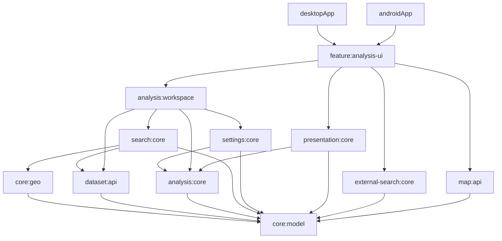
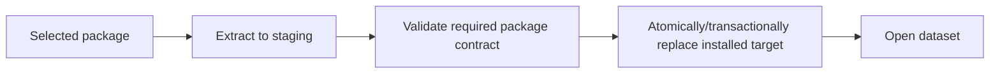

# KMP modular architecture and runtime hardening

## Status

Active interleaved architecture-hardening sub-spec; not the current product implementation focus.

Parent specification: [`../spec-initial-functional-product.md`](../spec-initial-functional-product.md).

This is a bounded architecture-hardening track that may be interleaved with
[`settlement-shortlist-workflow.md`](settlement-shortlist-workflow.md) and later product increments. Architecture work
must happen only between completed, testable feature increments, not in the middle of an unfinished behavioral change.

Iteration 1 implementation is complete; configured Kotlin validation remains pending in environments where the Gradle distribution/dependencies are unavailable. Logical commonMain ownership is acyclic, workspace orchestration and filter-summary
presentation have moved to the appropriate owners, dataset/map/external contracts no longer live in a generic runtime
API file, the unused legacy dataset-manager API is removed, and a network-free architecture check protects the current
dependency direction. The shortlist workflow is now the current product implementation focus.

The remaining work must continue as independently reviewable PATCH iterations. Each iteration must leave the repository
in a coherent, testable state; this specification deliberately rejects a single repository-wide rewrite.

## Goal

Prepare the Kotlin Multiplatform runtime for continued growth by making architecture boundaries enforceable rather
than merely conventional.

The target is a codebase where a developer or LLM working on one feature can normally load:

1. the repository/mobile development rules;
2. the documented module graph;
3. the feature's owning module;
4. only that module's dependency subtree.

The hardening work must improve:

- physical and logical module independence;
- explicit dependency direction;
- ownership of reusable contracts and helpers;
- Android/Desktop semantic parity without unnecessary implementation coupling;
- a single Kotlin operational-error policy;
- source-file/class responsibility and navigability;
- documentation of non-trivial algorithms and invariants;
- deterministic behavior and existing runtime compatibility.

This is primarily a behavior-preserving refactoring specification. Product behavior, scoring formulas, dataset metric
semantics, and map/search separation must not be redesigned merely to make the source tree look cleaner.

## Relationship to the umbrella and queued feature work

The parent umbrella already requires shared reusable logic, platform-owned filesystem/database integration,
deterministic local search, and a country-agnostic runtime. This sub-spec strengthens those boundaries without
changing the umbrella acceptance target.

The queued shortlist/import/notebook work is expected to add more application state, persistence, UI, and platform
integration. Performing the structural work first reduces the risk that those features further enlarge the current
`shared` module or duplicate another settings/storage implementation.

The implemented Desktop analysis workspace, Desktop map, and user-preference sub-specs remain
verification-pending; this refactoring must preserve their behavior and must not treat their outstanding configured
acceptance checks as complete.

## Current state

The runtime currently has three Gradle modules:

- `:shared`;
- `:desktopApp`;
- `:androidApp`.

This was appropriate for the initial vertical slice, but `:shared` now owns domain models, geographic algorithms,
search orchestration, preference scoring, application-state controllers, persistence models/codecs, presentation,
localization, map contracts/Compose integration, responsive UI, and the wide Desktop analysis UI.

Package names provide useful semantic grouping, but they do not yet provide build-enforced context boundaries.
Before iteration 1, package dependencies included `analysis -> preferences -> analysis` and
`analysis -> search -> presentation -> analysis`, and the generic `runtime` package owned unrelated dataset/map/external
contracts.

Iteration 1 removes those targeted cycles without adding Gradle modules. `AnalysisWorkspaceController` now belongs to
`workspace`, filter-summary generation belongs to `presentation`, `GeoRepository` belongs to `dataset`, `MapPackage`
belongs to `map`, and `ExternalLinkOpener` belongs to `external`; `runtime` retains only the platform composition bundle.
The unused legacy `DatasetManager`/`DatasetMetadata`/`DatasetConfig` API and its unread `config/app-config.yaml` companion are removed. `mobile/README.md` documents the current logical DAG and `tests/test_mobile_architecture.py` enforces allowed commonMain package directions during network-free checks.

Cross-platform implementations intentionally use different platform APIs, but some compatibility-sensitive semantics
are duplicated manually between Desktop and Android, notably dataset SQL behavior and application settings schema/
migrations.

Current source-size hot spots include approximately:

- `DesktopAnalysisWorkspace.kt` — 44.7 KB / 1052 lines;
- Desktop `LocalWebMapServer.kt` — 22.5 KB / 543 lines;
- `SearchPane.kt` — 20.9 KB / 517 lines;
- `AnalysisWorkspaceController.kt` — 16.1 KB / 381 lines.

The Python builder remains outside the primary scope of this KMP sub-spec. Its large settlement-canonicalization file
may be reviewed separately after Kotlin hardening.

## Architecture principles

### Dependency graph is a DAG

Internal Gradle module dependencies must be acyclic. Lower-level modules must not import higher-level presentation,
application orchestration, or platform implementation modules.

Package cleanup must establish this direction before packages are physically extracted into new Gradle modules.
Physical modularization must not encode cycles through broad dependency shortcuts.

### Semantic ownership before generic utility ownership

Reusable code should live under the narrowest stable semantic owner. Avoid generic `util`, `common`, or `helpers`
modules/packages that become dependency magnets.

Examples of desired ownership:

- Haversine/geographic calculations -> geography core;
- metric-value formatting -> presentation core;
- dataset package layout/metadata semantics -> dataset/package contract owner;
- SQL query construction semantics -> dataset query contract owner;
- settings schema/migration definitions -> application settings contract owner.

A reusable helper should not remain buried inside an unrelated service solely because that service was the first
consumer.

### Platform APIs remain platform-owned

Physical modularization must not erase useful Android/Desktop differences. JDBC execution, Android cursors,
filesystem APIs, lifecycle, browser intents, JCEF, and native map integrations remain platform-specific.

Where both platforms implement the same semantic contract, shared code may own the declarative/query/migration model
while platform adapters own execution and resource lifecycle.

### Modules should optimize comprehension, not module count

The project should gain modules as independent responsibilities become substantial, but it must not create one Gradle
module per class or tiny implementation detail.

A good module:

- has one clear responsibility;
- exposes a small intentional API;
- has a small direct dependency set;
- can be tested mostly in isolation;
- has a concise local README when its role is not obvious;
- meaningfully reduces the source context needed for changes.

## Provisional target module graph

The exact extraction order may change as dependencies are cleaned up, but the intended ownership should converge
approximately toward the following DAG rather than keeping all responsibilities in one `:shared` module:

This is a direction/ownership model, not a mandate to create every box immediately. Adjacent responsibilities may
remain combined until their independent size or change rate justifies extraction. Any deviation should preserve the
same lower-to-higher dependency direction and be documented in the authoritative mobile module graph.

## Requirements

### MH-R1 — authoritative documented module graph

`mobile/README.md` or another single owning mobile document must contain the current internal Gradle module graph.
For every non-trivial internal module it must state at least:

- module name/path;
- responsibility/ownership;
- direct internal dependencies;
- important public contracts/entry points;
- major forbidden dependency directions where useful;
- focused test command or test location.

The graph must describe current implementation, not aspirational modules that do not yet exist. Planned target
structure belongs in this specification until implemented.

The intended LLM workflow is: read root/mobile rules, find the target module, then recursively inspect only its direct
dependency subtree unless the task genuinely crosses another boundary.

### MH-R2 — build-enforced acyclic module dependencies

The final internal Gradle project dependency graph introduced by this sub-spec must be a DAG.

Before extracting a package into a module, package-level cycles involving that responsibility must be removed by
moving code to the correct semantic/application layer. Do not solve cycles by creating broad bidirectional bridge
modules or by moving unrelated code into a generic shared bucket.

### MH-R3 — pure analysis core versus workspace orchestration

Pure scoring/ranking concepts such as preference models, normalized quality, contributions, coverage, and deterministic
ranking belong to analysis core.

`AnalysisWorkspaceController` is application/feature orchestration because it coordinates repositories, persisted
preferences, debounce/cancellation, generations, and analysis execution. It must not remain the reason analysis core
depends upward on settings/persistence code.

Refactoring must preserve the existing scoring formula, ranking order, missing-data semantics, debounce behavior, and
stale-generation protection.

### MH-R4 — search and presentation dependency direction

Search/domain orchestration must not depend on presentation formatting merely to create UI text.

Presentation builders such as human-readable filter summaries and numeric/metric formatting should depend on stable
search/analysis models, not the reverse. A pure search module must remain usable without Compose/localization-specific
presentation code.

### MH-R5 — semantic runtime contracts

Generic runtime bundles must not become permanent ownership boundaries for unrelated APIs.

As modules are extracted, contracts should move toward their semantic owners, for example:

- dataset repository APIs -> dataset boundary;
- local map package/renderer-neutral contracts -> map boundary;
- explicit external link action -> external/platform action boundary;
- whole-application dependency bundle -> composition root only.

A temporary facade such as `OsmapDiggerRuntime` may remain when it simplifies composition, but feature/core modules
should depend on the smallest contract they need rather than on the whole facade.

### MH-R6 — interface segregation at changing boundaries

Large platform adapters may continue implementing one convenience facade, but shared services should be able to
depend on smaller capability interfaces where this materially reduces coupling.

For the dataset repository, likely capabilities include catalog/metadata, settlement lookup, analysis candidate
retrieval, and settlement details. The exact names are implementation decisions; do not split interfaces mechanically
when no consumer/dependency benefit exists.

### MH-R7 — one semantic owner for application settings schema

Desktop and Android application settings databases may use different SQLite APIs, but schema version and migration
semantics must have one authoritative Kotlin owner.

Future settings changes, including the queued notebook feature, must not require manually maintaining two independent
copies of the logical schema/migration sequence.

Platform database owners remain responsible for opening, transactions, SQL execution, resource lifecycle, and
platform paths.

### MH-R8 — one semantic owner for dataset package metadata/layout

Persisted dataset package filenames/placeholders and metadata parsing semantics should have one runtime contract owner.
Desktop and Android should not independently reinterpret the same `metadata.json` compatibility contract through
unrelated parsers unless a documented platform requirement makes that necessary.

Platform loaders remain responsible for filesystem access and resolving local paths/URIs.

### MH-R9 — reduce duplicated analytical SQL semantics

Desktop JDBC and Android SQLite adapters must preserve platform-specific execution and row mapping, but complex shared
query semantics should not be duplicated when they can be represented as deterministic query specifications.

A shared query builder may expose SQL plus ordered typed arguments while platform adapters bind/execute it. UI and
analysis services must still not construct SQL.

This refactor must have regression tests proving Desktop/Android analytical semantics remain aligned; do not rewrite
all SQL merely for stylistic uniformity.

### MH-R10 — unified Kotlin error taxonomy

Kotlin code must distinguish at least:

1. **programmer/domain invariant violations** — `require`/`check` are appropriate and are not silently recovered;
2. **expected operational failures** — represented through stable typed application failures at shared/application
   boundaries;
3. **coroutine cancellation** — always propagated immediately and never converted into ordinary failure state.

Expected operational failures include malformed/incompatible dataset packages, storage/database failures, import
failures, settings corruption/migration problems, unavailable external actions, and recoverable map initialization
failures.

Raw platform exception wording must not be the user-facing application contract. Presentation maps stable failure
kinds to localized messages; diagnostics may retain technical causes.

The implementation may use a small project-owned result/failure type and does not require a third-party functional
error library.

### MH-R11 — no silent loss of meaningful failures

`runCatching { ... }.getOrNull()` / `getOrDefault(...)` must not erase a meaningful operational failure when failure
and absence have different semantics.

Silent best-effort handling is acceptable for explicitly non-critical observability/cleanup paths when the method
contract makes that policy clear.

Persistence load/save, dataset open/import, and analytical repository operations are not best-effort merely because
the UI can continue running.

### MH-R12 — atomic dataset installation

Desktop and Android portable-package installation must use staging/validation/publication semantics so a failed import
does not delete or replace a previously usable installed dataset with partial content.

The intended lifecycle is conceptually:

Existing ZIP path-traversal protection and read-only dataset semantics must be preserved.

### MH-R13 — source-size and responsibility guideline

Ordinary production Kotlin source files/classes should normally remain below approximately **20 KB**.

Exceeding the guideline is allowed when a file is primarily cohesive declarative data, tightly related data models,
a deliberately broad facade/controller, generated content, or another case where splitting would reduce clarity.

A file above the guideline must be reviewed for responsibility boundaries. Existing hot spots should be split where
there are already independent responsibilities, especially:

- Desktop analysis workspace composition/components;
- responsive search reusable UI components;
- Desktop local web map server/router/page/tile/interaction concerns.

Do not split code solely to satisfy a byte counter.

### MH-R14 — DRY with semantic reuse

Repeated behavior with one semantic owner should be extracted when doing so reduces divergence or clarifies intent.
Priority examples include:

- metric value/unit presentation rules;
- settings schema/migrations;
- dataset package metadata/layout semantics;
- analytical SQL construction.

Platform code may remain duplicated when the platform APIs/lifecycle are genuinely different and a shared abstraction
would be more complex than the duplication.

### MH-R15 — reusable helpers do not live accidentally inside services

A non-trivial helper that is reusable outside one service should move to a focused semantic type/file when it has a
stable independent purpose.

Avoid collecting such helpers in generic utility packages. The extraction threshold is semantic ownership and reuse,
not method length alone.

### MH-R16 — non-trivial code and known algorithms are documented

Methods containing non-obvious algorithms, approximations, protocol/format transformations, concurrency invariants,
or compatibility rules must have a concise method/class-level explanation.

When an implementation follows a known algorithm or formula, name it where useful. Current examples that should be
clear to future readers include:

- Haversine great-circle distance;
- coarse latitude/longitude bounding-box approximation before exact Haversine filtering;
- bounded Levenshtein settlement matching;
- union-find/disjoint-set style settlement canonicalization in the builder when that Python area is later touched.

Comments should explain the invariant/algorithm/why, not narrate individual statements.

### MH-R17 — magic strings and persisted/protocol semantics

Avoid unexplained magic strings when they encode application-owned states or compatibility-sensitive semantics.
Prefer typed/sealed/enumerated contracts when the value set is controlled by the application.

Do not mechanically replace standard protocol/document literals with constants when doing so hurts readability. For
example, constructing GeoJSON with literals such as `type`, `FeatureCollection`, and `features` is acceptable when the
method-level contract explains that it emits GeoJSON and documents any OsmapDigger-specific properties.

Forward-compatible persisted values should retain an explicit unknown/fallback representation rather than failing
because a Kotlin enum does not know a future value.

### MH-R18 — remove or integrate false architectural APIs

Unused architectural abstractions that suggest a runtime boundary which the real application does not use should be
removed or deliberately integrated.

The current unused `shared/dataset` `DatasetManager`/`DatasetMetadata`/`DatasetConfig` path must be reviewed under this
rule. Keeping dead architecture for a hypothetical future feature is not sufficient justification when it can mislead
contributors or LLMs about the current source of truth.

### MH-R19 — domain invariants are explicit

Where practical, shared domain models should prevent invalid states rather than relying on distant consumers to reject
them repeatedly. Important numeric inputs should define finite/range/order requirements at the boundary that owns
them.

This refactoring must not introduce an incompatible dataset persisted-format change merely to strengthen in-memory
models.

### MH-R20 — preserve current product semantics

Architecture hardening must preserve:

- preference scoring/coverage formulas;
- deterministic ranking/tie-breaking;
- hard-filter and missing-metric semantics;
- exact shared radius filtering;
- dataset preference defaults and sparse user overrides;
- map/search separation;
- external search as an explicit user action;
- Android/Desktop platform independence;
- existing `geo-format` compatibility unless a separately justified persisted-format change is explicitly added.

## Scenarios

### MH-S1 — LLM works on scoring

A contributor needs to modify normalized preference scoring. The documented module graph identifies analysis core and
its small dependency subtree. The contributor does not need Desktop package loading, Android storage, JCEF, Compose UI,
or settings SQL to understand and test the scoring change.

Exercises: MH-R1, MH-R2, MH-R3.

### MH-S2 — LLM works on Desktop JCEF map server

A contributor changes Intel macOS map interaction. The map/server module or package has a focused local contract and
does not require understanding analytical scoring or settings persistence. Large web-server responsibilities are split
into navigable semantic components.

Exercises: MH-R1, MH-R5, MH-R13, MH-R15.

### MH-S3 — settings schema evolves

A future notebook migration adds tables/columns. One shared semantic settings migration definition is changed and both
Desktop/Android platform owners execute the same logical migration through their platform SQLite APIs.

Exercises: MH-R7, MH-R14.

### MH-S4 — malformed dataset import

The user chooses a corrupt or incomplete package. Extraction happens in staging, validation returns a typed dataset
failure, the previous installed package remains usable, and the UI renders a stable localized error instead of raw
`IllegalArgumentException`/`IOException` text.

Exercises: MH-R10, MH-R11, MH-R12.

### MH-S5 — platform query parity

A new candidate restriction is added later. Shared analytical query semantics are extended once; JDBC and Android
SQLite adapters execute/bind through their platform APIs. Tests prove both retain the same missing-value and hard
constraint behavior.

Exercises: MH-R9, MH-R20.

### MH-S6 — oversized feature file is reviewed

A UI file grows beyond the guideline. Independent components are extracted under the feature's semantic owner while
state ownership stays explicit. No generic `UiUtils` package is created and no behavior changes merely because code
moved.

Exercises: MH-R13, MH-R14, MH-R15.

## Non-goals

This sub-spec does not require:

- implementing shortlist/import/notebook/export behavior;
- redesigning the preference scoring formula or adopting TOPSIS;
- rewriting Compose UI appearance;
- changing MapLibre/JCEF renderer choices;
- replacing SQLite with another database;
- forcing Desktop and Android to share platform execution code;
- migrating the Python builder into Kotlin;
- fully modularizing `geo-builder/`;
- creating every provisional target module immediately;
- introducing dependency-injection, functional-programming, or architecture frameworks solely for this refactor;
- changing `geo-format/VERSION` unless a separately identified compatibility requirement makes it necessary;
- refactoring unrelated code for style-only consistency.

## Compatibility and migration

The default expectation is **no generated dataset format migration**.

Application settings schema may be reorganized internally so migration definitions have one semantic owner, but
existing settings data must continue to load through deterministic migration. This sub-spec must not discard user
search/preference state as a shortcut to cleaner code.

Moving Kotlin classes/packages/modules may require import/source-set/Gradle changes, but public runtime semantics and
serialized application payload versions must remain compatible unless an iteration explicitly documents a coordinated
migration.

Each physical module extraction must keep a clean dependency DAG and must not add platform API imports to shared/core
modules.

## Validation

Acceptance of the complete sub-spec requires:

1. the authoritative mobile documentation contains the actual Gradle module DAG and ownership/dependency table;
2. internal module dependencies introduced by the work are acyclic and correspond to the documented graph;
3. pure analysis/search core no longer depends upward on workspace/settings/presentation for incidental reasons;
4. application settings schema/migrations have one semantic owner used by both platform implementations;
5. dataset package metadata/layout semantics have one shared owner where platform-independent;
6. duplicated complex analytical SQL semantics are reduced without changing filtering/ranking behavior;
7. Kotlin operational errors follow the documented typed failure/cancellation policy and meaningful failures are not
   silently converted to absence;
8. Desktop and Android dataset installation preserve the previous usable package when a replacement import fails;
9. oversized current Kotlin hot spots have been reviewed and split where they contain independent responsibilities;
10. unused architectural API is removed or made genuinely authoritative;
11. focused tests cover moved contracts, error mapping, migrations, atomic installation boundaries, and query behavior;
12. existing scoring/search/persistence regression tests continue to pass;
13. `make check` remains deterministic and network-free;
14. configured Desktop/shared/Android Gradle tests pass on a normal development workstation before final acceptance;
15. current-state architecture/module/error-handling knowledge is moved from this specification into owning docs before
    archival.

No individual iteration should wait for every later acceptance item. Each iteration below has its own narrower gate.

## Small implementation iterations

The following sequence is intentional, but it is not a feature-development freeze. After a hardening iteration reaches
its own acceptance gate, implementation focus may return to a bounded product increment. Once that product increment is
complete and testable, one or two relevant hardening iterations may run before the next product increment. Preserve the
internal prerequisite order where one hardening iteration depends on another.

Later iterations may be adjusted after earlier dependency cleanup reveals a better boundary, but do not combine them
into one large patch without a concrete reason. Prefer hardening the dependency subtree that the next product increment
will extend.

### Iteration 1 — dependency map and direction cleanup — implementation complete, configured validation pending

Scope:

- document the current package dependency hotspots and proposed ownership direction;
- move `AnalysisWorkspaceController`/effective orchestration concepts out of pure analysis ownership as needed;
- remove `search -> presentation` dependency by moving presentation responsibilities to the correct layer;
- split generic `runtime` contracts by semantic ownership where this can be done without broad platform rewrites;
- remove or explicitly retain with justification the unused `shared/dataset` architectural API;
- add architecture/dependency tests or lightweight repository checks where practical.

Do **not** create many Gradle modules yet. The primary gate is that intended module boundaries can be represented as a
DAG at package level.

Iteration acceptance:

- package dependency cycles targeted by this iteration are removed;
- existing shared tests pass;
- no product behavior or persisted format changes;
- mobile documentation records the cleaned logical ownership graph.

### Iteration 2 — unified Kotlin error contract

Scope:

- define the small shared operational failure taxonomy/result contract;
- document `require/check` versus operational failures versus cancellation;
- migrate dataset open/import, settings, and repository/application boundaries incrementally;
- map stable failure kinds to localized UI messages;
- remove raw `Throwable.message` and silent meaningful `getOrNull()` patterns in migrated paths;
- preserve technical causes for diagnostics.

Iteration acceptance:

- selected runtime boundaries use one error policy;
- cancellation is explicitly propagated;
- tests distinguish missing/absent state from operational failure;
- UI behavior remains usable and deterministic.

### Iteration 3 — shared persistence/package semantics and atomic installation

Scope:

- create one semantic owner for settings schema version/migrations;
- create one semantic owner for dataset package layout/metadata parsing where platform-independent;
- make Desktop/Android package replacement staging-based and failure-safe;
- preserve platform-specific database/filesystem execution and resource ownership;
- add failure/recovery tests.

Iteration acceptance:

- logical settings migration changes no longer require editing two independent migration definitions;
- corrupt replacement import cannot destroy the existing usable package;
- legacy/current settings remain readable;
- no `geo-format` compatibility change unless explicitly justified.

### Iteration 4 — DRY analytical repository semantics

Scope:

- identify the compatibility-sensitive SQL duplicated by Desktop/Android repositories;
- extract deterministic query specifications/builders for shared semantics where beneficial;
- keep JDBC/Android binding, cursor/result mapping, connection ownership, and platform diagnostics local;
- segregate repository capability interfaces where consumers benefit.

Iteration acceptance:

- hard filtering and batch analysis have one authoritative query semantic representation for migrated operations;
- Desktop regression tests pass and Android compile/host validation covers the matching contract;
- missing-metric and rank-before-limit semantics are unchanged.

### Iteration 5 — source responsibility/size cleanup

Scope:

- split `DesktopAnalysisWorkspace.kt` into cohesive feature UI components;
- split reusable responsive search components out of `SearchPane.kt` where ownership is already broader than the file;
- split `LocalWebMapServer.kt` into HTTP lifecycle/routing, PMTiles access, interaction codec, style/page concerns as
  appropriate;
- centralize repeated semantic presentation helpers;
- add/upgrade KDoc for non-trivial algorithms and compatibility/concurrency invariants.

Iteration acceptance:

- no new generic utility package;
- current >20 KB hot spots are materially reduced or have an explicit documented reason to remain large;
- tests and manual behavior remain equivalent.

### Iteration 6 — first physical Gradle module extraction

Scope:

- extract the most stable low-level responsibilities first (for example model/geography/analysis/search APIs) according
  to the cleaned DAG;
- give each new substantial module a concise README or equivalent entry in the central module table;
- update Gradle/module tests and repository documentation together;
- avoid moving feature/platform code until its dependency direction is ready.

Iteration acceptance:

- new module dependencies are acyclic and documented;
- module APIs are smaller than the previous all-purpose `shared` surface;
- focused module tests can run without compiling unrelated Desktop/JCEF code where the Gradle model permits it;
- Android/Desktop hosts still compile against the extracted contracts.

### Iteration 7 — feature/presentation modularization and final architecture gate

Scope:

- continue physical extraction only where it produces meaningful context isolation (workspace, presentation,
  external-search, map API, feature UI);
- update dependency documentation to actual implemented modules;
- add a lightweight check that documented internal modules do not silently drift from Gradle settings/dependencies if
  practical;
- review remaining coupling and intentionally defer low-value splits.

Iteration acceptance:

- a normal feature task can be scoped to one owning module plus a small dependency subtree;
- mobile module graph is authoritative and matches the build;
- no cyclic project dependencies or generic dependency-magnet module is introduced;
- all complete-sub-spec validation items are satisfied or explicitly recorded as environment-dependent acceptance
  checks.

## Implementation discipline for every iteration

For each PATCH iteration:

1. read this spec and the owning module documentation;
2. keep the patch limited to one iteration or a smaller coherent subset;
3. avoid unrelated renames/style cleanup;
4. update/add tests before considering moved behavior accepted;
5. update current-state documentation only for architecture actually implemented in that patch;
6. report changed files, deleted files, validation performed, and anything not verified;
7. generate a PATCH archive rooted at `osmapdigger/` containing only added/modified files;
8. provide a multi-line commit summary describing architecture, behavior preservation, tests, and compatibility.

After the final iteration is accepted, move any remaining stable module/error/storage rules into `mobile/AGENTS.md`,
`mobile/README.md`, `mobile/IMPLEMENTATION.md`, and cross-project docs as appropriate, then archive this sub-spec. Product
work does not need to wait for that final archival: only completed/testable increments may alternate with the remaining
hardening gates.
