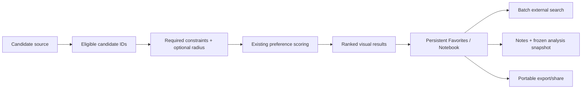

# Settlement favorites, import, notebook, and batch actions

## Status

Active product sub-spec; candidate-source, Favorites/notebook, batch external search, portable export/share, shared end-to-end acceptance, and a real Desktop headless JDBC/settings acceptance harness are implemented. Calibration-report tooling is implemented; representative dataset evidence and remaining native/manual Desktop/Android acceptance remain pending.

Parent specification: [`../spec-initial-functional-product.md`](../spec-initial-functional-product.md).

Architecture-hardening iterations 1–5 established the dependency direction, typed operational-failure policy, shared settings/package contracts, failure-safe dataset installation, shared analytical query ownership, and source-responsibility decomposition used by the completed candidate-source/notebook/export workflow. Further physical-module architecture gates remain active and will continue to be interleaved only between completed, testable product increments.

The bounded feature increments through portable export/share are implemented. Shared/runtime contracts parse and conservatively resolve imported settlement text, ranked analysis carries an imported stable-ID scope, and Desktop/Android dataset adapters restrict candidate retrieval in deterministic bounded batches. Wide Desktop adds paste/UTF-8 file import plus explicit review of ambiguous/non-exact matches, while application settings schema version 4 persists the reviewed dataset-scoped candidate source. Ranked result cards expose the existing numeric score as a 0–100 visual bar, candidate-relative advantage/compromise cues derived from the complete eligible set, and incomplete coverage. The earlier transient shortlist concept has been superseded by persistent dataset-scoped Favorites: application settings schema version 5 stores favorite settlements in a normalized table. Desktop can browse compact settlement/current-analysis context, select one or many available Favorites, select all, open/remove/clear entries, and explicitly replace/activate the imported candidate list from the selected Favorites before returning to ranked results. Android shares the persistence contract; polished Favorites UI remains Desktop-first. Settings schema version 6 adds optional notes plus one versioned frozen analysis snapshot per Favorite. A snapshot is captured when a ranked settlement is first saved and changes only through the explicit Update analysis snapshot action. Portable export now produces one deterministic ZIP containing a versioned JSON manifest and Markdown summary from the same shared notebook model; Desktop saves/reveals it and Android exposes the archive through the system share sheet.

The previously current [`desktop-analysis-workspace.md`](desktop-analysis-workspace.md) implementation is
substantially complete and remains verification-pending until strict country-scale scoring and the
remaining configured Desktop/Android acceptance checks are recorded. Moving the coding focus to this
sub-spec does not mark that work or the parent umbrella specification as accepted.

## Goal

Turn ranked analysis into a practical settlement research workflow in which a user can:

1. obtain a candidate set either from the existing dataset-wide filters or from an explicitly imported
   list of settlement names;
2. understand the ranked candidates visually without opening full details for every row;
3. save interesting ranked settlements directly into an application-owned Favorites/Notebook collection;
4. browse and remove saved settlements independently from the current candidate source and current ranking;
5. preserve frozen analysis assumptions and optional notes on saved entries;
6. export/share the saved notebook in a portable form;
7. launch explicit external searches for several saved settlements without copying names one by one.

The implementation must reuse the existing deterministic preference engine. This increment does not
introduce TOPSIS, opaque machine-learned ranking, hidden composite scores, or a second scoring formula.

## Relationship to the existing analysis workspace

The current runtime already has the essential analytical foundation:

- generic dataset-provided preference defaults;
- user overrides for `enabled`, `target`, `limit`, and `weight`;
- linear `LOWER`/`HIGHER` normalized quality;
- weighted overall score and explicit weighted data coverage;
- deterministic rank-before-limit analysis;
- generic Required hard constraints;
- multilingual settlement aliases and deterministic lookup;
- application-owned settings SQLite;
- dynamic external-search providers;
- a map-first Desktop analysis workspace with linked ranked results and map selection.

This sub-spec therefore extends the workflow around the current `SettlementAnalysisService` and
`AnalysisWorkspaceController` rather than replacing them. The parent umbrella originally treated
favorites/notes as non-goals for its minimum accepted vertical slice; this is a deliberate follow-up
increment while that umbrella remains active and does not retroactively enlarge the parent acceptance
gate.

A useful conceptual split is:



## Product model

### Candidate source

The analysis workspace gains an explicit candidate-source concept.

Initial modes:

- **Dataset** — current behavior: analyze settlements eligible under the normal Required/radius search;
- **Imported list** — restrict analysis to settlement IDs resolved from user-supplied settlement names,
  then apply the same Required/radius and Preferences semantics to that bounded set.

The imported set is an identity constraint, not a numeric `SearchCondition`. It must not be represented
as a fake metric or encoded into generated dataset SQLite.

A future saved notebook or named collection may become another candidate source, but that is not
required by this increment.

### Favorites / notebook versus candidate source

The imported candidate list and Favorites/Notebook are different product concepts:

- **Candidate source** is an input boundary: it limits which settlements are considered by Required/radius/ranking.
- **Favorites / Notebook** is persistent user-owned output: it collects interesting settlements found during research for later browsing, comparison, external search, export, notes, and re-analysis.

Adding/removing a favorite must never change candidate source, filters, ranking inputs, or the single details/map selection. The existing single selected settlement remains the details/map focus. Desktop provides an explicit user action that copies the currently selected available Favorites into the retained imported candidate list by stable settlement ID, replaces any previous imported list, activates the imported source, and returns to ranked results. This explicit bridge is the only Favorites-to-candidate feedback loop in the current workflow; Favorites never affect analysis automatically.

### Saved analysis snapshot

When a settlement is saved to the notebook, OsmapDigger must preserve enough information to explain
why it was saved even if the user later changes current preferences.

The snapshot should include at least:

- dataset ID;
- stable settlement ID;
- display name at save time;
- score and weighted data coverage when available;
- effective Required conditions that participated in the analysis;
- effective enabled preference parameters: metric ID, direction, target, limit, and weight;
- raw values/contribution state for the participating preferences when available.

The snapshot is frozen by default. Changing current analysis weights must not silently rewrite saved
history. An explicit **Update analysis snapshot** action may replace a saved snapshot only when that settlement is present in the current ranked analysis result, so the replacement uses the current authoritative score/contributions rather than reconstructing them separately.

## Default scoring and calibration policy

### Reuse the current mathematical model

The current score remains authoritative:

```text
score = 100 * sum(weight * normalized_quality) / sum(known enabled weight)
```

with weighted coverage reported separately. `target` and `limit` define a piecewise-linear utility
curve, while `weight` expresses relative importance among enabled preferences whose values are known.

This is intentionally simpler and more explainable than TOPSIS for the initial product. TOPSIS or other
multi-criteria methods may be evaluated later only if a concrete limitation of the current model is
demonstrated with representative data.

### Meaning of weight

Weights are ordinal product/user preferences on the existing 1–10 scale. They are not probabilities,
percentages, or statistical confidence values.

A high weight means that a metric should contribute more to the user's overall preference score. A
requirement that must never be violated belongs in **Required**, not in an arbitrarily huge preference
weight.

### Product-default rationale

The checked-in `balanced-living` profile is the initial baseline. It is a product heuristic rather than
a claim of statistically optimal settlement quality.

Before changing its defaults, review them using these rules:

1. **Broad utility transition** — `target` is a clearly satisfactory value and `limit` is a clearly
   poor value; the range between them should avoid cliff-like behavior that belongs in Required.
2. **Direction must be defensible** — monotonic `LOWER` or `HIGHER` is used only where the metric has a
   reasonable monotonic interpretation over the configured range.
3. **Avoid accidental group dominance** — review the sum of enabled weights by conceptual metric group
   so a group does not dominate merely because it contains more generated metrics.
4. **Risk can be emphasized, not hidden** — environmental-risk distances may receive relatively high
   weights, while true exclusion rules should still be hard constraints.
5. **Missing data remains uncertainty** — unknown values do not become zero-quality; coverage exposes
   the incomplete evidence.
6. **Distribution sanity check** — for representative Andorra/Belarus packages, inspect metric
   distributions and ensure configured target/limit values are not so extreme that nearly every
   settlement saturates at `0` or `1`.

Automatic percentile-derived targets are not required for the first implementation. Fixed product
thresholds are easier to explain across datasets; empirical distribution checks are validation evidence,
not hidden runtime adaptation.

Belarus calibration evidence recorded on a generated package with 22,771 settlements found that the original `forest.distance_km` default (`target = 1 km`, `limit = 10 km`) saturated at full quality for 93.9% of settlements, while the other enabled Preferences retained materially broader transition ranges. The checked-in baseline therefore tightens only the forest default to `target = 0.25 km` and `limit = 3 km`, keeping weight 8 and leaving all other Preference defaults unchanged. This is a bounded product-default adjustment based on representative generated data, not a percentile-derived runtime rule.

## Requirements

### SS-R1 — one authoritative scoring engine

The Favorites/notebook workflow must consume the existing shared deterministic score/contribution models.

No parallel scoring implementation may be introduced in UI, notebook persistence, export, or external
search code. A saved score is a snapshot of the authoritative analysis result, not a separately
recalculated presentation value.

### SS-R2 — explicit candidate-source contract

Shared application state must represent whether ranked analysis currently uses the normal dataset
candidate universe or an imported explicit settlement set.

The imported source must resolve to stable settlement IDs before ranked analysis. Candidate source is
orthogonal to Required constraints and Preferences.

### SS-R3 — simple deterministic settlement-list import

The first import format should intentionally be simple:

- UTF-8 plain text;
- one settlement name per non-blank line;
- leading/trailing whitespace ignored;
- duplicate normalized input lines collapsed while preserving first occurrence order.

Desktop should support file import and paste; Android should support document/text import when wired to
this workflow. CSV column mapping, spreadsheets, arbitrary encodings, and address geocoding are not
required initially.

Bulk resolution must reuse the dataset settlement alias index. Automatic resolution is conservative:

- one exact normalized alias match -> resolved;
- no exact match -> unresolved with ranked suggestions available for user correction;
- multiple exact matches -> ambiguous and requires explicit user choice;
- when a center and positive radius are active, exact alternatives and non-exact suggestions shown
  during import review are limited to settlements inside that same radius using shared Haversine
  semantics;
- an ambiguous exact-name row may select one, several, or all displayed settlements.

Fuzzy matching may generate suggestions but must not silently assign an imported name to a settlement.
The reviewed analytical result is a deterministic ordered set of stable settlement IDs. The imported
source text is retained only as editing provenance so **Edit list** reopens the user's previous lines;
it never becomes settlement identity. Import activation is independent from retention: users can
disable the imported restriction and analyze the full dataset with Required/Preferences, then re-enable
the retained reviewed IDs without resolving names again. Clearing the saved import removes both the
retained text/IDs and the active restriction. The candidate-source payload remains dataset-scoped so an
application restart cannot silently broaden an active imported analysis back to the whole dataset.

### SS-R4 — candidate restriction must scale without N+1 lookup

Imported candidate analysis must not perform `details()` once per imported name or once per candidate.

The repository/analysis boundary should support restricting batch analysis by a settlement-ID set before
or during candidate retrieval. Large ID sets must be handled deterministically without assuming one
unbounded SQLite `IN` list fits every platform limit.

Shared Kotlin continues to own exact radius filtering, scoring, coverage, stable ranking, and final
result limiting.

### SS-R5 — visual ranked-result affordances

The ranked list should become easier to scan while staying compact. Each ordinary result should expose:

- settlement display name;
- numeric score when available;
- a horizontal score indicator on the same 0–100 scale;
- coverage when incomplete;
- an explicit reason when score is unavailable because all enabled Preference values are missing, with the missing criteria discoverable by name;
- compact comparative cues that identify a Preference where the settlement is materially better or worse than the current eligible-candidate average when space allows;
- persistent favorite state.

The numeric value must remain available; color alone must never carry score or coverage meaning.

The first increment does not require statistical charts, scatter plots, radar charts, heatmaps, or
spatial clustering. Those may be evaluated after the favorites/notebook workflow is usable.

### SS-R6 — persistent favorites collection and explicit re-analysis bridge

Users must be able to add/remove ranked settlements directly from a persistent dataset-scoped Favorites collection without changing the single settlement selected for map/details focus or the current candidate source.

The initial Favorites entry uses stable `(datasetId, settlementId)` identity and stores the settlement display/canonical name at save time plus an insertion timestamp for deterministic presentation. Duplicate additions are idempotent. Desktop must provide a Favorites view with compact settlement/current-analysis context plus browse/open/remove/clear actions.

Favorites checkbox selection is transient UI state, separate from persistent membership and from the single current map/details settlement. Users must be able to select individual available entries, select all available entries, and clear the current checkbox selection. Clicking an available Favorite's analytical content must instead select/highlight that settlement through the existing shared map/details selection path without changing its checkbox state or closing Favorites; repeating that action for the already selected settlement must issue a fresh map-focus request so manual map panning cannot make the selection action appear inert. Ranked-result activation follows the same repeat-focus contract. **Open** may close Favorites and return to the normal details workflow. A saved entry whose stable ID is unavailable in the current dataset remains visible/removable but cannot be selected for current re-analysis.

An explicit **Copy selected to import list** action must transfer selected stable settlement IDs directly without name resolution, replace the retained imported list, activate `SettlementCandidateScope.Imported`, close the Favorites view, and return the Desktop sidebar to ranked results. The generated import source text is editing provenance only; stable IDs remain authoritative. Existing Required, Preferences, center, and radius state are preserved and continue to apply through the normal analysis pipeline.

Changing filters/preferences or imported candidate source may remove a favorite from the visible top-N ranked results; that must not delete the persistent favorite. The analysis pipeline ranks every eligible settlement before applying the visible result limit, so Favorites should retain the current rank/score/coverage for eligible settlements even when their rank falls below that limit. Only settlements excluded by Required/radius/candidate-source eligibility lack a current rank. Merely selecting Favorites must not trigger analysis until the explicit copy action is invoked.

### SS-R7 — notebook enrichment and analysis snapshots

Favorites/notebook state belongs in the application settings database, never in generated `georisk.sqlite`. The initial normalized `favorite_settlement` table is the persistent foundation and uses `(dataset_id, settlement_id)` as its primary key.

The implemented notebook-enrichment increment adds:

- optional user note stored on the normalized Favorite row;
- one frozen versioned analysis snapshot stored in a separate `favorite_analysis_snapshot` row;
- compact Desktop presentation of saved score/coverage, search area, Required criteria, and preference contribution context.

Snapshot internals remain versioned and replaceable without turning the growing notebook into one large JSON cell. Multiple historical snapshots per settlement are a future extension. Names are presentation/snapshot data, not identity fallback.

### SS-R8 — explicit snapshot refresh

Current preference changes must not mutate saved notebook snapshots automatically.

When the saved settlement participates in the complete current eligible ranking, the UI offers **Update analysis snapshot**, even if that settlement is below the visible top-N result limit. The replacement is explicit and uses the current authoritative analysis parameters, score, coverage, and contribution values. Merely changing current filters/preferences never mutates the stored snapshot.

If the dataset or settlement is unavailable, the historical notebook entry remains exportable rather
than being reassigned by name.

### SS-R9 — portable deterministic export

The Favorites/notebook collection must support a portable export that is useful outside OsmapDigger.

The first export should be one portable archive, for example `osmapdigger-favorites.zip`, containing:

- one machine-readable versioned JSON manifest with stable IDs, names, notes, score/coverage, and
  snapshot criteria;
- one human-readable summary, preferably Markdown, generated from the same model.

A single archive is easier to attach to mail/chat applications than several unrelated files. Export
ordering and archive contents must be deterministic for the same notebook state. Generated export must not contain
local filesystem paths, raw PBF information, or unrelated application settings.

Platform sharing is an adapter concern:

- Android should be able to expose the generated artifact through the normal system share flow;
- Desktop must at least support saving the export file and revealing/opening its location; direct
  Telegram/email-specific integrations are not required.

### SS-R10 — multi-settlement external search

The user must be able to invoke an external search for the current Favorites selection/collection without copying each
settlement name manually.

Batch search must reuse the configured `ExternalSearchProvider` catalog and remain an explicit user
action. Shared URL/query generation may combine names into a query such as quoted alternatives and may
split a large Favorites selection into several bounded query actions when the encoded URL would become too long.
For generic web search, quoted names joined with `OR` are preferable to blindly joining names with
spaces because ordinary spaces commonly mean that every settlement name must occur in the same result;
the provider template still owns any site restriction such as the current Kufar-oriented query. Provider-specific additional query terms are application-owned settings. The settings UI must expose the effective terms directly as editable text per provider: clearing a field means no extra terms, while **Set defaults** copies the dataset `property_search_terms` into the provider fields. Legacy null values may still resolve to dataset terms for compatibility. Single-settlement and batch builders must resolve the stored value identically.

The implementation must not automatically open many browser tabs. The UI should present the generated
batch query actions and let the user open each one explicitly.

Providers whose URL template cannot safely express a combined `{query}` are simply unavailable for the
batch action; no provider-specific branches should be added to shared UI.

### SS-R11 — external search remains discovery, not ingestion

Batch external search must preserve the existing boundary:

- no scraping;
- no embedded property-listing database;
- no background network requests;
- no automatic browser action during ranking or import.

For Belarus, the existing Kufar-oriented provider can continue using a site-restricted web-search
query; this sub-spec does not hardcode Kufar behavior into application logic.

### SS-R12 — dataset and language compatibility

Imported names may use any aliases stored in `settlement_name`; resolution identity is stable settlement
ID, not current UI language.

Notebook/export presentation should prefer the current localized settlement name when the opened dataset
provides it while retaining the saved display name in the historical snapshot.

The runtime remains country-agnostic.

### SS-R13 — no generated-format change for notebook/import state

Candidate lists, Favorites/notebook state, notes, snapshots, and exports are user-owned data. They must not add
columns/tables to generated dataset SQLite and must not increment `geo-format/VERSION`.

A generated-format change is needed only if a later feature requires new analytical evidence not
already available through current metric definitions/values.

### SS-R14 — current dataset rebuild expectations

This sub-spec itself does not require new Python-generated metrics or a new builder schema.

Andorra/Belarus packages only need regeneration when the developer's local package predates the current
repository's already-existing preference-default/Beach configuration or when product-default thresholds
are deliberately changed during calibration.

For analytical validation, prefer data-only rebuilds first. A full PMTiles rebuild is only required
when full map/package acceptance is being exercised or map inputs changed.

### SS-R15 — Desktop-first UI, reusable shared contracts

The first complete presentation may be Desktop-first because the existing map-first analysis workspace
is already Desktop-specific.

Shared Kotlin should still own:

- candidate-source models;
- import parsing/resolution state that is platform-neutral;
- Favorites/notebook models;
- snapshot/export model construction;
- batch external-search query construction.

Desktop/Android own file pickers, SQLite adapters, share/save OS integration, and lifecycle.

### SS-R16 — deterministic and offline testability

Default automated tests must cover the new logic without network access, external portals, production
PBF data, or map rendering.

At minimum test:

- import normalization/deduplication;
- exact/ambiguous/unresolved alias resolution;
- candidate-ID restriction before scoring;
- favorite state independent from candidate source and details selection;
- Favorites multi-selection/select-all plus direct stable-ID transfer into an activated imported candidate scope;
- unavailable saved Favorites excluded from current re-analysis transfer without losing the historical entry;
- notebook snapshot encode/decode and schema migration;
- snapshot immutability under later current-preference changes;
- explicit snapshot refresh;
- deterministic export ordering/content;
- batch external-search URL encoding/chunking;
- dataset mismatch/stale settlement handling.

## Scenarios

### SS-S1 — filter, rank, and save favorites

A user analyzes the current dataset with Required constraints and weighted Preferences. Results show
score bars and coverage. The user marks several promising settlements as Favorites while opening only one of them in the map/details pane. The saved settlements remain available after filters or candidate source change.

The user may then select several available Favorites and explicitly copy them to the imported candidate list. The previous import is replaced, the imported source becomes active, and the ranked-results list reopens using the same Required/radius/Preferences semantics.

Exercises: SS-R1, SS-R5, SS-R6.

### SS-S2 — import a hand-curated settlement list

The user imports a text file containing settlement names collected elsewhere. Exact unique aliases are
resolved automatically; ambiguous and unresolved rows are reviewed. Ranked analysis then considers only
the resolved settlement IDs while reusing current Required/radius/Preference semantics.

Exercises: SS-R2, SS-R3, SS-R4, SS-R12.

### SS-S3 — save a promising settlement

The user enriches an already saved favorite with a note and frozen analysis snapshot. The notebook preserves its score, coverage, active
criteria, weights, and contributions as they were at save time. Later the user changes the current
forest and medical weights; the saved snapshot remains unchanged.

Exercises: SS-R7, SS-R8.

### SS-S4 — refresh a saved analysis

The user explicitly chooses **Update snapshot** for a notebook settlement after changing current
preferences. The entry is recomputed from the current dataset and current analytical assumptions only
after that action.

Exercises: SS-R8.

### SS-S5 — batch property discovery

The user has several Belarus settlements in Favorites and opens **External search**. The UI offers a Kufar-
oriented site-search batch query containing the favorite settlement names and splits it into multiple explicit
actions only if necessary for bounded URLs.

Exercises: SS-R10, SS-R11.

### SS-S6 — share the notebook

The user exports Favorites/notebook entries. OsmapDigger writes one deterministic ZIP bundle containing a versioned
JSON manifest plus a human-readable summary from the same notebook model. Android can pass the archive
to the system share sheet; Desktop can save and reveal the file for attachment to mail/chat applications.

Exercises: SS-R9, SS-R15.

### SS-S7 — rebuilt dataset no longer contains a saved settlement

A notebook entry references a settlement ID absent from the currently opened rebuilt dataset. OsmapDigger
does not resolve it by name to another settlement. The frozen historical entry remains visible/exportable,
while snapshot refresh is unavailable until stable identity can be resolved.

Exercises: SS-R7, SS-R8, SS-R12.

## Non-goals

This increment does not require:

- replacing the current weighted-average scoring formula with TOPSIS/AHP/ML;
- automatically learning user weights;
- cloud sync/accounts;
- scraping or importing property listings;
- background external searches;
- direct Telegram/Gmail/Outlook integrations;
- arbitrary spreadsheet import or geocoding free-form addresses;
- named saved search profiles/history;
- full multi-settlement comparison dashboards;
- radar charts, statistical clustering, map heatmaps, or GIS cluster analysis;
- new environmental data sources;
- changing generated dataset format solely for user-owned notebook data.

## Design constraints

- Keep the current deterministic scoring contract authoritative.
- Keep Required eligibility distinct from Preferences ranking.
- Keep imported candidate identity distinct from numeric metric conditions.
- Stable IDs are authoritative across persistence boundaries.
- Missing metric data remains unknown and is represented through coverage/explanation.
- User-owned notebook/export data stays outside read-only generated datasets.
- Shared code does not own filesystem, browser, Android intent, JDBC, or Android SQLite APIs.
- Batch actions are explicit and bounded; no hidden network/background behavior.
- Avoid provider/country-specific branches in shared UI.
- Prefer simple visual indicators before introducing complex charts.

## Compatibility / migration

The generated dataset contract does not change in the first implementation.

The application settings database remains independent from `geo-format` and uses one shared semantic schema owner executed by both platforms. Candidate-source persistence uses schema version 4 with `candidate_scope_json`. Persistent Favorites use coordinated settings schema version 5 with normalized `favorite_settlement`. Notebook enrichment uses settings schema version 6: `note_text` is additive on `favorite_settlement` and `favorite_analysis_snapshot` stores one versioned snapshot JSON row per stable `(dataset_id, settlement_id)`. Provider-specific external-search terms use settings schema version 7 through nullable `external_search_provider.query_terms_override`; null inherits dataset terms, empty suppresses extra terms, and non-empty text replaces them. This does not change `geo-format` or require dataset regeneration.

A notebook snapshot/export payload must include its own explicit payload version so later additive or
incompatible fields can be handled without coupling file format evolution to the SQLite schema version.

## Validation

Acceptance requires all of the following:

1. Shared tests prove existing scoring results are unchanged by Favorites/notebook additions.
2. Imported candidate lists resolve stable IDs deterministically, never auto-select fuzzy/ambiguous
   matches, restrict review alternatives to the active center/radius when present, and support explicit
   multi/select-all for duplicate exact names.
3. Ranked analysis of an imported set considers no settlement outside the resolved candidate IDs.
4. Candidate restriction uses batch repository access and has no per-candidate details hydration.
5. Desktop visually exposes score/coverage plus persistent Favorites without conflating favorite membership, candidate source, and details selection.
6. Notebook persistence round-trips on Desktop and Android adapters with a coordinated settings schema
   migration.
7. Saved snapshots do not silently change after current preference edits.
8. Explicit snapshot refresh updates only resolvable requested entries.
9. Export content is deterministic, versioned, and free from private/local implementation paths.
10. Batch external-search generation encodes non-Latin settlement names correctly, bounds URL size,
    and never opens multiple queries without explicit user actions.
11. Android/shared compile tests remain green even if the initial polished presentation is Desktop-first.
12. `make check` remains network-free.
13. Configured Gradle tests pass where the toolchain is available.
14. When local packages are stale, rebuild Andorra/Belarus with the current checked-in preference
    profile and record the distribution sanity check before changing default thresholds/weights.
15. A focused shared acceptance fixture covers the cross-feature shortlist contract from reviewed import through ranking, explanation, snapshot/re-analysis bridge, batch search, and deterministic export without replacing platform/manual checks.
16. Stable implementation knowledge is moved into owning implementation/configuration/usage/test docs
    after acceptance before this sub-spec is archived.

## Implementation tasks

Implement in small increments:

1. **Implemented: Candidate-source core** — immutable candidate-scope/import models, conservative bulk alias resolution, repository candidate-ID restriction, bounded stable-ID batching, and focused shared/Desktop tests. The core is wired into `AnalysisWorkspaceController` as transient state, but no user-facing import control or persistence is enabled yet.
2. **Implemented: Candidate-source workflow** — Desktop paste/file import and full-sidebar review UI connect explicit reviewed matches to the shared stable-ID scope; active center/radius bounds the review alternatives, ambiguous exact matches support multi/select-all, the previous source text reopens for editing, and import can be disabled/re-enabled independently from deleting the retained list. Application settings schema version 4 keeps the same SQLite column while candidate-source payload version 2 stores active source plus retained reviewed IDs/source text; restore drops stale IDs without broadening an active import. The same shared contracts remain available for later Android document/text integration.
3. **Implemented: Visual ranked affordances** — Desktop ranked cards keep the numeric score and add a 0–100 score bar, incomplete-coverage text, and deterministic candidate-relative advantage/compromise cues. The absolute score remains unchanged; explanation compares each known Preference quality with the mean quality across all current eligible candidates before the visible top-N limit. The experimental transient `SettlementShortlist` layer was removed after clarifying that the user collection is persistent Favorites rather than another analysis-input loop.
4. **Implemented: Persistent Favorites foundation and re-analysis bridge** — add shared `FavoriteSettlementRepository`, settings schema version 5 with normalized `favorite_settlement`, Desktop/Android SQLite adapters, persistent result-card toggles, and a Desktop Favorites pane with compact current context plus browse/open/remove/clear. Favorites selection is transient; individual/select-all actions can explicitly replace and activate the imported stable-ID candidate list and return to ranked results without re-resolving names. Favorites otherwise remain output state and never change candidate source or trigger recalculation.
5. **Implemented: Notebook enrichment** — settings schema version 6 adds optional notes and a separate one-row versioned frozen analysis snapshot per Favorite. Saving a ranked settlement captures current score/coverage, effective Required criteria, enabled Preferences and contributions; later analysis edits do not mutate it, while explicit Update analysis snapshot replaces it from the current ranked result. Desktop Favorites show the saved context compactly and allow inline note editing.
6. **Implemented: Batch external search** — selected available Favorites reuse current localized settlement names and the configured provider catalog to build quoted `OR` queries. Shared construction is deterministic, UTF-8 percent-encoded, and greedily chunked under a conservative final-URL bound; providers that require a `{settlement}` placeholder are not offered for batch search. Desktop shows each generated provider/chunk action explicitly and opens only the action the user clicks. Provider-specific search-term settings are persisted in application settings schema v7 and are shared by single and batch URL generation; an explicit empty override supports site-restricted queries without generic dataset terms.
7. **Implemented: Export/share** — shared code builds one deterministic versioned Favorites export model with current localized names when available, saved historical names, notes, and frozen snapshot criteria. Platform adapters package the fixed `favorites.json` + `favorites.md` entries into a reproducible ZIP; Desktop saves it through a file chooser and reveals the result, while Android writes a cache-scoped archive and exposes it through `FileProvider` to the system share sheet. Unavailable/stale Favorites remain exportable because export covers the whole notebook rather than only transient checkbox selection.
8. **Calibration validation tooling implemented; Belarus evidence recorded** — `scripts/preference_calibration_report.py` reads the published runtime SQLite contract, reports enabled group weights, metric known-value/percentile and endpoint-saturation distributions, and overall score/coverage percentiles without changing runtime scoring or defaults. A representative Belarus report over 22,771 settlements showed 93.9% full-quality saturation for the original forest default; the checked-in `forest.distance_km` baseline is therefore tightened from `1/10 km` to `0.25/3 km`, with all other Preference defaults and weights unchanged. Rebuild Belarus and rerun the report to confirm the revised distribution; representative Andorra evidence and final acceptance remain pending.
9. **Acceptance/documentation in progress** — a deterministic shared fixture exercises the cross-feature shortlist contract, and a Desktop headless fixture now repeats the application workflow through real JDBC plus the real settings/Favorites SQLite adapters, including restart persistence and portable ZIP verification. Representative real-dataset checks plus native/manual map/browser/share/layout acceptance still need to be recorded before this sub-spec is archived.
