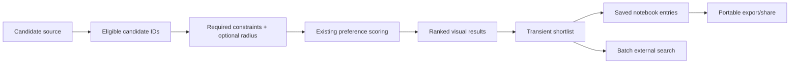

# Settlement shortlist, import, notebook, and batch actions

## Status

Active implementation sub-spec.

Parent specification: [`../spec-initial-functional-product.md`](../spec-initial-functional-product.md).

The previously current [`desktop-analysis-workspace.md`](desktop-analysis-workspace.md) implementation is
substantially complete and remains verification-pending until strict country-scale scoring and the
remaining configured Desktop/Android acceptance checks are recorded. Moving the coding focus to this
sub-spec does not mark that work or the parent umbrella specification as accepted.

## Goal

Turn ranked analysis into a practical settlement research workflow in which a user can:

1. obtain a candidate set either from the existing dataset-wide filters or from an explicitly imported
   list of settlement names;
2. understand the ranked candidates visually without opening full details for every row;
3. select several interesting settlements into a transient shortlist;
4. save chosen settlements into an application-owned notebook together with the analysis assumptions
   that produced the saved score;
5. export/share the saved shortlist in a portable form;
6. launch explicit external searches for several shortlisted settlements without copying names one by
   one.

The implementation must reuse the existing deterministic preference engine. This increment does not
introduce TOPSIS, opaque machine-learned ranking, hidden composite scores, or a second scoring formula.

## Relationship to the existing analysis workspace

The current runtime already has the essential analytical foundation:

- generic dataset-provided preference defaults;
- user overrides for `enabled`, `target`, `limit`, and `weight`;
- linear `LOWER`/`HIGHER` normalized quality;
- weighted overall score and explicit weighted data coverage;
- deterministic rank-before-limit analysis;
- generic Required hard constraints;
- multilingual settlement aliases and deterministic lookup;
- application-owned settings SQLite;
- dynamic external-search providers;
- a map-first Desktop analysis workspace with linked ranked results and map selection.

This sub-spec therefore extends the workflow around the current `SettlementAnalysisService` and
`AnalysisWorkspaceController` rather than replacing them. The parent umbrella originally treated
favorites/notes as non-goals for its minimum accepted vertical slice; this is a deliberate follow-up
increment while that umbrella remains active and does not retroactively enlarge the parent acceptance
gate.

A useful conceptual split is:



## Product model

### Candidate source

The analysis workspace gains an explicit candidate-source concept.

Initial modes:

- **Dataset** — current behavior: analyze settlements eligible under the normal Required/radius search;
- **Imported list** — restrict analysis to settlement IDs resolved from user-supplied settlement names,
  then apply the same Required/radius and Preferences semantics to that bounded set.

The imported set is an identity constraint, not a numeric `SearchCondition`. It must not be represented
as a fake metric or encoded into generated dataset SQLite.

A future saved notebook or named collection may become another candidate source, but that is not
required by this increment.

### Shortlist versus notebook

Two concepts must remain distinct:

- **Shortlist** — transient multi-selection in the current analysis session, used for batch actions;
- **Notebook** — persisted user-owned settlements with optional notes and a frozen analysis snapshot.

The existing single selected settlement remains the details/map focus. Multi-selection must not turn
map/detail selection into an ambiguous set-valued state.

### Saved analysis snapshot

When a settlement is saved to the notebook, OsmapDigger must preserve enough information to explain
why it was saved even if the user later changes current preferences.

The snapshot should include at least:

- dataset ID;
- stable settlement ID;
- display name at save time;
- score and weighted data coverage when available;
- effective Required conditions that participated in the analysis;
- effective enabled preference parameters: metric ID, direction, target, limit, and weight;
- raw values/contribution state for the participating preferences when available.

The snapshot is frozen by default. Changing current analysis weights must not silently rewrite saved
history. A later explicit **Update snapshot** action may replace a saved snapshot using current
analysis state.

## Default scoring and calibration policy

### Reuse the current mathematical model

The current score remains authoritative:

```text
score = 100 * sum(weight * normalized_quality) / sum(known enabled weight)
```

with weighted coverage reported separately. `target` and `limit` define a piecewise-linear utility
curve, while `weight` expresses relative importance among enabled preferences whose values are known.

This is intentionally simpler and more explainable than TOPSIS for the initial product. TOPSIS or other
multi-criteria methods may be evaluated later only if a concrete limitation of the current model is
demonstrated with representative data.

### Meaning of weight

Weights are ordinal product/user preferences on the existing 1–10 scale. They are not probabilities,
percentages, or statistical confidence values.

A high weight means that a metric should contribute more to the user's overall preference score. A
requirement that must never be violated belongs in **Required**, not in an arbitrarily huge preference
weight.

### Product-default rationale

The checked-in `balanced-living` profile is the initial baseline. It is a product heuristic rather than
a claim of statistically optimal settlement quality.

Before changing its defaults, review them using these rules:

1. **Broad utility transition** — `target` is a clearly satisfactory value and `limit` is a clearly
   poor value; the range between them should avoid cliff-like behavior that belongs in Required.
2. **Direction must be defensible** — monotonic `LOWER` or `HIGHER` is used only where the metric has a
   reasonable monotonic interpretation over the configured range.
3. **Avoid accidental group dominance** — review the sum of enabled weights by conceptual metric group
   so a group does not dominate merely because it contains more generated metrics.
4. **Risk can be emphasized, not hidden** — environmental-risk distances may receive relatively high
   weights, while true exclusion rules should still be hard constraints.
5. **Missing data remains uncertainty** — unknown values do not become zero-quality; coverage exposes
   the incomplete evidence.
6. **Distribution sanity check** — for representative Andorra/Belarus packages, inspect metric
   distributions and ensure configured target/limit values are not so extreme that nearly every
   settlement saturates at `0` or `1`.

Automatic percentile-derived targets are not required for the first implementation. Fixed product
thresholds are easier to explain across datasets; empirical distribution checks are validation evidence,
not hidden runtime adaptation.

## Requirements

### SS-R1 — one authoritative scoring engine

The shortlist workflow must consume the existing shared deterministic score/contribution models.

No parallel scoring implementation may be introduced in UI, notebook persistence, export, or external
search code. A saved score is a snapshot of the authoritative analysis result, not a separately
recalculated presentation value.

### SS-R2 — explicit candidate-source contract

Shared application state must represent whether ranked analysis currently uses the normal dataset
candidate universe or an imported explicit settlement set.

The imported source must resolve to stable settlement IDs before ranked analysis. Candidate source is
orthogonal to Required constraints and Preferences.

### SS-R3 — simple deterministic settlement-list import

The first import format should intentionally be simple:

- UTF-8 plain text;
- one settlement name per non-blank line;
- leading/trailing whitespace ignored;
- duplicate normalized input lines collapsed while preserving first occurrence order.

Desktop should support file import and paste; Android should support document/text import when wired to
this workflow. CSV column mapping, spreadsheets, arbitrary encodings, and address geocoding are not
required initially.

Bulk resolution must reuse the dataset settlement alias index. Automatic resolution is conservative:

- one exact normalized alias match -> resolved;
- no exact match -> unresolved with ranked suggestions available for user correction;
- multiple exact matches -> ambiguous and requires explicit user choice.

Fuzzy matching may generate suggestions but must not silently assign an imported name to a settlement.
The reviewed result is a deterministic ordered set of stable settlement IDs. The resolved imported
candidate scope should be persisted as part of the current dataset-scoped analysis context so an
application restart cannot silently broaden the analysis back to the whole dataset. Raw unresolved
input lines do not need to persist after the review flow is completed.

### SS-R4 — candidate restriction must scale without N+1 lookup

Imported candidate analysis must not perform `details()` once per imported name or once per candidate.

The repository/analysis boundary should support restricting batch analysis by a settlement-ID set before
or during candidate retrieval. Large ID sets must be handled deterministically without assuming one
unbounded SQLite `IN` list fits every platform limit.

Shared Kotlin continues to own exact radius filtering, scoring, coverage, stable ranking, and final
result limiting.

### SS-R5 — visual ranked-result affordances

The ranked list should become easier to scan while staying compact. Each ordinary result should expose:

- settlement display name;
- numeric score when available;
- a horizontal score indicator on the same 0–100 scale;
- coverage when incomplete;
- compact contribution cues for a small number of strongest/weakest active preferences when space
  allows;
- shortlist state.

The numeric value must remain available; color alone must never carry score or coverage meaning.

The first increment does not require statistical charts, scatter plots, radar charts, heatmaps, or
spatial clustering. Those may be evaluated after the shortlist workflow is usable.

### SS-R6 — transient multi-selection

Users must be able to add/remove ranked settlements from a transient shortlist without changing the
single settlement selected for map/details focus.

Shortlist order should follow current ranked order for analysis actions. Explicit user ordering is not
required initially.

Changing filters/preferences may remove a shortlisted settlement from the current ranked result set;
that must not silently delete an already saved notebook entry.

### SS-R7 — application-owned notebook persistence

Notebook state belongs in the application settings database, never in generated `georisk.sqlite`.

Shared code should define immutable notebook models and a small repository contract. Desktop and Android
settings database owners must migrate their own schema together and remain the only owners of
`PRAGMA user_version`/Android database version.

A notebook entry must use `(datasetId, settlementId)` as stable geographic identity and support at
least:

- optional user note;
- frozen versioned analysis snapshot;
- deterministic persisted ordering.

A recommended first physical shape is one application-settings row per saved settlement with
`dataset_id`, `settlement_id`, `sort_order`, optional `note`, and `snapshot_json`, using
`(dataset_id, settlement_id)` as the primary key. This avoids turning a growing notebook into one large
JSON cell while keeping snapshot internals versioned and replaceable. Multiple historical snapshots
per settlement are a future extension.

Names are presentation/snapshot data, not identity fallback.

### SS-R8 — explicit snapshot refresh

Current preference changes must not mutate saved notebook snapshots automatically.

When the currently opened dataset can resolve the saved settlement, the UI may offer **Update snapshot**
for one or more entries. The replacement must be explicit and use the current authoritative analysis
parameters/metric values.

If the dataset or settlement is unavailable, the historical notebook entry remains exportable rather
than being reassigned by name.

### SS-R9 — portable deterministic export

The notebook/shortlist must support a portable export that is useful outside OsmapDigger.

The first export should be one portable archive, for example `osmapdigger-shortlist.zip`, containing:

- one machine-readable versioned JSON manifest with stable IDs, names, notes, score/coverage, and
  snapshot criteria;
- one human-readable summary, preferably Markdown, generated from the same model.

A single archive is easier to attach to mail/chat applications than several unrelated files. Export
ordering and archive contents must be deterministic for the same notebook state. Generated export must not contain
local filesystem paths, raw PBF information, or unrelated application settings.

Platform sharing is an adapter concern:

- Android should be able to expose the generated artifact through the normal system share flow;
- Desktop must at least support saving the export file and revealing/opening its location; direct
  Telegram/email-specific integrations are not required.

### SS-R10 — multi-settlement external search

The user must be able to invoke an external search for the current shortlist without copying each
settlement name manually.

Batch search must reuse the configured `ExternalSearchProvider` catalog and remain an explicit user
action. Shared URL/query generation may combine names into a query such as quoted alternatives and may
split a large shortlist into several bounded query actions when the encoded URL would become too long.
For generic web search, quoted names joined with `OR` are preferable to blindly joining names with
spaces because ordinary spaces commonly mean that every settlement name must occur in the same result;
the provider template still owns any site restriction such as the current Kufar-oriented query.

The implementation must not automatically open many browser tabs. The UI should present the generated
batch query actions and let the user open each one explicitly.

Providers whose URL template cannot safely express a combined `{query}` are simply unavailable for the
batch action; no provider-specific branches should be added to shared UI.

### SS-R11 — external search remains discovery, not ingestion

Batch external search must preserve the existing boundary:

- no scraping;
- no embedded property-listing database;
- no background network requests;
- no automatic browser action during ranking or import.

For Belarus, the existing Kufar-oriented provider can continue using a site-restricted web-search
query; this sub-spec does not hardcode Kufar behavior into application logic.

### SS-R12 — dataset and language compatibility

Imported names may use any aliases stored in `settlement_name`; resolution identity is stable settlement
ID, not current UI language.

Notebook/export presentation should prefer the current localized settlement name when the opened dataset
provides it while retaining the saved display name in the historical snapshot.

The runtime remains country-agnostic.

### SS-R13 — no generated-format change for notebook/import state

Candidate lists, shortlist state, notes, snapshots, and exports are user-owned data. They must not add
columns/tables to generated dataset SQLite and must not increment `geo-format/VERSION`.

A generated-format change is needed only if a later feature requires new analytical evidence not
already available through current metric definitions/values.

### SS-R14 — current dataset rebuild expectations

This sub-spec itself does not require new Python-generated metrics or a new builder schema.

Andorra/Belarus packages only need regeneration when the developer's local package predates the current
repository's already-existing preference-default/Beach configuration or when product-default thresholds
are deliberately changed during calibration.

For analytical validation, prefer data-only rebuilds first. A full PMTiles rebuild is only required
when full map/package acceptance is being exercised or map inputs changed.

### SS-R15 — Desktop-first UI, reusable shared contracts

The first complete presentation may be Desktop-first because the existing map-first analysis workspace
is already Desktop-specific.

Shared Kotlin should still own:

- candidate-source models;
- import parsing/resolution state that is platform-neutral;
- shortlist/notebook models;
- snapshot/export model construction;
- batch external-search query construction.

Desktop/Android own file pickers, SQLite adapters, share/save OS integration, and lifecycle.

### SS-R16 — deterministic and offline testability

Default automated tests must cover the new logic without network access, external portals, production
PBF data, or map rendering.

At minimum test:

- import normalization/deduplication;
- exact/ambiguous/unresolved alias resolution;
- candidate-ID restriction before scoring;
- shortlist state independent from details selection;
- notebook snapshot encode/decode and schema migration;
- snapshot immutability under later current-preference changes;
- explicit snapshot refresh;
- deterministic export ordering/content;
- batch external-search URL encoding/chunking;
- dataset mismatch/stale settlement handling.

## Scenarios

### SS-S1 — filter, rank, and shortlist

A user analyzes the current dataset with Required constraints and weighted Preferences. Results show
score bars and coverage. The user checks several promising settlements into the shortlist while opening
only one of them in the map/details pane.

Exercises: SS-R1, SS-R5, SS-R6.

### SS-S2 — import a hand-curated settlement list

The user imports a text file containing settlement names collected elsewhere. Exact unique aliases are
resolved automatically; ambiguous and unresolved rows are reviewed. Ranked analysis then considers only
the resolved settlement IDs while reusing current Required/radius/Preference semantics.

Exercises: SS-R2, SS-R3, SS-R4, SS-R12.

### SS-S3 — save a promising settlement

The user saves a shortlisted settlement with a note. The notebook preserves its score, coverage, active
criteria, weights, and contributions as they were at save time. Later the user changes the current
forest and medical weights; the saved snapshot remains unchanged.

Exercises: SS-R7, SS-R8.

### SS-S4 — refresh a saved analysis

The user explicitly chooses **Update snapshot** for a notebook settlement after changing current
preferences. The entry is recomputed from the current dataset and current analytical assumptions only
after that action.

Exercises: SS-R8.

### SS-S5 — batch property discovery

The user shortlists several Belarus settlements and opens **External search**. The UI offers a Kufar-
oriented site-search batch query containing the shortlist names and splits it into multiple explicit
actions only if necessary for bounded URLs.

Exercises: SS-R10, SS-R11.

### SS-S6 — share the notebook

The user exports a shortlist. OsmapDigger writes one deterministic ZIP bundle containing a versioned
JSON manifest plus a human-readable summary from the same notebook model. Android can pass the archive
to the system share sheet; Desktop can save and reveal the file for attachment to mail/chat applications.

Exercises: SS-R9, SS-R15.

### SS-S7 — rebuilt dataset no longer contains a saved settlement

A notebook entry references a settlement ID absent from the currently opened rebuilt dataset. OsmapDigger
does not resolve it by name to another settlement. The frozen historical entry remains visible/exportable,
while snapshot refresh is unavailable until stable identity can be resolved.

Exercises: SS-R7, SS-R8, SS-R12.

## Non-goals

This increment does not require:

- replacing the current weighted-average scoring formula with TOPSIS/AHP/ML;
- automatically learning user weights;
- cloud sync/accounts;
- scraping or importing property listings;
- background external searches;
- direct Telegram/Gmail/Outlook integrations;
- arbitrary spreadsheet import or geocoding free-form addresses;
- named saved search profiles/history;
- full multi-settlement comparison dashboards;
- radar charts, statistical clustering, map heatmaps, or GIS cluster analysis;
- new environmental data sources;
- changing generated dataset format solely for user-owned notebook data.

## Design constraints

- Keep the current deterministic scoring contract authoritative.
- Keep Required eligibility distinct from Preferences ranking.
- Keep imported candidate identity distinct from numeric metric conditions.
- Stable IDs are authoritative across persistence boundaries.
- Missing metric data remains unknown and is represented through coverage/explanation.
- User-owned notebook/export data stays outside read-only generated datasets.
- Shared code does not own filesystem, browser, Android intent, JDBC, or Android SQLite APIs.
- Batch actions are explicit and bounded; no hidden network/background behavior.
- Avoid provider/country-specific branches in shared UI.
- Prefer simple visual indicators before introducing complex charts.

## Compatibility / migration

The generated dataset contract does not change in the first implementation.

The application settings database will require a coordinated Desktop/Android schema migration for
notebook persistence and persisted current candidate scope. The settings database remains independent
from `geo-format`; both platform schema owners must move from the current version together and retain
deterministic migration tests. The current repository schema is version 3, so the straightforward first
implementation is a coordinated version-4 migration unless implementation review finds a concrete
reason to split the change differently.

A notebook snapshot/export payload must include its own explicit payload version so later additive or
incompatible fields can be handled without coupling file format evolution to the SQLite schema version.

## Validation

Acceptance requires all of the following:

1. Shared tests prove existing scoring results are unchanged by shortlist/notebook additions.
2. Imported candidate lists resolve stable IDs deterministically and never auto-select fuzzy/ambiguous
   matches.
3. Ranked analysis of an imported set considers no settlement outside the resolved candidate IDs.
4. Candidate restriction uses batch repository access and has no per-candidate details hydration.
5. Desktop visually exposes score/coverage plus multi-selection without conflating shortlist and details
   selection.
6. Notebook persistence round-trips on Desktop and Android adapters with a coordinated settings schema
   migration.
7. Saved snapshots do not silently change after current preference edits.
8. Explicit snapshot refresh updates only resolvable requested entries.
9. Export content is deterministic, versioned, and free from private/local implementation paths.
10. Batch external-search generation encodes non-Latin settlement names correctly, bounds URL size,
    and never opens multiple queries without explicit user actions.
11. Android/shared compile tests remain green even if the initial polished presentation is Desktop-first.
12. `make check` remains network-free.
13. Configured Gradle tests pass where the toolchain is available.
14. When local packages are stale, rebuild Andorra/Belarus with the current checked-in preference
    profile and record the distribution sanity check before changing default thresholds/weights.
15. Stable implementation knowledge is moved into owning implementation/configuration/usage/test docs
    after acceptance before this sub-spec is archived.

## Implementation tasks

Implement in small increments:

1. **Candidate-source core** — add immutable candidate-scope/import models, conservative bulk alias
   resolution, repository candidate-ID restriction, and focused shared/platform tests.
2. **Visual shortlist** — add compact score indicators and transient multi-selection to the Desktop
   ranked list without changing the existing single selected-settlement/map contract.
3. **Notebook persistence** — add shared notebook/snapshot contracts, coordinated settings SQLite
   migration, Desktop/Android repositories, notes, save/remove/update-snapshot operations, and tests.
4. **Batch external search** — extend generic query construction to a settlement list with explicit
   bounded/chunked browser actions and no provider-specific UI branches.
5. **Export/share** — add versioned deterministic JSON plus human-readable summary export and
   platform save/share adapters.
6. **Calibration validation** — rebuild/inspect representative Andorra and Belarus analytical packages
   if necessary; record score/metric distribution evidence before deliberately changing checked-in
   `balanced-living` defaults.
7. **Acceptance/documentation** — run configured shared/Desktop/Android tests, record manual workflow
   acceptance, update owning current-state docs, and archive this sub-spec when complete.
