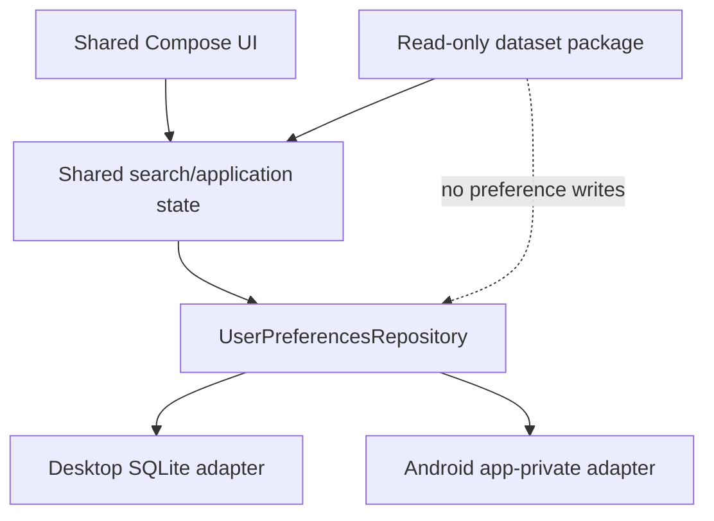

# User preferences persistence

## Status

Planned architectural initiative — not yet the active implementation specification.

The repository currently has one active specification,
[`../active/initial-functional-product.md`](../active/initial-functional-product.md). This initiative
should move to `docs/specs/active/` when that specification is accepted and archived, or when the
project deliberately reprioritizes the active work.

## Goal

Persist the user's current search context locally so Desktop and Android can restore useful state
after application restart without coupling user data to an installed geographic dataset.

The first implementation should persist:

- selected dataset identity;
- selected center settlement identity and display name;
- search radius;
- dynamic numeric filter conditions.

## Current state

Search state is currently owned by the shared Compose UI and is recreated from dataset defaults
when the runtime is opened. Dataset packages are read-only analytical/map artifacts and do not own
user preferences.

Desktop already has a stable application storage root under `~/.osmapdigger/`, but no authoritative
preferences database is implemented yet. Android currently restores the installed dataset from
app-private storage, but not the search state.

## Requirements

### R1 — separate user-data storage

User preferences must not be written into `georisk.sqlite`, package metadata, PMTiles, or other
generated dataset artifacts.

Desktop should store preferences in a dedicated SQLite database under the application storage root.
Android should use app-private local storage behind the same shared contract. The Android storage
technology is an implementation detail and does not need to match Desktop internally.

### R2 — shared persistence contract

`mobile/shared` should own immutable preference models and a small persistence interface. Platform
modules should own SQLite/filesystem/database APIs and lifecycle.

Shared UI and search code must not construct preference SQL or depend on platform database types.

### R3 — dataset-scoped search state

Persisted search state must identify the dataset it belongs to. Restoring state for one dataset must
not silently apply metric IDs or a center settlement from a different dataset.

Metric IDs and settlement IDs are the stable references. Display names may be stored as presentation
fallbacks but must not replace stable IDs.

### R4 — stable filter representation

Persist dynamic filter conditions by `metricId` with optional minimum and maximum values. The
persisted representation must preserve unknown future metric IDs without introducing category-specific
columns or UI branches.

A compact versioned JSON payload inside the preferences database is acceptable for the first
implementation because the dynamic filter set is expected to evolve independently of the settings
schema.

### R5 — deterministic restore

Application startup should restore persisted preferences only after the corresponding dataset runtime
and metric catalog are available.

Restore must validate references against the opened dataset:

- ignore filter conditions whose metric IDs are unavailable;
- restore the center only when its settlement ID can be resolved or safely retained by the runtime
  contract;
- treat missing or invalid optional preference data as absence of saved state rather than corrupting
  dataset loading.

### R6 — explicit save ownership

A shared application-state layer should translate user-visible search state into `UserPreferences` and
request persistence. Individual Compose controls must not write directly to SQLite or platform storage.

The first implementation does not require a search-history event log. It stores the current restorable
state.

### R7 — offline and local-only behavior

Saving and restoring preferences must require no network access, account, backend, or external service.

## Architecture direction



Suggested shared contracts:

- `UserPreferences` — immutable restorable state;
- `SavedSearchCondition` — `metricId`, optional minimum, optional maximum;
- `UserPreferencesRepository` — load/save/clear boundary.

The final names may follow the existing runtime package organization discovered during implementation;
this initiative defines ownership and semantics rather than prescribing unnecessary file structure.

## Desktop implementation direction

Use a dedicated SQLite database under:

```text
~/.osmapdigger/settings/preferences.sqlite
```

The database should be created and migrated by the Desktop preferences adapter, independently of the
versioned `geo-format` dataset schema.

A single current-state row is sufficient for the first implementation. A possible logical shape is:

```text
user_preferences
- id
- dataset_id
- center_settlement_id
- center_settlement_name
- radius_km
- filters_json
- updated_at_epoch_ms
```

This table is illustrative. The implementation may normalize fields differently if tests or lifecycle
requirements justify it, while preserving the requirements above.

## Android implementation direction

Use app-private local persistence behind `UserPreferencesRepository`. Android must preserve the same
shared semantics but does not need to share Desktop's JDBC implementation or physical database layout.

Room is not required by this initiative. Prefer the smallest stable platform implementation that fits
the current KMP architecture and can be migrated predictably.

## Scenarios

### S1 — restore a search after restart

A user selects a dataset, center settlement, radius, and several min/max metric filters. After closing
and reopening the application, the same valid search context is restored.

Exercises: R1, R2, R4, R5, R6, R7.

### S2 — dataset changes

Saved preferences belong to dataset A, but dataset B is opened. Dataset-A center/filter references are
not silently applied to dataset B.

Exercises: R3, R5.

### S3 — metric catalog evolves

A rebuilt dataset removes or renames a metric referenced by saved filters. The application restores
all still-valid conditions and ignores unavailable ones without failing startup.

Exercises: R3, R4, R5.

## Non-goals

The first user-preferences stage does not require:

- search history;
- multiple named saved searches;
- favorites or notes;
- user profiles;
- cloud synchronization;
- cross-device synchronization;
- encryption of non-sensitive search preferences;
- changes to `geo-format/VERSION` or the generated dataset schema.

## Compatibility / migration

The preferences database is application-owned user data and is separate from `geo-format`. Its schema
must therefore have its own small migration/version strategy rather than reusing the dataset format
version.

Persisted metric IDs depend on the existing dynamic metric contract. Metric IDs should remain stable
when their meaning is stable; unavailable saved IDs must be handled as described in R5.

## Validation

When this initiative becomes active implementation work, acceptance should include:

1. shared model/serialization tests for dynamic filter conditions;
2. Desktop SQLite save/load round-trip tests using a temporary directory;
3. restart-style restoration tests that reopen the repository/store;
4. dataset-mismatch and missing-metric tests;
5. Android compile/host validation for the platform adapter;
6. `make check-all` where the configured toolchain permits it;
7. verification that no user preferences are written into generated dataset artifacts.

## Implementation tasks

When activated, implement in this order:

1. define shared immutable preference models and persistence contract;
2. define a versioned filter payload and validation rules;
3. implement Desktop SQLite preferences storage and tests;
4. introduce shared application-state restore/save orchestration;
5. wire Desktop startup and state changes;
6. implement the Android app-private adapter against the same contract;
7. add focused shared/Desktop/Android tests;
8. update owning current-state documentation after acceptance and archive the completed spec.
