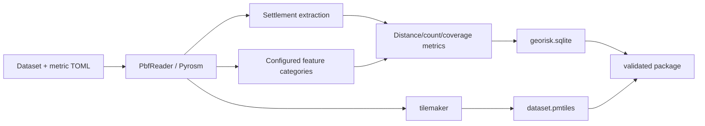

# OsmapDigger Geo Builder

`geo-builder/` is the build-time Python application that turns a local OSM PBF into runtime artifacts consumed by OsmapDigger. It is never part of normal Android/Desktop search execution.

## Pipeline



The package can be built without PMTiles using `--skip-map`, which keeps analytical work testable independently from tilemaker.

## Main package map

| Module | Responsibility |
|---|---|
| `cli.py` | Thin command-line composition root: list/build/validate |
| `config.py` | Resolve dataset paths and parse dynamic category definitions |
| `models.py` | Immutable builder contracts used across stages |
| `osm_reader.py` | Lazy Pyrosm adapter, batch reads, optional regional PBF crop |
| `geometry.py` | Boundary loading, metric CRS selection, context buffering |
| `metric_catalog.py` | Convert source categories into persisted runtime metric definitions |
| `metrics.py` | Settlement extraction, selector filtering, distance/count/coverage calculation |
| `database.py` | Create and validate canonical SQLite output from `geo-format/schema.sql` |
| `map_builder.py` | Write style template and invoke direct/Docker tilemaker |
| `package.py` | Artifact hashes, structural validation, portable ZIP creation |
| `pipeline.py` | Staging build orchestration and atomic publication |

See [`IMPLEMENTATION.md`](IMPLEMENTATION.md) for contracts/call paths and [`../docs/CONFIGURATION.md`](../docs/CONFIGURATION.md) for TOML semantics.

## Setup

From the repository root:

```bash
python -m venv .venv
source .venv/bin/activate
python -m pip install -e './geo-builder[dev]'
```

## Main commands

```bash
PYTHONPATH=geo-builder/src python -m osmapdigger_geo.cli list-datasets
```

```bash
make build-andorra-data
```

```bash
make build-andorra
```

```bash
PYTHONPATH=geo-builder/src python -m osmapdigger_geo.cli validate \
  data/generated/packages/andorra
```

## Local-data boundary

Source PBF and generated packages live under root `data/` and are ignored by Git. Builder code/configuration must never assume those files are tracked repository fixtures.

The included development archive may contain a real Andorra PBF for local testing, but repository snapshots/patches should exclude it.

## Tests

```bash
make test-python
```

Default tests use synthetic geospatial data and temporary files; they must not parse a real PBF or invoke external tile tooling.

## Read next

- [`IMPLEMENTATION.md`](IMPLEMENTATION.md) — module contracts and current processing details.
- [`AGENTS.md`](AGENTS.md) — builder-specific change rules.
- [`../docs/USAGE.md`](../docs/USAGE.md) — operational commands.
- [`../docs/TESTS.md`](../docs/TESTS.md) — validation matrix.
- [`../geo-format/README.md`](../geo-format/README.md) — persisted runtime contract.

## Map profile

Map generation uses the checked-in `tilemaker/config.json` and `tilemaker/process.lua` files. The Python adapter always passes them explicitly, so native tilemaker does not depend on a `config.json` in the shell working directory.
