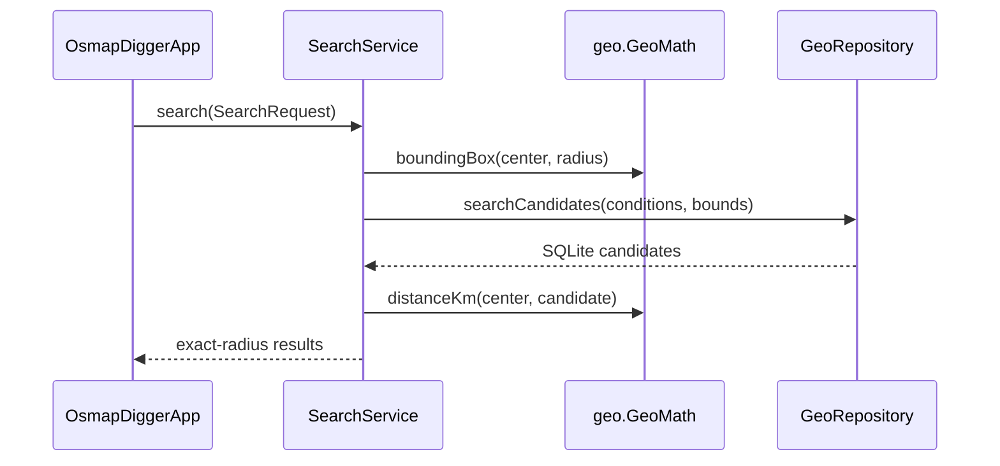
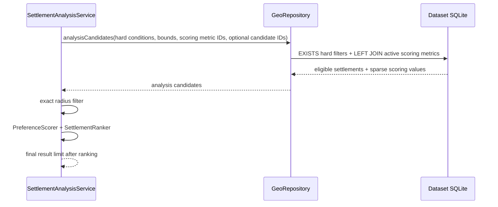

# Mobile/runtime implementation

## Scope

This document describes the current Kotlin Multiplatform implementation under `mobile/`. Stable system boundaries remain in [`../docs/ARCHITECTURE.md`](../docs/ARCHITECTURE.md); persisted SQLite/metadata semantics are owned by [`../geo-format/`](../geo-format/).

## Module layout

| Module | Current responsibility |
|---|---|
| `shared` | Logical domain/dataset/search/analysis/preferences/workspace/presentation/map/external boundaries plus shared Compose UI; physical extraction is pending |
| `desktopApp` | JVM app host, dataset JDBC SQLite, settings SQLite, filesystem/ZIP loading, Desktop browser integration |
| `androidApp` | Android app host, dataset/settings SQLite, SAF ZIP import, app-private installation, browser intents |

`shared/commonMain` contains no Android/JDBC/filesystem implementation APIs.

The current logical package graph inside `:shared` is documented in [`README.md`](README.md) and enforced by the network-free `tests/test_mobile_architecture.py` check. The graph is intentionally acyclic before any package is extracted into a physical Gradle module.

## Shared domain model

`domain/Models.kt` defines:

- `GeoPoint` — WGS84 coordinate;
- `DatasetInfo` — runtime dataset identity/initial camera/map availability;
- `PreferredDirection` — descriptive lower/higher preference metadata;
- `MetricDefinition` — one persisted numeric metric/filter definition;
- `MetricPreferenceDefault` — one validated dataset-provided generic scoring default with legacy-package absence represented by an empty catalog;
- `Settlement` — one canonical searchable settlement point;
- `SettlementName` / `SettlementSearchEntry` / `SettlementSearchMatch` — multilingual alias index and ranked center-lookup models;
- `SearchCondition` — optional min/max range for one metric ID;
- `SearchRequest` — center, radius, metric conditions, result limit;
- `MetricValue` — hydrated metric definition/value;
- `SettlementDetails` — settlement plus all available metrics.

Models are intentionally immutable and do not know SQL/OSM selector semantics.

## Shared runtime boundaries

Iteration 1 of KMP architecture hardening makes semantic ownership explicit inside the still-physical `:shared` module:

- `dataset/GeoRepository.kt` owns the read-only analytical dataset boundary;
- `map/MapPackage.kt` owns platform-resolved local map assets;
- `external/ExternalLinkOpener.kt` owns the explicit platform browser action;
- `runtime/OsmapDiggerRuntime.kt` is only the dataset-scoped composition bundle assembled by platform hosts.

`runtime` is therefore no longer the API owner for unrelated dataset/map/external contracts. Platform implementations provide the `GeoRepository` capabilities below:

- dataset metadata;
- metric catalog;
- optional dataset preference-default catalog with legacy-v1 empty fallback;
- complete settlement-name search index loading with legacy-dataset fallback;
- legacy SQL-reduced hard-filter search candidates;
- batch hard-filter-eligible analysis candidates with only requested scoring metric values;
- detailed single-settlement hydration.

`OsmapDiggerRuntime` bundles dataset-scoped repository/map/browser dependencies. The platform host separately creates one application-scoped `UserPreferencesRepository` and injects it into `OsmapDiggerApp`. `workspace/AnalysisWorkspaceController.kt` owns restored hard constraints, effective preference defaults/overrides, center/radius, automatic ranked-analysis results, and persistence orchestration; Compose observes that state instead of independently owning those analytical fields.

## User preferences

`preferences/UserPreferences.kt` defines the immutable current search-context model, the small persistence interface, a versioned JSON codec for dynamic metric conditions, and restore validation.

Restore is dataset-scoped. Metric conditions are retained only when their stable IDs still exist in the opened metric catalog. The saved center is resolved only by stable settlement ID; no display-name fallback is used.

`workspace/AnalysisWorkspaceController.initialize()` loads dataset metadata, metric definitions, dataset preference defaults, and persisted user state in one shared lifecycle. It validates restored center/hard-filter references, merges sparse user preference overrides over dataset defaults, persists only after initialization, and immediately schedules ranked analysis. `OsmapDiggerApp` keeps only presentation-local text/selection/provider state and delegates analytical mutations back to the controller.

`SettlementAnalysisService.analyzeWithDiagnostics()` wraps the same deterministic analysis result with execution-only counters/timings for acceptance measurements. `workspace/AnalysisWorkspaceController` forwards only the currently valid generation through an injected diagnostics callback. Desktop supplies that callback and records `analysis.performance` entries through `DesktopDiagnostics`; Android leaves the callback at its no-op default. This instrumentation is observational only and is not part of score/search semantics.

## Search orchestration

`search/SettlementSearch.kt` owns shared center-settlement lookup semantics. It normalizes configured aliases, lazily caches the compact search index for the opened dataset, and ranks exact, prefix, substring, then bounded Levenshtein fuzzy matches. Platform repositories read `settlement_name` when available and synthesize aliases from legacy `name`/`name_local`/`name_en` columns for older format-version-1 datasets. This avoids platform-specific SQLite Unicode/FTS behavior.

`search/SettlementListImport.kt` owns the first candidate-list import core. `SettlementListImportParser` accepts the deliberately small one-name-per-line text format, trims blanks, normalizes names with the same rules as interactive settlement search, and collapses duplicate normalized input while preserving first occurrence order. `SettlementListImportResolver` loads the alias index once and, when the workspace has a center plus positive radius, first limits that index with the same shared Haversine distance semantics used by analysis. It automatically resolves only one exact stable-ID match, leaves multiple exact matches ambiguous, and exposes normal prefix/substring/bounded-Levenshtein results only as review suggestions. Ambiguous exact rows may explicitly select one, several, or all displayed matches; different imported aliases that resolve to the same canonical settlement still collapse to one stable ID in deterministic review order.

Wide Desktop exposes this core through `CandidateSourceUi.kt`: users can paste the one-name-per-line format or load a UTF-8 `.txt` through the platform-owned `DesktopSettlementListFilePicker`, review ambiguous/non-exact rows explicitly, and apply only reviewed stable IDs. `ImportedCandidateList` retains the original source text strictly as editing provenance alongside stable reviewed IDs. The active `SettlementCandidateScope` remains separate, so **Disable import** returns analysis to the full dataset without deleting the retained list, **Enable import** reuses reviewed IDs, and **Delete saved list** clears both retained import state and any active restriction. Reopening the editor starts with the retained source text.

`search/SearchService.kt` is intentionally small and deterministic.



This keeps SQL spatial requirements minimal and behavior consistent across Android/JVM.

## Preference scoring and ranked analysis

`analysis/PreferenceModels.kt`, `analysis/PreferenceScorer.kt`, and `analysis/SettlementRanker.kt` own
immutable scoreable preferences, contribution breakdowns, aggregate score/coverage, and deterministic
ranking. `PreferenceScorer` rejects implicit `NEUTRAL` direction, calculates linear `LOWER`/`HIGHER`
quality, preserves missing metrics as unknown, and fails fast on non-finite present metric values.

`analysis/SettlementAnalysisModels.kt` defines the full ranked-analysis request above the existing
hard `SearchRequest`. `analysis/SettlementCandidateScope.kt` adds either the unrestricted `Dataset` universe or an ordered, validated `Imported` list of stable settlement IDs without encoding identity as a fake numeric metric. The repository-facing `SettlementAnalysisCandidate` lives in `domain/` so the
`runtime` contract does not depend back on the `analysis` service package; it carries one eligible
settlement plus only requested metric values.

`SettlementAnalysisService` owns the new orchestration path:



The repository path intentionally has no unrelated name-based final limit and never hydrates full
`SettlementDetails` per candidate. Missing joined scoring rows remain absent from the metric map. A null candidate-ID set means the normal dataset universe; a non-null set restricts retrieval before shared scoring, and an empty imported set returns zero candidates without querying or silently broadening to the dataset. `dataset/DatasetCandidateQueries.kt` is the single shared owner of the legacy hard-filter query, ranked-analysis LEFT JOIN/predicates, ordered typed bind values, and conservative SQLite candidate-ID batching. Platform repositories execute those specs through JDBC/Android SQLite and retain only platform binding/result-mapping responsibilities.
`search/SearchRequestSemantics.kt` centralizes radius validation, coarse bounds, exact radius matching,
and effective-condition selection so legacy `SearchService` and ranked analysis cannot drift.

`workspace/AnalysisWorkspaceController` connects `MetricPreferenceDefault`, saved overrides, `SettlementAnalysisService`, and `UserPreferencesRepository` into the active application flow. It also carries the current `SettlementCandidateScope`; an imported scope is persisted with the dataset-scoped user context and counts as an explicit bounded analysis constraint, so even a legacy dataset with no preferences may analyze that reviewed ID set without enabling the protected unbounded auto-scan. Dataset-scoped Favorites are loaded and mutated through `FavoriteSettlementRepository`: add/remove/clear, note updates, and explicit frozen-snapshot replacement persist in the application settings database without changing candidate scope or triggering ranked recalculation. Adding a ranked result captures the already-authoritative score/coverage, effective Required criteria, enabled Preferences, and contribution values; later current-analysis edits do not rewrite that snapshot automatically. Input changes schedule a 250 ms debounced recalculation and late stale generations cannot replace newer ranked results. The controller also exposes explicit generic preference-edit operations for enabled state, weight, target/limit thresholds, and reset-to-dataset-default while keeping persisted overrides sparse. Legacy packages with no enabled preference defaults and no effective hard/radius constraint do not trigger an automatic unbounded candidate scan; explicit refresh remains available through the compatibility SearchPane path.

## Filter summaries

`presentation/FilterSummaryBuilder.kt` renders the current structured request into readable text. It uses persisted metric title/unit metadata and therefore requires no category-specific wording branches for normal range metrics.

It is presentation logic only: the generated sentence does not become an executable query language.

## External property links

`external/ExternalSearchProviders.kt` owns the shared provider model, repository contract, seed-catalog parser, percent encoding, and single-settlement URL-template expansion. `external/ExternalSearchBatch.kt` owns deterministic multi-settlement query construction for Favorites. Batch-capable providers must expose `{query}` without requiring `{settlement}`; selected localized names are quoted and joined with `OR`, then greedily split so every final UTF-8 percent-encoded URL remains within the shared bound. `mobile/config/external-search-providers.json` owns the packaged default provider rows. Shared UI receives already loaded providers and never branches on provider IDs or countries.

Desktop and Android store provider rows in the same application-owned settings SQLite used for user preferences. The existing physical filename `preferences.sqlite` is retained for backward compatibility even though the database now contains broader application settings. Platform settings database owners migrate schema version 1 to version 2 by adding `external_search_provider`. Seed insertion uses `INSERT OR IGNORE`, preserving customized rows. Provider selection returns global rows plus rows matching `DatasetInfo.countryCode`.

## Map overlay

`map/MapOverlayGeoJson.kt` serializes search results into a small engine-neutral in-memory GeoJSON FeatureCollection used by native MapLibre and the Intel macOS web renderer.

`ui/MapPanel.kt`:

- loads the platform-resolved local style through `BaseStyle.Json`;
- renders result points in one circle layer;
- renders the selected settlement in a separate highlighted layer;
- moves the camera toward a newly selected settlement.

The basemap remains PMTiles; result overlays are runtime GeoJSON and are not written back to tiles.

## Shared Compose UI

`ui/OsmapDiggerApp.kt` is the common entry point.

The UI has two top-level states:

1. no dataset — explain that a generated package is required and offer import;
2. loaded dataset — load metadata/metric definitions and show search/map UI.

The Desktop host explicitly selects `AppPresentationMode.DESKTOP_ANALYSIS`. On wide Desktop windows, `ui/DesktopAnalysisWorkspace.kt` renders a resizable left analysis panel that defaults to roughly 34% of the window and uses the remaining width for a map/details column. The panel contains Search area, generic Required constraints, generic Preferences with single-row progressive editing, and ranked results. `ui/RankedResultsUi.kt` owns scan-oriented result cards: numeric score remains visible, a determinate 0–100 bar visualizes that same score, incomplete coverage remains textual, strongest/weakest cues reuse `ScoreExplanationBuilder`, and a separate checkbox persists favorite membership without opening/changing map details. `ui/FavoritesUi.kt` provides a Desktop-first notebook pane with compact current context plus frozen saved analysis context, inline note editing, explicit snapshot refresh, transient individual/select-all selection, browse/open/remove/clear actions, and explicit stable-ID transfer into a replacement activated imported candidate list. `ui/FavoriteBatchExternalSearchUi.kt` presents explicit batch external search for the selected available Favorites. Batch search uses the current localized settlement names, shows each provider/chunk before opening it, and never launches multiple browser actions automatically. Add filter opens a full-pane chooser inside the left analysis area instead of a window-level dropdown. With no selected settlement, a shallow pane below the map exposes the current ranked-result count and recalculation state. Selecting a ranked result reuses the existing selected-settlement map focus and allocates the lower third of the right column to a compact non-scrolling settlement summary, leaving the upper two thirds to the map. The summary shows score/coverage plus every metric that actually participates in the current analysis, prioritizing effective Required constraints before enabled Preferences and preserving missing values as unknown. Active criteria are arranged in two balanced rows inside one horizontally scrollable strip, and their presentation labels follow the selected UI language where the application owns a localized category label. An explicit Details action opens complete grouped metrics and deterministic score explanation in a scrollable view in the same lower pane; a separate External search action opens configured provider buttons there. These surfaces never overlap the platform map rectangle. Desktop radius input treats blank or numeric zero as an unset radius and exposes an explicit Clear action while preserving the domain invariant that persisted/search radius is either null or positive.


Ranked settlement map labels remain transient runtime presentation data. Native MapLibre targets position Compose text labels from `CameraProjection` so the offline package does not need a glyph PBF bundle merely to label ranked settlements. Intel macOS/JCEF renders equivalent collision-aware result labels inside MapLibre GL JS, where local browser fonts are available. Result labels appear from a useful zoom threshold while the selected settlement label remains visible and visually emphasized.

Desktop composition intentionally keeps all Compose transient/detail surfaces outside the platform map rectangle. This avoids relying on Compose/Swing z-order behavior for the Intel macOS JCEF renderer. `PlatformMapSurface` therefore remains a small renderer contract with stable settlement-ID activation callbacks but no popup-occlusion or freeze-frame lifecycle, and `IntelMacWebMapSurface` keeps its original windowed JCEF browser/session behavior.

Android keeps the existing responsive presentation; narrow layouts continue to use Search/Map tabs. `ui/SearchPane.kt` remains the compatibility/shared responsive surface and implements:

- multilingual/fuzzy center settlement lookup with alias-aware suggestions;
- radius input;
- dynamic default/additional filters;
- deterministic filter description;
- local search action;
- result cards;
- settlement detail metrics;
- explicit external property searches.

The UI never constructs SQL.

## Desktop adapter

### `JdbcGeoRepository`

Uses Xerial SQLite JDBC.

`searchCandidates()` executes the shared `DatasetCandidateQueries.searchCandidates()` specification through JDBC. The shared spec preserves the current UI contract: optional coordinate bounds, one `EXISTS` subquery per effective metric condition, deterministic name ordering, and a repository-side limit.

`analysisCandidates()` executes one or more shared ranked-analysis query specs with no final result limit. `DatasetCandidateQueries` owns the active-metric `LEFT JOIN`, shared hard predicates, ordered bind values, and deterministic stable-ID batching; JDBC owns typed parameter binding and row folding into immutable `SettlementAnalysisCandidate` values. Missing scoring rows therefore remain unknown rather than excluding the settlement or becoming zero.

`preferenceDefaults()` reads `metric_preference_default` ordered by the owning metric's `sort_order`. It first probes `sqlite_master`; a legacy format-v1 database without the additive table returns an empty list. Persisted rows are converted into validated shared `MetricPreferenceDefault` values, so unsupported direction or invalid numeric contracts fail instead of being silently reinterpreted.

### Shared preference override persistence

`UserPreferences` carries `preferenceOverrides` keyed by stable metric ID. An override is intentionally sparse and may replace only `enabled`, `targetValue`, `limitValue`, or `weight`; scoring direction remains owned by the dataset's `MetricPreferenceDefault`. Untouched fields therefore follow new dataset defaults after a compatible dataset rebuild instead of being duplicated into mutable application state.

`MetricPreferenceOverridePayloadCodec` stores overrides as an independently versioned JSON payload. `MetricPreferenceOverrideResolver` applies them to the currently opened dataset defaults, ignores valid stale overrides whose metric ID is no longer present, rejects duplicate IDs, and reconstructs `MetricPreference` so invalid effective target/limit combinations fail deterministically before scoring. Dataset mismatch produces no restored preference state.

The shared application settings schema is version 6. Version 3 added `user_preferences.preferences_json`; version 4 added `candidate_scope_json`; version 5 added normalized `favorite_settlement` rows keyed by `(dataset_id, settlement_id)`; version 6 adds nullable `note_text` plus a separate `favorite_analysis_snapshot` row containing one versioned immutable snapshot JSON payload per Favorite. Candidate-source payload version 2 still stores active source plus retained reviewed IDs/source text in the existing column. Favorites use a separate table and therefore remain independent from candidate-source filtering. The Desktop UI may explicitly bridge selected available Favorite IDs back into the existing imported candidate-source contract; this action does not perform alias resolution and preserves current Required/Preferences/center/radius inputs. The schema remains application-owned without changing `geo-format/VERSION`.

### `SqliteUserPreferencesRepository`

Stores the current search context at `~/.osmapdigger/settings/preferences.sqlite` using the shared application-owned schema currently at `PRAGMA user_version = 5`. Connections are short-lived and preference I/O runs on `Dispatchers.IO`.

The preferences database is application-owned and independent from `geo-format`. It stores dataset identity, the stable center settlement ID plus optional display name, optional radius, and a versioned JSON payload of dynamic metric ID/min/max conditions. Missing saved state degrades to normal dataset defaults; malformed stored payloads are typed settings failures, while unknown metric IDs are ignored and an unavailable saved center clears the center/radius constraint. Search history and multiple named saved searches are not part of the current store. Dataset-scoped Favorites use `favorite_settlement`; optional notes live on that row and one frozen versioned snapshot is stored separately in `favorite_analysis_snapshot`.

### Desktop storage and dataset lifecycle

Desktop keeps generated/installed dataset artifacts separate from mutable application state:

```text
~/.osmapdigger/
    datasets/
    settings/
        preferences.sqlite
    logs/
    runtime/
```

Generated packages under repository `data/generated/` are installation sources, not mutable runtime state. `DesktopDatasetChooser` can open a package directory or securely extract a ZIP into `~/.osmapdigger/datasets/`; normalized entries must stay under the destination root.

Startup dataset resolution is host-owned. `OSMAPDIGGER_DATASET_DIR` has development precedence; otherwise `DesktopConfigLoader` discovers `desktop-config.json` and resolves its configured package. Manual import/change remains available when automatic loading is unavailable.

### `DesktopDataset`

`open(directory)` parses metadata, opens dataset SQLite, resolves optional PMTiles into the style template, and creates the dataset-scoped `OsmapDiggerRuntime`. The Desktop host owns one separate preferences repository for the application lifetime and deliberately closes/replaces dataset resources when the active package changes.

### Desktop MapLibre runtime

`shared/src/desktopMain/.../MapPanel.desktop.kt` is the default Desktop `actual` map surface. It renders the local package style, result/selection GeoJSON overlays, camera focus, attribution, a metric scale bar derived from the current Web Mercator camera, normal settlement-marker activation, and optional WGS84 map-location activation on MapLibre Compose native hosts, and otherwise provides the non-fatal fallback. Map focus uses an explicit monotonic request token in addition to selected settlement identity, so re-activating an already selected ranked/Favorite settlement re-centers the camera after manual panning; the Intel macOS JCEF renderer consumes the same renderer-neutral focus request. Shared UI can accept a small `PlatformMapSurface` override from the Desktop application host; the contract exposes only stable settlement IDs and `GeoPoint`, never MapLibre/JCEF types.

`desktopApp/build.gradle.kts` owns the platform-native runtime selection for macOS Apple Silicon Metal, Linux x86-64 OpenGL, and Windows x86-64 OpenGL. Intel macOS receives no incompatible MapLibre JNI runtime; instead `desktopApp/.../map/IntelMacWebMapSurface.kt` owns the JCEF + MapLibre GL JS renderer. `LocalWebMapServer` binds to loopback only, serves packaged browser assets, converts local PMTiles reads into XYZ vector-tile responses, exposes MapLibre's metric scale control, and accepts bounded same-origin POST payloads for normal stable-ID marker activation and WGS84 map-location activation. `IntelMacWebMapSurface` marshals those callbacks onto the Desktop AWT event queue before invoking shared UI callbacks, keeping browser/native lifecycle outside shared code.

### Desktop diagnostics

`desktopApp/.../diagnostics/DesktopDiagnostics.kt` owns process-local Desktop diagnostics. It mirrors
JUL output to `~/.osmapdigger/logs/desktop.log`, records a runtime fingerprint and timed startup
phases, redirects JVM fatal-error reports into the same log directory, and maintains an
unclean-shutdown marker under `~/.osmapdigger/runtime/`. The diagnostics API is not exposed to
`shared`.

Desktop diagnostics deliberately observe JCEF initialization from outside the native runtime and do not
modify CEF cache/settings or attach browser handlers. This keeps diagnostics from changing JCEF startup
behavior during native-crash investigation. `LocalWebMapServer` still logs lifecycle, PMTiles metadata,
failures, and aggregate request counters rather than one line per successful tile.

### `Main.kt`

Uses `OSMAPDIGGER_DATASET_DIR` when set; otherwise follows Desktop configuration/package loading. It
owns closing/replacing Desktop dataset resources and initializes Desktop diagnostics before dataset
loading or native map initialization.

## Android adapter

### `AndroidGeoRepository`

Executes both legacy hard-filter and batch ranked-analysis `DatasetCandidateQueries` specifications through `SQLiteDatabase.rawQuery()`. Android converts the shared typed bind arguments to selection strings and retains cursor/result mapping locally; hard predicates, active-metric `LEFT JOIN`, stable-ID batching, and query ordering are no longer duplicated from Desktop. `preferenceDefaults()` mirrors Desktop's additive-table probe/order/validation and returns an empty list for legacy v1 packages without the table.

### `AndroidDatasetInstaller`

Reads a user-selected ZIP through Storage Access Framework, resolves each entry to its canonical destination, and rejects entries escaping app-private dataset storage.

### `AndroidUserPreferencesRepository`

Stores the same current search-context contract in app-private `filesDir/settings/preferences.sqlite` through Android `SQLiteDatabase`. Its schema version is independent from generated dataset format versioning.

### `AndroidDataset`

Parses metadata, opens generated SQLite with `OPEN_READONLY`, resolves a local `pmtiles://file://` URI, and injects Android browser behavior. `MainActivity` owns the separate application-scoped preferences adapter.

### `MainActivity`

Owns the document picker and current `AndroidDataset` lifecycle, then hosts the shared `OsmapDiggerApp`.

## Main dependencies

Dependency versions are centralized in `gradle/libs.versions.toml`.

Current dependency families:

- Kotlin Multiplatform / Kotlin compiler;
- Compose Multiplatform + Material 3;
- kotlinx.coroutines;
- kotlinx.serialization;
- MapLibre Compose;
- Xerial SQLite JDBC for Desktop;
- Android platform SQLite.

## Tests

- `shared/commonTest` covers geography, deterministic preference scoring/ranking, rank-before-limit analysis orchestration, exact-radius analysis semantics, debounced shared analysis-state orchestration, filter summaries, external links, preference payloads, and restore semantics;
- `shared/desktopTest` covers Desktop MapLibre host capability resolution;
- `desktopApp/jvmTest` covers legacy dynamic metric SQL, batch scoring-metric retrieval/unknown handling, and preferences/settings SQLite round trips;
- Android compilation/host tests are separate Gradle tasks.

See [`../docs/TESTS.md`](../docs/TESTS.md) for current commands and real-package acceptance checks.

## Known implementation limitations

- one current Android dataset is installed at a time;
- Desktop dataset chooser is functional but not yet a full dataset-manager UI;
- numeric filters use text fields rather than metric-specific widgets;
- map style is basic and lacks polished fully offline label/font/sprite packaging;
- dataset-scoped Favorites are persisted and browseable/selectable on Desktop, including notes, one frozen versioned analysis snapshot with explicit refresh, and selected-Favorites re-analysis through the imported candidate source. Checkbox multi-selection is independent from the current map/details Favorite: clicking a Favorite's analytical content selects/highlights it and focuses the map without closing the notebook, while **Open** returns to the normal details workflow. Named saved searches, multiple historical snapshots, and comparison state are not implemented yet.


Normal ranked-marker interaction on Intel macOS uses a bounded screen-space hit area before sending a stable settlement ID through the loopback server. **Pick center on map** instead sends the clicked WGS84 coordinate; shared `SettlementSearchService.nearestTo()` scans its cached complete settlement index and chooses the exact Haversine-nearest settlement with a stable ID tie-break. Interaction receipt and dispatch are logged through Desktop diagnostics.

## UI localization

`shared/ui/UiLocalization.kt` owns the application UI language catalog and composition-local access. Supported UI languages are Russian and English; Russian is the default. `OsmapDiggerApp` owns a saveable language code and injects `LocalUiLanguage`, `LocalUiStrings`, and the language setter for both Desktop and Android presentation modes. `SearchPane`, `DesktopAnalysisWorkspace`, native map fallback/status surfaces, `presentation.FilterSummaryBuilder`, and generic metric-filter presentation consume localized connective/control text instead of hardcoded English strings.

Persisted dataset metadata remains the source of truth. Settlement display names may select a dataset-provided alias whose `language` matches the current UI language, falling back to the canonical settlement name. Current stable metric categories have presentation-only Russian labels keyed by `category_id`; unknown/additive categories fall back to the persisted metric title. Dataset names and provider titles remain unchanged.
