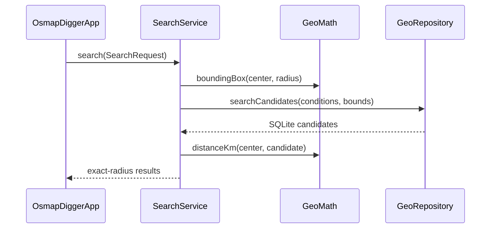

# Mobile/runtime implementation

## Scope

This document describes the current Kotlin Multiplatform implementation under `mobile/`. Stable system boundaries remain in [`../docs/ARCHITECTURE.md`](../docs/ARCHITECTURE.md); persisted SQLite/metadata semantics are owned by [`../geo-format/`](../geo-format/).

## Module layout

| Module | Current responsibility |
|---|---|
| `shared` | Domain models, repository/runtime contracts, exact-radius search, filter summary, property-link generation, GeoJSON overlay, shared Compose/MapLibre UI |
| `desktopApp` | JVM app host, JDBC SQLite, filesystem/ZIP loading, Desktop browser integration, native MapLibre binding selection |
| `androidApp` | Android app host, Android SQLite, SAF ZIP import, app-private installation, browser intents |

`shared/commonMain` contains no Android/JDBC/filesystem implementation APIs.

## Shared domain model

`domain/Models.kt` defines:

- `GeoPoint` — WGS84 coordinate;
- `DatasetInfo` — runtime dataset identity/initial camera/map availability;
- `PreferredDirection` — descriptive lower/higher preference metadata;
- `MetricDefinition` — one persisted numeric filter definition;
- `Settlement` — one searchable settlement point;
- `SearchCondition` — optional min/max range for one metric ID;
- `SearchRequest` — center, radius, metric conditions, result limit;
- `MetricValue` — hydrated metric definition/value;
- `SettlementDetails` — settlement plus all available metrics.

Models are intentionally immutable and do not know SQL/OSM selector semantics.

## Runtime contracts

`runtime/RuntimeContracts.kt` defines `GeoRepository` as the shared data boundary.

Platform implementations provide:

- dataset metadata;
- metric catalog;
- settlement-name search;
- SQL-reduced search candidates;
- detailed settlement hydration.

`OsmapDiggerRuntime` bundles repository, resolved map style, and external-browser opener for shared UI injection.

## Search orchestration

`search/SearchService.kt` is intentionally small and deterministic.

This keeps SQL spatial requirements minimal and behavior consistent across Android/JVM.

## Filter summaries

`FilterSummaryBuilder` renders the current structured request into readable text. It uses persisted metric title/unit metadata and therefore requires no category-specific wording branches for normal range metrics.

It is presentation logic only: the generated sentence does not become an executable query language.

## External property links

`external/PropertySearchLinks.kt` builds percent-encoded Google/Yandex URLs from:

- provider;
- selected settlement;
- dataset-provided optional site restriction;
- dataset-provided terms.

It does not perform HTTP requests itself.

## Map overlay

`map/GeoJson.kt` serializes search results into a small in-memory GeoJSON FeatureCollection.

`ui/MapPanel.kt`:

- loads the platform-resolved local style through `BaseStyle.Json`;
- renders result points in one circle layer;
- renders the selected settlement in a separate highlighted layer;
- moves the camera toward a newly selected settlement.

The basemap remains PMTiles; result overlays are runtime GeoJSON and are not written back to tiles.

## Shared Compose UI

`ui/OsmapDiggerApp.kt` is the common entry point.

The UI has two top-level states:

1. no dataset — explain that a generated package is required and offer import;
2. loaded dataset — load metadata/metric definitions and show search/map UI.

Wide layouts show search/details and map side by side. Narrow layouts use Search/Map tabs.

`ui/SearchPane.kt` implements:

- center settlement lookup;
- radius input;
- dynamic default/additional filters;
- deterministic filter description;
- local search action;
- result cards;
- settlement detail metrics;
- explicit external property searches.

The UI never constructs SQL.

## Desktop adapter

### `JdbcGeoRepository`

Uses Xerial SQLite JDBC.

`searchCandidates()` builds SQL with:

- optional latitude range;
- optional longitude range;
- one `EXISTS` subquery per effective metric condition;
- lower/upper comparisons only when supplied;
- deterministic name ordering and limit.

Using `EXISTS` means a missing metric row fails a condition rather than being treated as zero.

### `DesktopDataset`

`open(directory)` parses metadata, opens SQLite, resolves optional PMTiles into the style template, and creates a shared `OsmapDiggerRuntime`.

`DesktopDatasetChooser` can open a package directory or securely extract a ZIP into `~/.osmapdigger/datasets/`. Normalized entries must stay under the destination root.

### `Main.kt`

Uses `OSMAPDIGGER_DATASET_DIR` when set; otherwise starts with no dataset. It owns closing/replacing Desktop dataset resources.

## Android adapter

### `AndroidGeoRepository`

Implements the same repository semantics through `SQLiteDatabase.rawQuery()` and the same `EXISTS` metric-filter pattern.

### `AndroidDatasetInstaller`

Reads a user-selected ZIP through Storage Access Framework, resolves each entry to its canonical destination, and rejects entries escaping app-private dataset storage.

### `AndroidDataset`

Parses metadata, opens generated SQLite with `OPEN_READONLY`, resolves a local `pmtiles://file://` URI, and injects Android browser behavior.

### `MainActivity`

Owns the document picker and current `AndroidDataset` lifecycle, then hosts the shared `OsmapDiggerApp`.

## Main dependencies

Dependency versions are centralized in `gradle/libs.versions.toml`.

Current dependency families:

- Kotlin Multiplatform / Kotlin compiler;
- Compose Multiplatform + Material 3;
- kotlinx.coroutines;
- kotlinx.serialization;
- MapLibre Compose;
- Xerial SQLite JDBC for Desktop;
- Android platform SQLite.

## Tests

- `shared/commonTest` covers geographic distance, filter summaries, and external-link encoding;
- `desktopApp/jvmTest` covers dynamic metric SQL through JDBC;
- Android compilation/host tests are separate Gradle tasks.

See [`../docs/TESTS.md`](../docs/TESTS.md) for current commands and real-package acceptance checks.

## Known implementation limitations

- one current Android dataset is installed at a time;
- Desktop dataset chooser is functional but not yet a full dataset-manager UI;
- numeric filters use text fields rather than metric-specific widgets;
- map style is basic and lacks polished fully offline label/font/sprite packaging;
- favorites/saved searches/comparison state are not persisted yet.
