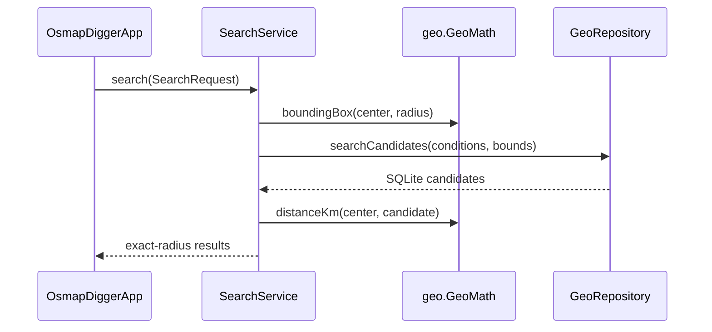
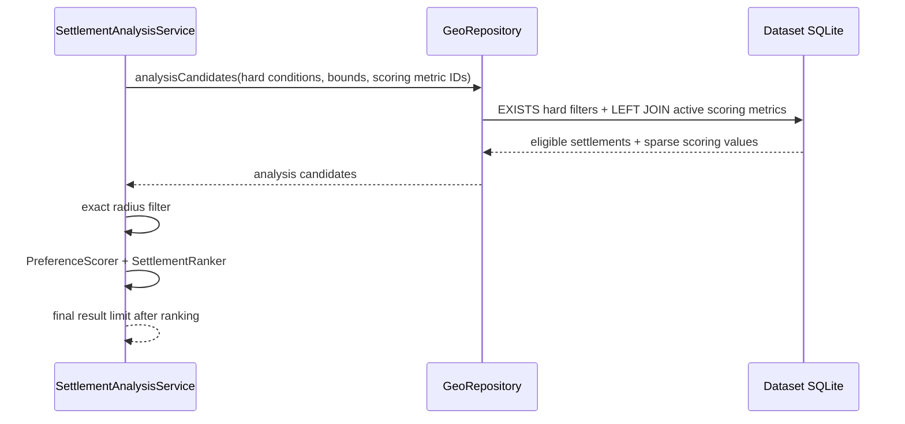

# Mobile/runtime implementation

## Scope

This document describes the current Kotlin Multiplatform implementation under `mobile/`. Stable system boundaries remain in [`../docs/ARCHITECTURE.md`](../docs/ARCHITECTURE.md); persisted SQLite/metadata semantics are owned by [`../geo-format/`](../geo-format/).

## Module layout

| Module | Current responsibility |
|---|---|
| `shared` | Domain models, search/preferences contracts, exact-radius search, filter summary, property-link generation, GeoJSON overlay, shared Compose/MapLibre UI |
| `desktopApp` | JVM app host, dataset JDBC SQLite, settings SQLite, filesystem/ZIP loading, Desktop browser integration |
| `androidApp` | Android app host, dataset/settings SQLite, SAF ZIP import, app-private installation, browser intents |

`shared/commonMain` contains no Android/JDBC/filesystem implementation APIs.

## Shared domain model

`domain/Models.kt` defines:

- `GeoPoint` — WGS84 coordinate;
- `DatasetInfo` — runtime dataset identity/initial camera/map availability;
- `PreferredDirection` — descriptive lower/higher preference metadata;
- `MetricDefinition` — one persisted numeric metric/filter definition;
- `MetricPreferenceDefault` — one validated dataset-provided generic scoring default with legacy-package absence represented by an empty catalog;
- `Settlement` — one canonical searchable settlement point;
- `SettlementName` / `SettlementSearchEntry` / `SettlementSearchMatch` — multilingual alias index and ranked center-lookup models;
- `SearchCondition` — optional min/max range for one metric ID;
- `SearchRequest` — center, radius, metric conditions, result limit;
- `MetricValue` — hydrated metric definition/value;
- `SettlementDetails` — settlement plus all available metrics.

Models are intentionally immutable and do not know SQL/OSM selector semantics.

## Runtime contracts

`runtime/RuntimeContracts.kt` defines `GeoRepository` as the shared data boundary.

Platform implementations provide:

- dataset metadata;
- metric catalog;
- optional dataset preference-default catalog with legacy-v1 empty fallback;
- complete settlement-name search index loading with legacy-dataset fallback;
- legacy SQL-reduced hard-filter search candidates;
- batch hard-filter-eligible analysis candidates with only requested scoring metric values;
- detailed single-settlement hydration.

`OsmapDiggerRuntime` bundles dataset-scoped repository/map/browser dependencies. The platform host separately creates one application-scoped `UserPreferencesRepository` and injects it into `OsmapDiggerApp`. Shared `AnalysisWorkspaceController` now owns restored hard constraints, effective preference defaults/overrides, center/radius, automatic ranked-analysis results, and persistence orchestration; Compose observes that state instead of independently owning those analytical fields.

## User preferences

`preferences/UserPreferences.kt` defines the immutable current search-context model, the small persistence interface, a versioned JSON codec for dynamic metric conditions, and restore validation.

Restore is dataset-scoped. Metric conditions are retained only when their stable IDs still exist in the opened metric catalog. The saved center is resolved only by stable settlement ID; no display-name fallback is used.

`AnalysisWorkspaceController.initialize()` loads dataset metadata, metric definitions, dataset preference defaults, and persisted user state in one shared lifecycle. It validates restored center/hard-filter references, merges sparse user preference overrides over dataset defaults, persists only after initialization, and immediately schedules ranked analysis. `OsmapDiggerApp` keeps only presentation-local text/selection/provider state and delegates analytical mutations back to the controller.

## Search orchestration

`search/SettlementSearch.kt` owns shared center-settlement lookup semantics. It normalizes configured aliases, lazily caches the compact search index for the opened dataset, and ranks exact, prefix, substring, then bounded Levenshtein fuzzy matches. Platform repositories read `settlement_name` when available and synthesize aliases from legacy `name`/`name_local`/`name_en` columns for older format-version-1 datasets. This avoids platform-specific SQLite Unicode/FTS behavior.

`search/SearchService.kt` is intentionally small and deterministic.



This keeps SQL spatial requirements minimal and behavior consistent across Android/JVM.

## Preference scoring and ranked analysis

`analysis/PreferenceModels.kt`, `analysis/PreferenceScorer.kt`, and `analysis/SettlementRanker.kt` own
immutable scoreable preferences, contribution breakdowns, aggregate score/coverage, and deterministic
ranking. `PreferenceScorer` rejects implicit `NEUTRAL` direction, calculates linear `LOWER`/`HIGHER`
quality, preserves missing metrics as unknown, and fails fast on non-finite present metric values.

`analysis/SettlementAnalysisModels.kt` defines the full ranked-analysis request above the existing
hard `SearchRequest`. The repository-facing `SettlementAnalysisCandidate` lives in `domain/` so the
`runtime` contract does not depend back on the `analysis` service package; it carries one eligible
settlement plus only requested metric values.

`SettlementAnalysisService` owns the new orchestration path:



The repository path intentionally has no unrelated name-based final limit and never hydrates full
`SettlementDetails` per candidate. Missing joined scoring rows remain absent from the metric map.
`search/SearchRequestSemantics.kt` centralizes radius validation, coarse bounds, exact radius matching,
and effective-condition selection so legacy `SearchService` and ranked analysis cannot drift.

`AnalysisWorkspaceController` connects `MetricPreferenceDefault`, saved overrides, `SettlementAnalysisService`, and `UserPreferencesRepository` into the active application flow. Input changes schedule a 250 ms debounced recalculation and late stale generations cannot replace newer ranked results. It also exposes explicit generic preference-edit operations for enabled state, weight, target/limit thresholds, and reset-to-dataset-default while keeping persisted overrides sparse. Legacy packages with no enabled preference defaults and no effective hard/radius constraint do not trigger an automatic unbounded candidate scan; explicit refresh remains available through the compatibility SearchPane path.

## Filter summaries

`FilterSummaryBuilder` renders the current structured request into readable text. It uses persisted metric title/unit metadata and therefore requires no category-specific wording branches for normal range metrics.

It is presentation logic only: the generated sentence does not become an executable query language.

## External property links

`external/ExternalSearchProviders.kt` owns the shared provider model, repository contract, seed-catalog parser, percent encoding, and URL-template expansion. `mobile/config/external-search-providers.json` owns the packaged default provider rows. `SearchPane` receives already loaded providers and renders the action list dynamically; it does not know provider IDs or construct provider-specific URLs.

Desktop and Android store provider rows in the same application-owned settings SQLite used for user preferences. The existing physical filename `preferences.sqlite` is retained for backward compatibility even though the database now contains broader application settings. Platform settings database owners migrate schema version 1 to version 2 by adding `external_search_provider`. Seed insertion uses `INSERT OR IGNORE`, preserving customized rows. Provider selection returns global rows plus rows matching `DatasetInfo.countryCode`.

## Map overlay

`map/MapOverlayGeoJson.kt` serializes search results into a small engine-neutral in-memory GeoJSON FeatureCollection used by native MapLibre and the Intel macOS web renderer.

`ui/MapPanel.kt`:

- loads the platform-resolved local style through `BaseStyle.Json`;
- renders result points in one circle layer;
- renders the selected settlement in a separate highlighted layer;
- moves the camera toward a newly selected settlement.

The basemap remains PMTiles; result overlays are runtime GeoJSON and are not written back to tiles.

## Shared Compose UI

`ui/OsmapDiggerApp.kt` is the common entry point.

The UI has two top-level states:

1. no dataset — explain that a generated package is required and offer import;
2. loaded dataset — load metadata/metric definitions and show search/map UI.

The Desktop host explicitly selects `AppPresentationMode.DESKTOP_ANALYSIS`. On wide Desktop windows, `ui/DesktopAnalysisWorkspace.kt` renders a resizable left analysis panel that defaults to roughly 34% of the window and uses the remaining width for a map/details column. The panel contains Search area, generic Required constraints, generic Preferences with single-row progressive editing, and ranked results with score/data coverage. Add filter opens a full-pane chooser inside the left analysis area instead of a window-level dropdown. Selecting a ranked result reuses the existing selected-settlement map focus and allocates the lower third of the right column to settlement details, leaving the upper two thirds to the map. Details include deterministic strongest/weakest/unknown preference explanation above the complete grouped raw metrics and external property-search actions.

Desktop composition intentionally keeps all Compose transient/detail surfaces outside the platform map rectangle. This avoids relying on Compose/Swing z-order behavior for the Intel macOS JCEF renderer. `PlatformMapSurface` therefore remains a simple renderer contract with no popup-occlusion or freeze-frame lifecycle, and `IntelMacWebMapSurface` keeps its original windowed JCEF browser/session behavior.

Android keeps the existing responsive presentation; narrow layouts continue to use Search/Map tabs. `ui/SearchPane.kt` remains the compatibility/shared responsive surface and implements:

- multilingual/fuzzy center settlement lookup with alias-aware suggestions;
- radius input;
- dynamic default/additional filters;
- deterministic filter description;
- local search action;
- result cards;
- settlement detail metrics;
- explicit external property searches.

The UI never constructs SQL.

## Desktop adapter

### `JdbcGeoRepository`

Uses Xerial SQLite JDBC.

`searchCandidates()` retains the current UI contract: optional coordinate bounds, one `EXISTS`
subquery per effective metric condition, deterministic name ordering, and a repository-side limit.

`analysisCandidates()` reuses the same hard predicates but has no final result limit. It performs one
`LEFT JOIN` restricted to sorted active scoring metric IDs and folds the sparse rows into immutable
`SettlementAnalysisCandidate` values. Missing scoring rows therefore remain unknown rather than
excluding the settlement or becoming zero.

`preferenceDefaults()` reads `metric_preference_default` ordered by the owning metric's `sort_order`. It first probes `sqlite_master`; a legacy format-v1 database without the additive table returns an empty list. Persisted rows are converted into validated shared `MetricPreferenceDefault` values, so unsupported direction or invalid numeric contracts fail instead of being silently reinterpreted.

### Shared preference override persistence

`UserPreferences` carries `preferenceOverrides` keyed by stable metric ID. An override is intentionally sparse and may replace only `enabled`, `targetValue`, `limitValue`, or `weight`; scoring direction remains owned by the dataset's `MetricPreferenceDefault`. Untouched fields therefore follow new dataset defaults after a compatible dataset rebuild instead of being duplicated into mutable application state.

`MetricPreferenceOverridePayloadCodec` stores overrides as an independently versioned JSON payload. `MetricPreferenceOverrideResolver` applies them to the currently opened dataset defaults, ignores valid stale overrides whose metric ID is no longer present, rejects duplicate IDs, and reconstructs `MetricPreference` so invalid effective target/limit combinations fail deterministically before scoring. Dataset mismatch produces no restored preference state.

The platform settings schema advances from version 2 to version 3 by adding `user_preferences.preferences_json`. Existing rows receive an empty version-1 override payload, preserving center/radius/hard-filter state while making effective preferences equal to dataset defaults after migration. This schema belongs only to application-owned settings and does not change `geo-format/VERSION`.

### `SqliteUserPreferencesRepository`

Stores the current search context at `~/.osmapdigger/settings/preferences.sqlite` using a single-row application-owned schema with `PRAGMA user_version = 1`. Connections are short-lived and preference I/O runs on `Dispatchers.IO`.

The preferences database is application-owned and independent from `geo-format`. It stores dataset identity, the stable center settlement ID plus optional display name, optional radius, and a versioned JSON payload of dynamic metric ID/min/max conditions. Missing or unsupported saved state degrades to normal dataset defaults; unknown metric IDs are ignored and an unavailable saved center clears the center/radius constraint. Search history, favorites, notes, and multiple named saved searches are not part of the current store.

### Desktop storage and dataset lifecycle

Desktop keeps generated/installed dataset artifacts separate from mutable application state:

```text
~/.osmapdigger/
    datasets/
    settings/
        preferences.sqlite
    logs/
    runtime/
```

Generated packages under repository `data/generated/` are installation sources, not mutable runtime state. `DesktopDatasetChooser` can open a package directory or securely extract a ZIP into `~/.osmapdigger/datasets/`; normalized entries must stay under the destination root.

Startup dataset resolution is host-owned. `OSMAPDIGGER_DATASET_DIR` has development precedence; otherwise `DesktopConfigLoader` discovers `desktop-config.json` and resolves its configured package. Manual import/change remains available when automatic loading is unavailable.

### `DesktopDataset`

`open(directory)` parses metadata, opens dataset SQLite, resolves optional PMTiles into the style template, and creates the dataset-scoped `OsmapDiggerRuntime`. The Desktop host owns one separate preferences repository for the application lifetime and deliberately closes/replaces dataset resources when the active package changes.

### Desktop MapLibre runtime

`shared/src/desktopMain/.../MapPanel.desktop.kt` is the default Desktop `actual` map surface. It renders the local package style, result/selection GeoJSON overlays, camera focus, and attribution on MapLibre Compose native hosts, and otherwise provides the non-fatal fallback. Shared UI can accept a small `PlatformMapSurface` override from the Desktop application host.

`desktopApp/build.gradle.kts` owns the platform-native runtime selection for macOS Apple Silicon Metal, Linux x86-64 OpenGL, and Windows x86-64 OpenGL. Intel macOS receives no incompatible MapLibre JNI runtime; instead `desktopApp/.../map/IntelMacWebMapSurface.kt` owns the JCEF + MapLibre GL JS renderer. `LocalWebMapServer` binds to loopback only, serves packaged browser assets, converts local PMTiles reads into XYZ vector-tile responses, and keeps browser/native lifecycle outside shared code.

### Desktop diagnostics

`desktopApp/.../diagnostics/DesktopDiagnostics.kt` owns process-local Desktop diagnostics. It mirrors
JUL output to `~/.osmapdigger/logs/desktop.log`, records a runtime fingerprint and timed startup
phases, redirects JVM fatal-error reports into the same log directory, and maintains an
unclean-shutdown marker under `~/.osmapdigger/runtime/`. The diagnostics API is not exposed to
`shared`.

Desktop diagnostics deliberately observe JCEF initialization from outside the native runtime and do not
modify CEF cache/settings or attach browser handlers. This keeps diagnostics from changing JCEF startup
behavior during native-crash investigation. `LocalWebMapServer` still logs lifecycle, PMTiles metadata,
failures, and aggregate request counters rather than one line per successful tile.

### `Main.kt`

Uses `OSMAPDIGGER_DATASET_DIR` when set; otherwise follows Desktop configuration/package loading. It
owns closing/replacing Desktop dataset resources and initializes Desktop diagnostics before dataset
loading or native map initialization.

## Android adapter

### `AndroidGeoRepository`

Implements both legacy hard-filter and batch ranked-analysis candidate semantics through
`SQLiteDatabase.rawQuery()`. Its `analysisCandidates()` query mirrors Desktop hard predicates and
active-metric `LEFT JOIN` behavior so shared scoring sees the same sparse metric contract. `preferenceDefaults()` mirrors Desktop's additive-table probe/order/validation and returns an empty list for legacy v1 packages without the table.

### `AndroidDatasetInstaller`

Reads a user-selected ZIP through Storage Access Framework, resolves each entry to its canonical destination, and rejects entries escaping app-private dataset storage.

### `AndroidUserPreferencesRepository`

Stores the same current search-context contract in app-private `filesDir/settings/preferences.sqlite` through Android `SQLiteDatabase`. Its schema version is independent from generated dataset format versioning.

### `AndroidDataset`

Parses metadata, opens generated SQLite with `OPEN_READONLY`, resolves a local `pmtiles://file://` URI, and injects Android browser behavior. `MainActivity` owns the separate application-scoped preferences adapter.

### `MainActivity`

Owns the document picker and current `AndroidDataset` lifecycle, then hosts the shared `OsmapDiggerApp`.

## Main dependencies

Dependency versions are centralized in `gradle/libs.versions.toml`.

Current dependency families:

- Kotlin Multiplatform / Kotlin compiler;
- Compose Multiplatform + Material 3;
- kotlinx.coroutines;
- kotlinx.serialization;
- MapLibre Compose;
- Xerial SQLite JDBC for Desktop;
- Android platform SQLite.

## Tests

- `shared/commonTest` covers geography, deterministic preference scoring/ranking, rank-before-limit analysis orchestration, exact-radius analysis semantics, debounced shared analysis-state orchestration, filter summaries, external links, preference payloads, and restore semantics;
- `shared/desktopTest` covers Desktop MapLibre host capability resolution;
- `desktopApp/jvmTest` covers legacy dynamic metric SQL, batch scoring-metric retrieval/unknown handling, and preferences/settings SQLite round trips;
- Android compilation/host tests are separate Gradle tasks.

See [`../docs/TESTS.md`](../docs/TESTS.md) for current commands and real-package acceptance checks.

## Known implementation limitations

- one current Android dataset is installed at a time;
- Desktop dataset chooser is functional but not yet a full dataset-manager UI;
- numeric filters use text fields rather than metric-specific widgets;
- map style is basic and lacks polished fully offline label/font/sprite packaging;
- favorites, named saved searches, notes, and comparison state are not persisted yet.
