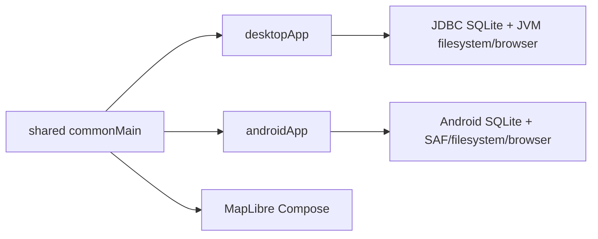

# OsmapDigger mobile/runtime

`mobile/` contains the Kotlin Multiplatform runtime: shared domain/search/UI plus Android and JVM Desktop hosts.

## Runtime structure



Shared code is country-agnostic and does not parse OSM files or construct SQL.

## Modules

- `shared/` — immutable domain models, `GeoRepository` contract, deterministic radius search, filter summary generation, GeoJSON overlays, responsive Compose filter/results/details/map UI.
- `desktopApp/` — Desktop window, JDBC repository, directory/ZIP dataset opening, JVM browser integration, MapLibre native binding selection.
- `androidApp/` — Activity host, Android SQLite repository, Storage Access Framework ZIP import into app-private storage, Android browser intents.

See [`IMPLEMENTATION.md`](IMPLEMENTATION.md) for class-level call paths and platform behavior.

## Run Desktop

```bash
./gradlew :desktopApp:run
```

To open a package automatically:

```bash
export OSMAPDIGGER_DATASET_DIR=/absolute/path/to/generated/package
./gradlew :desktopApp:run
```

Without the environment variable, use the in-app dataset import/open action.

## Android

```bash
./gradlew :androidApp:assembleDebug
```

The initial Android runtime imports a prebuilt `.omd.zip`; it does not run the Python builder on-device.

## Tests

```bash
./gradlew :shared:desktopTest
./gradlew :desktopApp:jvmTest
./gradlew :shared:testAndroidHostTest
```

Root `make check-all` composes configured Kotlin/Python checks.

## Important boundaries

- SQLite is the analytical search source.
- PMTiles is the map source.
- `metric_definition` drives generic filters.
- platform hosts own local file/SQLite APIs.
- external web search happens only from an explicit user action.

## Read next

- [`IMPLEMENTATION.md`](IMPLEMENTATION.md) — current shared/platform implementation.
- [`AGENTS.md`](AGENTS.md) — mobile-specific change rules.
- [`../docs/ARCHITECTURE.md`](../docs/ARCHITECTURE.md) — cross-project boundaries.
- [`../docs/TESTS.md`](../docs/TESTS.md) — full validation matrix.
