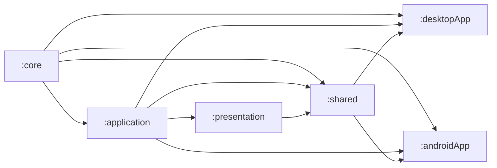
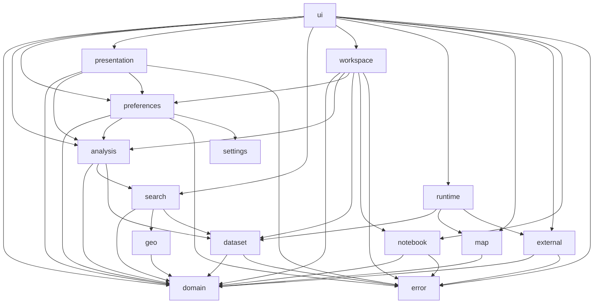

# OsmapDigger mobile runtime

`mobile/` contains the Kotlin Multiplatform runtime: low-level core models/geography, headless application logic, deterministic presentation logic, shared Compose UI/map code, and Android/JVM Desktop hosts.

## Physical Gradle modules

Architecture hardening Gates 6–7 establish explicit physical boundaries for low-level contracts, headless application behavior, presentation, Compose UI/runtime, and platform hosts.



| Module | Owns | Direct internal dependencies | Main entry points | Focused validation |
|---|---|---|---|---|
| `:core` | Immutable country-agnostic runtime models and pure WGS84 geographic calculations | none | `GeoPoint`, `DatasetInfo`, `Settlement`, `MetricDefinition`, `SearchRequest`, `GeoMath` | `./gradlew :core:desktopTest`, `./gradlew :core:testAndroidHostTest` |
| `:application` | Headless dataset/search/analysis logic, settings contracts, Preferences, Favorites/notebook, external-search contracts, and workspace orchestration | `:core` | `GeoRepository`, `SearchService`, `SettlementAnalysisService`, `AnalysisWorkspaceController` | `./gradlew :application:desktopTest`, `./gradlew :application:testAndroidHostTest` |
| `:presentation` | Platform-independent localization, formatting, filter summaries, score explanations, and display-name resolution | `:application` | `FilterSummaryBuilder`, `ScoreExplanationBuilder`, `MetricDisplayNameResolver`, `UiStrings` | `./gradlew :presentation:desktopTest`, `./gradlew :presentation:testAndroidHostTest` |
| `:shared` | Shared Compose UI plus renderer-neutral map/runtime composition contracts | `:core`, `:application`, `:presentation` | `OsmapDiggerApp`, `DesktopAnalysisWorkspace`, `SearchPane`, `MapOverlayGeoJson` | `./gradlew :shared:desktopTest`, `./gradlew :shared:testAndroidHostTest` |
| `:desktopApp` | JVM composition root, JDBC, Desktop filesystem/package loading, Favorites ZIP save/reveal, browser integration, native/JCEF map host, headless developer automation | `:core`, `:application`, `:shared` | Desktop main host, `JdbcGeoRepository`, `DesktopDataset`, `DesktopHeadlessWorkspace` | `./gradlew :desktopApp:jvmTest` |
| `:androidApp` | Android composition root, Android SQLite, SAF/package installation, Favorites system-share adapter, browser intents, Activity lifecycle | `:core`, `:application`, `:shared` | Android Activity, `AndroidGeoRepository`, `AndroidDataset` | `./gradlew :androidApp:assembleDebug` |

See [`IMPLEMENTATION.md`](IMPLEMENTATION.md) for concrete class/platform call paths.

## Current logical ownership across shared KMP modules

Top-level packages remain logical boundaries inside the physical modules. `domain` and `geo` live in `:core`; headless application packages live in `:application`; `presentation` lives in `:presentation`; and `map`, `runtime`, and `ui` live in `:shared`. Their dependency direction is intentionally acyclic and is checked by `tests/test_mobile_architecture.py` during `make check`.



| Logical package | Responsibility | Direct logical dependencies | Important contracts / entry points |
|---|---|---|---|
| `error` | Stable expected operational-failure taxonomy and cancellation-safe boundary adaptation | none | `OperationalFailure`, `operationalBoundary` |
| `settings` | Platform-independent application settings schema and ordered migrations | none | `ApplicationSettingsSchema`, `SettingsMigration` |
| `domain` | Immutable runtime data models and persisted-contract values | none | `DatasetInfo`, `Settlement`, `MetricDefinition`, `SearchRequest` |
| `geo` | Platform-independent geographic calculations | `domain` | `GeoMath` |
| `dataset` | Read-only analytical dataset boundary, shared candidate-query semantics, package metadata/layout semantics, and deterministic stable-ID batching | `domain`, `error` | `GeoRepository`, `DatasetCandidateQueries`, `DatasetPackageLayout`, `DatasetPackageMetadataParser`, `StableIdBatches` |
| `map` | Renderer-neutral map data/assets and overlay serialization | `domain` | `MapPackage`, `MapOverlayGeoJson` |
| `external` | External-search provider model, URL expansion, explicit platform link action | `domain`, `error` | `ExternalSearchProviderRepository`, `ExternalSearchUrlBuilder`, `ExternalLinkOpener` |
| `notebook` | Dataset-scoped persistent Favorites, notes, frozen versioned snapshot models/codecs, deterministic portable export model, and typed storage/export wrappers | `domain`, `error` | `FavoriteSettlement`, `FavoriteAnalysisSnapshot`, `FavoriteNotebookExportBuilder`, `FavoriteSettlementRepository`, `FavoriteNotebookExporter` |
| `search` | Deterministic hard search, radius semantics, settlement-name matching, conservative settlement-list import resolution | `domain`, `geo`, `dataset` | `SearchService`, `SettlementSearchService`, `SettlementListImportResolver`, `SettlementImportReviewer`, `SearchRequestSemantics` |
| `analysis` | Preference scoring, candidate-scope/imported-list contracts, contributions, ranked-analysis orchestration | `domain`, `search`, `dataset` | `SettlementCandidateScope`, `ImportedCandidateList`, `PreferenceScorer`, `SettlementRanker`, `SettlementAnalysisService` |
| `preferences` | Application-owned persisted search/preference/candidate-scope models, payload codecs, restore/override logic, and operational storage wrapper | `domain`, `analysis`, `error`, `settings` | `UserPreferencesRepository`, `MetricPreferenceOverrideResolver` |
| `presentation` | Deterministic formatting, localized operational failures, and human-readable analysis/search presentation | `domain`, `analysis`, `preferences`, `error` | `FilterSummaryBuilder`, `ScoreExplanationBuilder`, metric/localization presentation |
| `workspace` | Application orchestration for one opened analysis workspace, including candidate scope, persistent favorites state, explicit Favorites-to-import transfer, and typed failure state | `domain`, `analysis`, `preferences`, `dataset`, `notebook`, `error` | `AnalysisWorkspaceController`, `FavoriteCandidateTransfer` |
| `runtime` | Dataset-scoped dependency bundle assembled only by platform composition roots | `dataset`, `map`, `external` | `OsmapDiggerRuntime` |
| `ui` | Shared Compose presentation and feature composition | `domain`, `analysis`, `preferences`, `presentation`, `search`, `workspace`, `runtime`, `map`, `external`, `notebook`, `error` | `OsmapDiggerApp`, `DesktopAnalysisWorkspace`, `SearchPane`, `PlatformMapSurface` |

### Dependency rules

- The physical Gradle module graph and logical package graph must remain DAGs; lower modules must not depend upward on presentation, Compose UI, or platform hosts.
- Lower-level packages must not import `workspace`, `presentation`, or `ui` to reuse incidental helpers.
- `analysis` owns scoring/ranking; persistence/debounce/application state belongs to `workspace`.
- `search` owns structured search semantics and must not depend on human-readable presentation formatting.
- `runtime` is a composition bundle, not a general-purpose API owner. Dataset, map, and external-action contracts live in their semantic packages.
- Expected operational failures cross migrated application boundaries as stable `OperationalFailure` kinds; raw exception wording is diagnostic-only and cancellation is never converted to normal failure state.
- `settings` owns logical settings DDL/migrations; platform modules only execute them with platform SQLite APIs.
- Platform APIs remain in `desktopApp`/`androidApp`; `commonMain` does not import JDBC, Android, filesystem, JCEF, or native map APIs.

For an LLM-oriented change, start with this graph, open the target logical owner, and recursively inspect only its dependency subtree unless the task explicitly crosses another boundary.

## Run Desktop

```bash
./gradlew :desktopApp:run
```

To open a package automatically:

```bash
export OSMAPDIGGER_DATASET_DIR=/absolute/path/to/generated/package
./gradlew :desktopApp:run
```

Without the environment variable, use the in-app dataset import/open action.


### Headless developer automation

Desktop exposes a developer-only headless adapter over the same shared `AnalysisWorkspaceController` used by Compose. Mutable application state is stored in an explicitly supplied settings SQLite file, so CLI and tests can reproduce a workflow without touching the user's normal `~/.osmapdigger` state.

Run the real-JDBC/settings acceptance fixture with:

```bash
make desktop-headless-acceptance
```

For ad-hoc automation, pass CLI arguments through the root Make target, for example:

```bash
make headless-cli HEADLESS_ARGS='--dataset ../data/generated/packages/belarus --settings /tmp/osmapdigger-headless.sqlite state'
```

The CLI is an adapter only; scoring, candidate semantics, Favorites behavior, and persistence contracts remain owned by shared application/domain code and the existing Desktop repositories.

## Android

```bash
./gradlew :androidApp:assembleDebug
```

The initial Android runtime imports a prebuilt `.omd.zip`; it does not run the Python builder on-device.

## Tests

```bash
./gradlew :core:desktopTest
./gradlew :shared:desktopTest
./gradlew :desktopApp:jvmTest
./gradlew :core:testAndroidHostTest
./gradlew :shared:testAndroidHostTest
```

Root `make check` also validates the current logical package dependency contract without requiring Gradle or network access. Root `make check-all` composes the configured Kotlin/Python checks.

## Important boundaries

- SQLite is the analytical search source.
- PMTiles is the map source.
- `metric_definition` drives generic filters.
- platform hosts own local file/SQLite APIs.
- external web search happens only from an explicit user action.

## Read next

- [`IMPLEMENTATION.md`](IMPLEMENTATION.md) — current shared/platform implementation.
- [`AGENTS.md`](AGENTS.md) — mobile-specific change rules.
- [`../docs/ARCHITECTURE.md`](../docs/ARCHITECTURE.md) — cross-project boundaries.
- [`../docs/TESTS.md`](../docs/TESTS.md) — full validation matrix.
