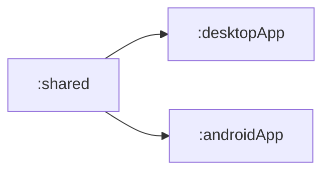
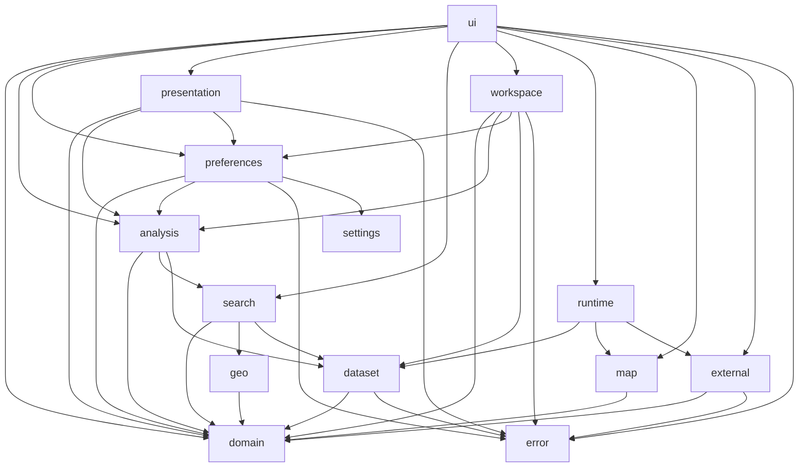

# OsmapDigger mobile runtime

`mobile/` contains the Kotlin Multiplatform runtime: shared domain/search/application/UI code plus Android and JVM Desktop hosts.

## Physical Gradle modules

The current build still has three Gradle modules. Architecture hardening first makes the logical shared-code graph acyclic; physical extraction into additional Gradle modules is a later bounded iteration.



| Module | Owns | Direct internal dependencies | Main entry points | Focused validation |
|---|---|---|---|---|
| `:shared` | Country-agnostic models, dataset/search/analysis contracts and logic, workspace orchestration, presentation, shared Compose UI, renderer-neutral map contracts | none | `GeoRepository`, `SearchService`, `SettlementAnalysisService`, `AnalysisWorkspaceController`, `OsmapDiggerApp` | `./gradlew :shared:desktopTest`, `./gradlew :shared:testAndroidHostTest` |
| `:desktopApp` | JVM composition root, JDBC, Desktop filesystem/package loading, browser integration, native/JCEF map host | `:shared` | Desktop main host, `JdbcGeoRepository`, `DesktopDataset` | `./gradlew :desktopApp:jvmTest` |
| `:androidApp` | Android composition root, Android SQLite, SAF/package installation, browser intents, Activity lifecycle | `:shared` | Android Activity, `AndroidGeoRepository`, `AndroidDataset` | `./gradlew :androidApp:assembleDebug` |

See [`IMPLEMENTATION.md`](IMPLEMENTATION.md) for concrete class/platform call paths.

## Current logical ownership inside `:shared`

Until physical Gradle extraction is performed, top-level packages are treated as logical module boundaries. Their dependency direction is intentionally acyclic and is checked by `tests/test_mobile_architecture.py` during `make check`.



| Logical package | Responsibility | Direct logical dependencies | Important contracts / entry points |
|---|---|---|---|
| `error` | Stable expected operational-failure taxonomy and cancellation-safe boundary adaptation | none | `OperationalFailure`, `operationalBoundary` |
| `settings` | Platform-independent application settings schema and ordered migrations | none | `ApplicationSettingsSchema`, `SettingsMigration` |
| `domain` | Immutable runtime data models and persisted-contract values | none | `DatasetInfo`, `Settlement`, `MetricDefinition`, `SearchRequest` |
| `geo` | Platform-independent geographic calculations | `domain` | `GeoMath` |
| `dataset` | Read-only analytical dataset boundary, package metadata/layout semantics, and deterministic stable-ID batching | `domain`, `error` | `GeoRepository`, `DatasetPackageLayout`, `DatasetPackageMetadataParser`, `StableIdBatches` |
| `map` | Renderer-neutral map data/assets and overlay serialization | `domain` | `MapPackage`, `MapOverlayGeoJson` |
| `external` | External-search provider model, URL expansion, explicit platform link action | `domain`, `error` | `ExternalSearchProviderRepository`, `ExternalSearchUrlBuilder`, `ExternalLinkOpener` |
| `search` | Deterministic hard search, radius semantics, settlement-name matching, conservative settlement-list import resolution | `domain`, `geo`, `dataset` | `SearchService`, `SettlementSearchService`, `SettlementListImportResolver`, `SettlementImportReviewer`, `SearchRequestSemantics` |
| `analysis` | Preference scoring, candidate-scope/imported-list contracts, contributions, ranked-analysis orchestration | `domain`, `search`, `dataset` | `SettlementCandidateScope`, `ImportedCandidateList`, `PreferenceScorer`, `SettlementRanker`, `SettlementAnalysisService` |
| `preferences` | Application-owned persisted search/preference/candidate-scope models, payload codecs, restore/override logic, and operational storage wrapper | `domain`, `analysis`, `error`, `settings` | `UserPreferencesRepository`, `MetricPreferenceOverrideResolver` |
| `presentation` | Deterministic formatting, localized operational failures, and human-readable analysis/search presentation | `domain`, `analysis`, `preferences`, `error` | `FilterSummaryBuilder`, `ScoreExplanationBuilder`, metric/localization presentation |
| `workspace` | Application orchestration for one opened analysis workspace, including transient candidate scope and typed failure state | `domain`, `analysis`, `preferences`, `dataset`, `error` | `AnalysisWorkspaceController` |
| `runtime` | Dataset-scoped dependency bundle assembled only by platform composition roots | `dataset`, `map`, `external` | `OsmapDiggerRuntime` |
| `ui` | Shared Compose presentation and feature composition | `domain`, `analysis`, `preferences`, `presentation`, `search`, `workspace`, `runtime`, `map`, `external`, `error` | `OsmapDiggerApp`, `DesktopAnalysisWorkspace`, `SearchPane`, `PlatformMapSurface` |

### Dependency rules

- The logical package graph must remain a DAG; lower-level packages must not import `workspace`, `presentation`, or `ui` to reuse incidental helpers.
- `analysis` owns scoring/ranking; persistence/debounce/application state belongs to `workspace`.
- `search` owns structured search semantics and must not depend on human-readable presentation formatting.
- `runtime` is a composition bundle, not a general-purpose API owner. Dataset, map, and external-action contracts live in their semantic packages.
- Expected operational failures cross migrated application boundaries as stable `OperationalFailure` kinds; raw exception wording is diagnostic-only and cancellation is never converted to normal failure state.
- `settings` owns logical settings DDL/migrations; platform modules only execute them with platform SQLite APIs.
- Platform APIs remain in `desktopApp`/`androidApp`; `commonMain` does not import JDBC, Android, filesystem, JCEF, or native map APIs.

For an LLM-oriented change, start with this graph, open the target logical owner, and recursively inspect only its dependency subtree unless the task explicitly crosses another boundary.

## Run Desktop

```bash
./gradlew :desktopApp:run
```

To open a package automatically:

```bash
export OSMAPDIGGER_DATASET_DIR=/absolute/path/to/generated/package
./gradlew :desktopApp:run
```

Without the environment variable, use the in-app dataset import/open action.

## Android

```bash
./gradlew :androidApp:assembleDebug
```

The initial Android runtime imports a prebuilt `.omd.zip`; it does not run the Python builder on-device.

## Tests

```bash
./gradlew :shared:desktopTest
./gradlew :desktopApp:jvmTest
./gradlew :shared:testAndroidHostTest
```

Root `make check` also validates the current logical package dependency contract without requiring Gradle or network access. Root `make check-all` composes the configured Kotlin/Python checks.

## Important boundaries

- SQLite is the analytical search source.
- PMTiles is the map source.
- `metric_definition` drives generic filters.
- platform hosts own local file/SQLite APIs.
- external web search happens only from an explicit user action.

## Read next

- [`IMPLEMENTATION.md`](IMPLEMENTATION.md) — current shared/platform implementation.
- [`AGENTS.md`](AGENTS.md) — mobile-specific change rules.
- [`../docs/ARCHITECTURE.md`](../docs/ARCHITECTURE.md) — cross-project boundaries.
- [`../docs/TESTS.md`](../docs/TESTS.md) — full validation matrix.
